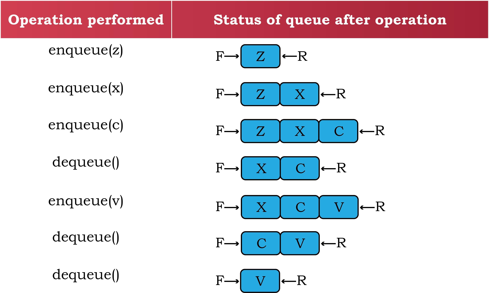

import { Steps } from '@astrojs/starlight/components';                                                                                        
      
import { Example, Card, Figure, Quote, Algorithm, Activity, Table, Program, Summary, Think, Know } from "@/components/markdown";

<Quote author="Sir Tim Berners-Lee" href="https://en.wikipedia.org/wiki/Tim_Berners-Lee">
  "We could say we want the Web to reflect a vision of the world where
  everything is done democratically. To do that, we get computers to talk with
  each other in such a way as to promote that ideal."
</Quote>

In this Chapter

- [Introduction to Queue](#section-4.1)
- [Operations on Queue](#section-4.2)
- [Implementation of Queue using Python](#section-4.3)
- [Introduction to Deque](#section-4.4)
- [Implementation of Deque using Python](#section-4.5)

## 4.1 Introduction to Queue ||section-4.1||

In the previous chapter we learned about a data structure called **Stack**, which
works on **Last-In-First-Out (LIFO)** principle. In this chapter, we will learn
about another data structure called **Queue** which works on **First-In-First-Out
(FIFO)** principle. Queue is an ordered linear list of elements, having different
ends for adding and removing elements in it.

Examples of queue in our everyday life include students standing in a queue for
morning assembly, customers forming a queue at the cash counter in a bank
([Figure 4.1](#figure-4.1)), vehicles queued at fuel pumps ([Figure 4.2](#figure-4.2)), etc.

<Figure 
  id="4.1" 
  title="Figure 4.1: Queue of people at a bank"
  invertable={false}
>
  <centre>
    
  </centre>
</Figure>

<Figure 
  id="4.2" 
  title="Figure 4.2: Queue of cars in a petrol pump"
  invertable={false}
>
  <centre>
    
  </centre>
</Figure>

### 4.1.1 First In First Out (FIFO) ||section-4.1.1||

Queue follows the principle of **First In First Out (FIFO)**, since the element
entering first in the queue will be the first one to come out of it. Thus, the
element that has been longest in the queue will be removed first. It is also
known as a **First Come First Served (FCFS)** approach. Queue is an arrangement in
which new objects/items always get added at one end, usually called the **REAR**,
and objects/items always get removed from the other end, usually called the
**FRONT** of the queue. **REAR** is also known as **TAIL** and **FRONT** as **HEAD** of a queue.

### 4.1.2 Applications of Queue ||section-4.1.2||

**(A) The concept of queue has many applications in real-life:**

- If a train ticket is in the waiting list (such as W/L1), it means the ticket
  is in a queue of tickets waiting to get confirmed, as per the increasing order
  of waiting numbers. If a confirmed ticket is cancelled, the W/ L1 numbered
  ticket is removed from the **FRONT **of the waiting queue and confirmed.
- Sometimes on calling a customer service centre, the Interactive Voice Response
  System (IVRS) tells us to wait till a support person is available. Here the
  call is put into a queue of customers waiting to be serviced.
- Imagine there is a single-lane one-way road, then the vehicle that entered
  first will exit first, following the concept of queue. Likewise, vehicles in a
  highway toll tax booth are served following the principle of **FIFO**.

**(B) Following are some examples of application of queue in computer science:**

- Suppose there is a web-server hosting a web-site to declare result(s). This
  server can handle a maximum of 50 concurrent requests to view result(s). So,
  to serve thousands of user requests, a Queue would be the most appropriate
  data structure to use.
- Some Operating Systems (OS) are required to handle multiple tasks called -
  jobs, seeking to use the processor. But we know that a processor can handle
  only one task at a time. Therefore, in a multitasking operating system, jobs
  are lined up (queued) and then given access to the processor according to some
  order. The simplest way is to give access to the processor on a **FIFO** basis,
  that is according to the order in which the jobs arrive with a request for the
  processor.
- When we send print commands from multiple files from the same computer or from
  different computers using a shared printer. The OS puts these print requests
  in a queue and sends them to the printer one by one on a **FIFO** basis.

<Think title="Think and Reflect">


In the web-server example (for result declaration), suppose the server receives
a request from an Administrator to access the result of a school on an urgent
basis, along with other requests from students to check individual results. Can
you suggest some strategy to ensure service to all as per their urgency?

</Think>

## 4.2 Operations on Queue ||section-4.2||

Following the FIFO approach, data structure queue supports the following
operations:

- **ENQUEUE**: is used to insert a new element to the queue at the rear end. We can
  insert elements in the queue till there is space in the queue for adding more
  elements. Inserting elements beyond capacity of the queue will result in an
  exception known as _**Overflow**_.
- **DEQUEUE**: is used to remove one element at a time from the front of the queue.
  We can delete elements from a queue until it is empty, trying to delete an
  element from an empty queue will result in exception known as _**Underflow**_.

To perform enqueue and dequeue efficiently on a queue, following operations are
also required:

- **IS EMPTY**: used to check whether the queue has any element or not, so as to
  avoid Underflow exception while performing dequeue operation.

- **PEEK**: used to view elements at the front of the queue, without removing it
  from the queue.
- **IS FULL**: used to check whether any more elements can be added to the queue or
  not, to avoid Overflow exceptions while performing enqueue operation.

[Figure 4.3](#figure-4.3) shows the various stages of a simple queue containing alphabets. In
the figure, Front of the queue is on the left and Rear on the right.

<Figure 
  id="4.3" 
  title="Figure 4.3: Various Stages of Stack Operations"
  invertable={true}
>
  <centre>
    
  </centre>
</Figure>

<Know title="Now you know">

While using a list to implement queue, we can designate either end of the list
as Front or Rear of the queue. But we have to fix either of the ends index[0] or
index[n-1] as Front and fix the opposite end as Rear.

</Know>

## 4.3 Implementation of Queue using Python ||section-4.3||

There are many ways in which queues can be implemented in a computer program,
one way is using the list data type of Python. For creating a queue structure in
the program, following functions need to be defined:

<Steps>

1. Let's create a queue named `myQueue`. We can create it by assigning an empty
   list.
   ```py
   myQueue = list()
   ```

2. A function (`enqueue`) to insert a new element at the end of queue. The
   function has two parameters name of the queue and element which is to be
   inserted in the queue.
   ```py
   def enqueue(myQueue, element):
       myQueue.append(element)
   ```
   :::note

   `append()` function always adds an element at the end of the list, hence Rear
   of queue.

   :::

3. We don't need to implement `Is Full`, as Python being a dynamic language,
   does not ask for the creation of list having fixed size. Hence, we will never
   encounter a situation when the queue is full.

4. A function (`isEmpty`) to check, if the queue has an element or not? This can
   be done by checking the length of the queue. The function has a parameter --
   name of the queue and returns `True` if the queue is empty `False` otherwise.
   ```py
   def isEmpty(myQueue):
       if len(myQueue)==0: 
           return True
       else:
           return False
   ```

   <Think title="Think and Reflect">
   Can you implement a queue data structure using tuple or dictionary?
   </Think>

5. A function (`dequeue`) to delete an element from the front of the queue. It
   has one parameter - name of the queue and returns the deleted element. The
   function first checks if the queue is empty or not, for successful deletion.
   ```py
   def dequeue(myQueue):
       if not (isEmpty(myQueue)):
           return myQueue.pop(0) 
       else:
           print(“Queue is empty”)
   ```
   :::note

   The `pop()` function with `index[0]` will delete the element from the
   beginning of the list, hence Front of queue.

   :::

6. A function (`size`) to get the number of elements in the queue. We can use
   the `len()` function of Python's list to find the number of elements in the
   queue. The function has one parameter - name of the queue and returns the
   number of elements in the queue.
   ```py
   def size(myQueue):
       return len(myQueue)
   ```

7. A function (`peek`) to simply read, but not to delete, the element at the
   front end of the queue. For this, we can read the element at `index[0]` of
   the queue. The function has one parameter - name of the queue and returns the
   value of element at Front if queue is not empty, `None` otherwise.
   ```py
   def peek(myQueue):
       if isEmpty(myQueue):
           print("Queue is empty")
           return None
       else:
           return myQueue[0]
   ```

</Steps>

<Know title="Now you know">

While choosing the name of above functions general naming convention w.r.t. the
queue is followed. As these are user defined functions any other name can also
be used.

</Know>

Let us consider the example of a queue that people form while waiting at a bank
cash counter. Usually, following are the events that occur in queue:

- Two friends come together and go to the cash counter, i.e. they form a queue -
  enqueue operation is performed two times.
- As soon as the person at the front is serviced, he will be removed from the
  queue - thus dequeue operation is performed. Cashier calls Next to serve the
  next person who is now at the front of the queue.
- Cashier wants to know the length of the queue - size of the queue is checked.
- Meanwhile, a few more people walk in the bank, and three of them join the
  queue at the cash counter, i.e. enqueue happens 3 times.
- Another person gets served and leaves the counter, i.e. dequeue is performed.
  Cashier calls Next to serve another person.
- The Next three people get served one after another, i.e. dequeue is performed
  thrice.
- Cashier calls Next and realises that there are no more people to be served -
  underflow situation happens

<Activity id="4.1" title="Activity 4.1">
How can you avoid printing of `None`, 
when trying to print an empty queue?
</Activity>

<Activity id="4.2" title="Activity 4.2">
What if the content of the complete queue is to be listed?
Write a function for it.
</Activity>

Now, let us write the code for the above scenario of the bank.

import program_4_1 from './res/program_4.1.py?raw';
import output_4_1 from './res/output_4.1.txt?raw';

<Program
  id="4.1"
  title="Program 4-1 Implementation of Queue in Python"
  code={program_4_1}
	output={output_4_1}
/>

## 4.4 Introduction to Deque ||section-4.4||

**Deque** (pronounced as “deck”) is an arrangement in which addition and removal of
element(s) can happen from any end, i.e. head/front or tail/rear. This data
structure does not apply any restriction on the side from which addition/removal
of elements should happen, so it can be used to implement stack or queue in the
program. It is also known as Double ended queue, because it permits insertion,
deletion operations from any end.

<Figure 
  id="4.4" 
  title="Figure 4.4: Basic deque structure displaying head and tail to implement stack or queue."
  invertable={true}
>
  <centre>
    
  </centre>
</Figure>

### 4.4.1 Applications of Deque ||section-4.4.1||

- At a train ticket purchasing counter, a normal queue of people is formed for
  purchasing a ticket. A person at the front purchased the ticket and left the
  counter. After a while they return back to the counter to ask something. As
  they have already purchased a ticket, they may have the privilege to join the
  queue from the front.
- Vehicles in a highway toll tax booth are served following the principle of
  queue. There are multiple queues if there are parallel booths at the toll
  gate. In case all vehicles of a booth are served then vehicles from the other
  booth(s) are asked to form a queue in front of the vacant booth. So, vehicles
  at the end of those queues will leave (removed from the end from where queue
  was joined) current booth and join queue at the vacant booth.

Following are some examples where data structure deque maybe applied in computer
science:

- To maintain browser history (URL), usually a stack is used, because once a tab
  is closed and if you press ctrl+shift+T, the most recently closed URL is
  opened first. As the number of URLs which can be stored in history is fixed,
  so when this list of URLs becomes large, URLs from the end of the list (i.e.
  which were least visited) gets deleted.
- Same happens for providing the Do and Undo option in any text editor.
- To check whether a given string is palindrome or not? Process string left to
  right (character wise) and insert it in deque from tail/rear like a normal
  queue. Once the entire string is processed (i.e. inserted in deque) we will
  take out (delete) a character from both the ends and match them till there is
  no character left or only one character left in deque. In either case, string
  is palindrome.

<Activity id="4.3" title="Activity 4.3">
In a deque, if insertion and deletion of elements is done from the same end, it
will behave as

1. Queue

2. Stack

3. List

4. None of the above
</Activity>

<Activity id="4.4" title="Activity 4.4">
In a deque, if insertion and deletion of elements is done from the opposite end,
it will behave as

1. Queue

2. Stack

3. List

4. None of the above
</Activity>

### 4.4.2 Operations on Deque ||section-4.4.2||

- **INSERTFRONT**: This operation is used to insert a new element at the front of
  the deque.
- **INSERTREAR**: This operation is the same as a normal queue, i.e. insert a new
  element at the rear of the deque.
- **DELETIONFRONT**: This operation is the same as normal queue, i.e. to remove an
  element from the front of the deque.
- **DELETIONREAR**: This operation is used to remove one element at a time from the
  rear of the deque.

To perform above operations efficiently on a deque, we will need all supporting
operations used in normal queue viz Is Empty, Peek, Size.

Let's understand how these operations work for checking whether a string is
palindrome or not, using a deque through the following algorithm.

<Algorithm id="4.1" title="Algorithm 4.1">
  <Steps>

1. Start traversing string (madam) from left side, a character at a time.

2. Insert the character in deque as normal queue using `INSERTREAR`.

3. REPEAT Step 1 and Step 2 for all characters of string (madam)
   <Figure 
    id="4.5" 
    title="Figure 4.5: Status of Deque after 4th iteration"
    invertable={true}
    >
    <centre>
    
    </centre>
   </Figure>

4. Remove one character from the front and one character from the rear end of
   deque using `DELETIONFRONT` and `DELETIONREAR` we can do it.
   <Figure 
    id="4.6" 
    title="Figure 4.6: Status of Deque after removing one character from both the ends."
    invertable={true}
    >
    <centre>
    
    </centre>
   </Figure>
5. Match these two removed characters.

6. If they are same then REPEAT Step 4 and 5 till deque is empty or left with
   only one character, eventually string is Palindrome else stop as string is
   not palindrome

  </Steps>
</Algorithm>

## 4.5 Implementation of Deque Using Python ||section-4.5||

Like queue, deque is also an ordered linear list, hence we use list data type to
create deque in our program. The program should have the following functions/
statement(s) defined in it:

<Steps>

1. A statement to create deque, with name myDeque.

   ```py
   myDeque = list()
   ```

2. A function `insertFront()`, to insert an element at the front of deque having
   two parameters - name of deque and element to be inserted. As the element is
   to be inserted in the beginning, we will use `insert()` with index 0 for it.

   ```py
   def insertFront(myDeque, element):
       myDeque.insert(0, element)
   ```

3. A function `insertRear()`, to insert an element at the rear of deque. It's
   implementation will be the same as `enqueue()` of normal queue requiring two
   parameters same as `insertFront()`.

4. A function `isEmpty()`, to check the presence of element(s) in deque will be
   the same as the function, with the same name, defined for normal queue.

5. A function `deletionRear()`, to delete an element from the rear of the deque.
   It only requires the name of deque and returns the deleted element. We will
   use `pop()` without parameter(s) to delete the last element of the deque.

   ```py
   def deletionRear(myDeque):
       if not (isEmpty()):
           return myDeque.pop()  # removing data from end of list
       else:
           print("Deque empty")
   ```

6. A function `deletionFront()`, to delete an element from the front of deque.
   It's implementation will be the same as `dequeue()` of normal queue.

7. A function `getFront()`, to read value from the front of deque, without
   removing it from the queue when the queue is not empty. It accepts the name
   of deque as parameter and returns a copy of value.

   ```py
   def getFront(mydeque):
       if not (isEmpty()):
           return mydeque[0]
       else:
           print("Queue empty")
   ```

8. A function `getRear()`, to read value from the rear of the deque, without
   removing it from the deque. The function accepts deque as argument and
   returns a copy of value, when the queue is not empty.

   ```py
   def getRear(mydeque):
       if not (isEmpty()):
           return mydeque[len(mydeque) - 1]
       else:
           print("Deque empty")
   ```

</Steps>

Let us write a `main()`, function to invoke various Deque functions :

import program_4_2 from './res/program_4.2.py?raw';
import output_4_2 from './res/output_4.2.txt?raw';

<Program
  id="4.2"
  title="Program 4-2 Implementation of Deque in Python"
  code={program_4_2}
	output={output_4_2}
/>

---

## Summary

<Summary>
- Queue is an ordered linear data structure, following FIFO strategy.
- Front and Rear are used to indicate beginning and end of queue.
- In Python, the use of predefined methods takes care of Front and Rear.
- Insertion in a queue happens at the rear end. Deletion happens at the
  front.
- Insertion operation is known as enqueue and deletion operation is known as
  dequeue.
- To support enqueue and dequeue operations, isEmpty, isfull and peek operations
  are used
- Deque is a version of queue, which allows insertion and deletion at both ends.
- A deque can support both stack and queue operations.
- Other operations supported by deque are insertfront, insertrear, deletefront,
  deleterear, getfront, getrear, isempty and isfull.
</Summary>

---

## Exercise

### Question 1

Fill in the blank

1. ____________________ is a linear list of elements in which insertion and
   deletion takes place from different ends.
2. Operations on a queue are performed in __________________ order.
3. Insertion operation in a queue is called ______________ and deletion
   operation in a queue is called ____________________.
4. Deletion of elements is performed from _______________ end of the queue.
5. Elements 'A','S','D' and 'F' are present in the queue, and they are deleted
   one at a time, ________________________ is the sequence of element received.
6. _______________ is a data structure where elements can be added or removed at
   either end, but not in the middle.
7. A deque contains 'z','x','c','v' and 'b' . Elements received after deletion
   are 'z','b','v','x' and 'c'. ________ __________________________ is the
   sequence of deletion operation performed on deque.

### Question 2

Compare and contrast queue with stack.

### Question 3

How does FIFO describe queue?

- Insertion in a queue happens at the rear end. Deletion happens at the front.
- Insertion operation is known as enqueue and deletion operation is known as
  dequeue.
- To support enqueue and dequeue operations, isEmpty, isfull and peek operations
  are used
- Deque is a version of queue, which allows insertion and deletion at both ends.
- A deque can support both stack and queue operations.
- Other operations supported by deque are insertfront, insertrear, deletefront,
  deleterear, getfront, getrear, isempty and isfull.

### Question 4

Write a menu driven python program using queue, to implement movement of
shuttlecock in it's box.

### Question 5

How is queue data type different from deque data type?

### Question 6

Show the status of queue after each operation

```py
enqueue(34)
enqueue(54)
dequeue()
enqueue(12)
dequeue()
enqueue(61)
peek()
dequeue()
dequeue()
dequeue()
dequeue()
enqueue(1)
```

### Question 7

Show the status of deque after each operation

```py
peek()
insertFront(12)
insertRear(67)
deletionFront()
insertRear(43)
deletionRear()
deletionFront()
deletionRear()
```

### Question 8

Write a python program to check whether the given string is palindrome or not,
using deque. 

(**Hint**: refer to [algorithm 4.1](#algorithm-4.1))

---
