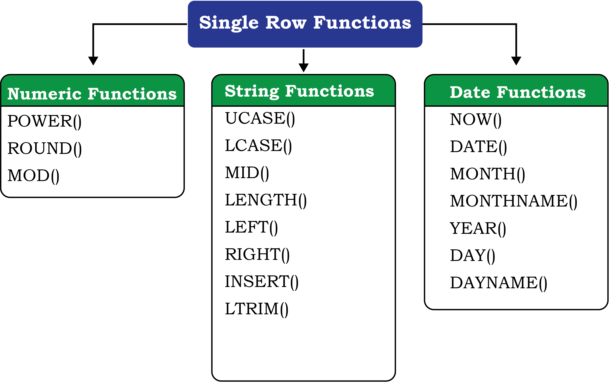

import { Example, Card, Figure, Quote, Activity, Table, Summary, Think, Collapse } from "@/components/markdown";

import { MySql } from "@/components/code"

<MySql/>

<Quote author="Lev Manovich" href="https://en.wikipedia.org/wiki/Lev_Manovich">
"Any unique image that you desire probably already exists on the internet or in
some database... The problem today is no longer how to create the right image,
but how to find an already existing one"
</Quote>

In this Chapter

- [Introduction](#section-9.1)
- [Structured Query Language (SQL)](#section-9.2)
- [Data Types and Constraints in MySQL](#section-9.3)
- [SQL for Data Definition](#section-9.4)
- [SQL for Data Manipulation](#section-9.5)
- [SQL for Data Query](#section-9.6)
- [Data Updation and Deletion](#section-9.7)
- [Functions in SQL](#section-9.8)
- [GROUP BY Clause in SQL](#section-9.9)
- [Operations on Relations](#section-9.10)
- [Using Two Relations in a Query](#section-9.11)

## 9.1 Introduction ||section-9.1||

We have learnt about Relational Database Management Systems (RDBMS) and its
purpose in the previous chapter. There are many RDBMS such as MySQL, Microsoft
SQL Server, PostgreSQL, Oracle, etc. that allow us to create a database
consisting of relations. These RDBMS also allow us to store, retrieve and
manipulate data on that database through queries. In this chapter, we will learn
how to create, populate and query databases using MySQL.

## 9.2 Structured Query Language (SQL) ||section-9.2||

One has to write application programs to access data in case of a file system.
However, for database management systems there are special kinds of languages
called query language that can be used to access and manipulate data from the
database. The Structured Query Language (SQL) is the most popular query language
used by major relational database management systems such as MySQL, ORACLE, SQL
Server, etc.

<Activity id="9.1" title="Activity 9.1">
Find and list other types of databases other than RDBMS.
</Activity>

SQL is easy to learn as the statements comprise of descriptive English words and
are not case sensitive. We can create and interact with a database using SQL
easily. Benefit of using SQL is that we do not have to specify how to get the
data from the database. Rather, we simply specify what is to be retrieved, and
SQL does the rest. Although called a query language, SQL can do much more,
besides querying. SQL provides statements for defining the structure of the
data, manipulating data in the database, declaring constraints and retrieving
data from the database in various ways, depending on our requirements.

In this chapter, we will use the StudentAttendance discussed in [chapter 8](../chapter-08) and
create a database. We will also learn how to populate databases with data,
manipulate data and retrieve data from a database through SQL queries.

### 9.2.1 Installing MySQL ||section-9.2.1||

MySQL is an open source RDBMS software which can be easily downloaded from the
official website [https://dev.mysql.com/downloads](https://dev.mysql.com/downloads). 
After installing MySQL, start MySQL service. The
appearance of `mysql>` prompt ([Figure 9.1](#figure-9.1)) means that MySQL is ready to accept SQL
statements.

<Figure id="9.1" title="Figure 9.1: MySQL Shell">
```ansi title="MySQL Shell 8.0 Command Line Client"
Enter password: ****
Welcome to the MySQL monitor.  Commands end with ; or \g.
Your MySQL connection id is 11
Server version: 8.0.40 MySQL Community Server - GPL

Copyright (c) 2000, 2024, Oracle and/or its affiliates.

Oracle is a registered trademark of Oracle Corporation and/or its
affiliates. Other names may be trademarks of their respective
owners.

Type 'help;' or '\h' for help. Type '\c' to clear the current input statement.

mysql>
```
</Figure>

Following are some important points to be kept in mind while using SQL:

- SQL is case insensitive. For example, the column names 'salary' and 'SALARY'
  are the same for SQL.
- Always end SQL statements with a semicolon (`;`).
- To enter multiline SQL statements, we don't write `;` after the first line. We
  press the Enter key to continue on the next line. The prompt mysql> then
  changes to `->`, indicating that statement is continued to the next line.
  After the last line, put `;` and press enter.

## 9.3 Data Types and Constraints in MySQL ||section-9.3||

We know that a database consists of one or more relations and each relation
(table) is made up of attributes (column). Each attribute has a data type. We
can also specify constraints for each attribute of a relation.

### 9.3.1 Data type of Attribute ||section-9.3.1||

Data type of an attribute indicates the type of data value that an attribute can
have. It also decides the operations that can be performed on the data of that
attribute. For example, arithmetic operations can be performed on numeric data
but not on character data. Commonly used data types in MySQL are numeric types,
date and time types, and string types as shown in [Table 9.1](#table-9.1).

<Table id="9.1" title="Table 9.1: Commonly used data types in MySQL">
| Data type    | Description                                                                                                                                                                                                                                                                                                                                                                               |
| :----------- | :---------------------------------------------------------------------------------------------------------------------------------------------------------------------------------------------------------------------------------------------------------------------------------------------------------------------------------------------------------------------------------------- |
| `CHAR(n)`    | Specifies character type data of length n where n could be any value from 0 to 1. `CHAR` is of fixed length, means, declaring `CHAR(10)` implies to reserve spaces for 10 characters. If data does not have 10 characters (e.g., 'city' has four characters), MySQL fills the remaining 6 characters with spaces padded on the right.                                                        |
| `VARCHAR(n)` | Specifies character type data of length where n could be any value from 0 to 65535. But unlike `CHAR`, `VARCHAR(n)` is a variable-length data type. That is, declaring `VARCHAR(30)` means a maximum of 30 characters can be stored but the actual allocated bytes will depend on the length of entered string. So 'city' in `VARCHAR(30)` will occupy space needed to store 4 characters only. |
| `INT`        | `INT` specifies an integer value. Each `INT` value occupies 4 bytes of storage. The range of unsigned values allowed in a 4 byte integer type are 0 to 4,294,967,295. For values larger than that, we have to use BIGINT, which occupies 8 bytes.                                                                                                                                             |
| `FLOAT`      | Holds numbers with decimal points. Each `FLOAT` value occupies 4 bytes.                                                                                                                                                                                                                                                                                                                     |
| `DATE`       | The `DATE` type is used for dates in 'YYYY-MM-DD' format. YYYY is the 4 digit year, MM is the 2 digit month and DD is the 2 digit date. The supported range is '1000-01-01' to '9999-12-31'.                                                                                                                                                                                                |
</Table>

<Activity id="9.2" title="Activity 9.2">
What are the other data types supported in MySQL? Are there other variants of
integer and float data type?
</Activity>

### 9.3.2 Constraints ||section-9.3.2||

Constraints are the certain types of restrictions on the data values that an
attribute can have. [Table 9.2](#table-9.2) lists some of the commonly used constraints in
SQL. They are used to ensure correctness of data. However, it is not mandatory
to define constraints for each attribute of a table.

<Table id="9.2" title="Table 9.2: Commonly used SQL Constraints">
| Constraint    | Description                                                                                          |
| :------------ | :--------------------------------------------------------------------------------------------------- |
| `NOT NULL`    | Ensures that a column cannot have `NULL` values where `NULL` means missing/unknown/not applicable value. |
| `UNIQUE`      | Ensures that all the values in a column are distinct/unique                                          |
| `DEFAULT`     | A default value specified for the column if no value is provided                                     |
| `PRIMARY KEY` | The column which can uniquely identify each row/record in a table.                                   |
| `FOREIGN KEY` | The column which refers to value of an attribute defined as primary key in another table             |
</Table>

<Think title="Think and Reflect">


Which two constraints when applied together will produce a Primary Key
constraint?

</Think>

## 9.4 SQL for Data Definition ||section-9.4||

In order to be able to store data we need to first define the relation schema.
Defining a schema includes creating a relation and giving name to a relation,
identifying the attributes in a relation, deciding upon the datatype for each
attribute and also specify the constraints as per the requirements. Sometimes,
we may require to make changes to the relation schema also. SQL allows us to
write statements for defining, modifying and deleting relation schemas. These
are part of _**Data Definition Language (DDL)**_.

We have already learned that the data are stored in relations or tables in a
database. Hence, we can say that a database is a collection of tables. The
Create statement is used to create a database and its tables (relations). Before
creating a database, we should be clear about the number of tables the database
will have, the columns (attributes) in each table along with the data type of
each column, and its constraint, if any.

### 9.4.1 `CREATE` Database ||section-9.4.1||

To create a database, we use the `CREATE DATABASE` statement as shown in the
following 

<Card>
_Syntax:_

```sql
CREATE DATABASE databasename;
```
</Card>

To create a database called StudentAttendance, we will type following command at
mysql prompt.


```sql exec
CREATE DATABASE StudentAttendance;
```
```output
Query OK, 1 row affected (0.02 sec)
```

:::note

In LINUX environment, names for database and tables are case-sensitive whereas
in WINDOWS, there is no such differentiation. However, as a good practice, it is
suggested to write database/table name in the same letter cases that were used
at the time of their creation.

:::

<Activity id="9.3" title="Activity 9.3">
Type the statement show database; Does it show the name of StudentAttendance
database?
</Activity>

A DBMS can manage multiple databases on one computer. Therefore, we need to
select the database that we want to use. To know the names of existing
databases, we use the statement `SHOW DATABASES`. From the listed databases, we
can select the database to be used. Once the database is selected, we can
proceed with creating tables or querying data.

In order to use the StudentAttendance database, the following SQL statement is
required.

```sql exec
USE StudentAttendance;
```
```output
Database changed
```

Initially, the created database is empty. It can be checked by using the show
tables statement that lists names of all the tables within a database.

```sql exec
SHOW TABLES;
```
```output
Empty set (0.06 sec)
```

### 9.4.2 `CREATE` Table ||section-9.4.2||

After creating a database StudentAttendance, we need to define relations in this
database and specify attributes for each relation along with data type and
constraint (if any) for each attribute. This is done using the `CREATE TABLE` 
statement.

<Card>
_Syntax:_

```sql
CREATE TABLE tablename(
    attributename1 DATATYPE CONSTRAINT,
    attributename2 DATATYPE CONSTRAINT,
    :
    attributenameN DATATYPE CONSTRAINT
);
```
</Card>

It is important to observe the following points with respect to the
`CREATE TABLE` statement:

- The number of columns in a table defines the degree of that relation, which is
  denoted by N.
- Attribute name specifies the name of the column in the table.
- Datatype specifies the type of data that an attribute can hold.
- Constraint indicates the restrictions imposed on the values of an attribute.
  By default, each attribute can take NULL values except for the primary key.

Let us identify data types of the attributes of table STUDENT along with their
constraints (if any). Assuming maximum students in a class to be 100 and values
of roll number in a sequence from 1 to 100, we know that 3 digits are sufficient
to store values for the attribute RollNumber. Hence, data type INT is
appropriate for this attribute. Total number of characters in a student name
(SName) can differ. Assuming maximum characters in a name as 20, we use
VARCHAR(20) for the SName column. Data type for the attribute SDateofBirth is
DATE and supposing the school uses guardian's 12 digit Aadhaar number as GUID,
we can declare GUID as CHAR (12) since Aadhaar number is of fixed length and we
are not going to perform any mathematical operation on GUID.

[Table 9.3](#table-9.3), [9.4](#table-9.4) and [9.5](#table-9.4) shows the chosen data 
type and constraint for each
attribute of the relations STUDENT, GUARDIAN and ATTENDANCE, respectively.

<Table id="9.3" title="Table 9.3: Data types and constraints for the attributes of relation STUDENT">
| Attribute Name | Data expected to be stored                     | Data type     | Constraint    |
| :------------- | :--------------------------------------------- | :------------ | :------------ |
| RollNumber     | Numeric value consisting of maximum 3 digits   | `INT`         | `PRIMARY KEY` |
| SName          | Variant length string of maximum 20 characters | `VARCHAR(20)` | `NOT NULL`    |
| SDateofBirth   | Date value                                     | `DATE`        | `NOT NULL`    |
| GUID           | Numeric value consisting of 12 digits          | `CHAR (12)`   | `FOREIGN KEY` |
</Table>

<Table id="9.4" title="Table 9.4: Data types and constraints for the attributes of relation GUARDIAN">
| Attribute Name | Data expected to be stored                          | Data type     | Constraint  |
| :------------- | :-------------------------------------------------- | :------------ | :---------- |
| GUID           | Numeric value consisting of 12 digit Aadhaar number | `CHAR (12)`   | `PRIMARY KEY` |
| GName          | Variant length string of maximum 20 characters      | `VARCHAR(20)` | `NOT NULL`    |
| GPhone         | Numeric value consisting of 10 digits               | `CHAR(10)`    | `NULL UNIQUE` |
| GAddress       | Variant length String of size 30 characters         | `VARCHAR(30)` | `NOT NULL`    |
</Table>

<Table id="9.5" title="Table 9.5: Data types and constraints for the attributes of relation ATTENDANCE">
| Attribute Name   | Data expected to be stored                   | Data type | Constraint                         |
| :--------------- | :------------------------------------------- | :-------- | :--------------------------------- |
| AttendanceDate   | Date value                                   | `DATE`      | `PRIMARY KEY`*                   |
| RollNumber       | Numeric value consisting of maximum 3 digits | `INT`       | `PRIMARY KEY`*<br/>`FOREIGN KEY` |
| AttendanceStatus | 'P' for present and 'A' for absent           | `CHAR(1)`   | `NOT NULL`                       |

*means part of composite primary key.
</Table>

Once data types and constraints are identified, let us create tables without
specifying constraints along with the attribute name for simplification. We will
learn to incorporate constraints on attributes in [Section 9.4.4](#section-9.4.4).

<Think title="Think and Reflect">


Which datatype out of Char and Varchar will you prefer for storing contact
number(mobile number)? Discuss.

</Think>

<Example id="9.1" title="Example 9.1">
Create table STUDENT.

```sql exec
CREATE TABLE STUDENT(
    RollNumber INT,
    SName VARCHAR(20),
    SDateofBirth DATE,
    GUID CHAR (12),
    PRIMARY KEY (RollNumber)
);
```
```output
Query OK, 0 rows affected (0.91 sec)
```

</Example>

:::note

"`,`" is used to separate two attributes and each statement terminates with a
semi-colon (`;`). The arrow (`->`) is an interactive continuation prompt. If we
enter an unfinished statement, the SQL shell will wait for us to enter the rest
of the statement.

:::

### 9.4.3 `DESCRIBE` Table ||section-9.4.3||

We can view the structure of an already created table using the `DESCRIBE`
statement or `DESC` statement.

<Card>
_Syntax:_

```sql
DESCRIBE tablename;
```
</Card>

```sql exec
DESCRIBE STUDENT;
```
```output
+--------------+-------------+------+-----+---------+-------+
| Field        | Type        | Null | Key | Default | Extra |
+--------------+-------------+------+-----+---------+-------+ 
| RollNumber   | int         | NO   | PRI | NULL    |       |
| SName        | varchar(20) | YES  |     | NULL    |       |
| SDateofBirth | date        | YES  |     | NULL    |       |
| GUID         | char(12)    | YES  |     | NULL    |       |
+--------------+-------------+------+-----+---------+-------+
4 rows in set (0.06 sec)
```

We can use the `SHOW TABLES` statement to see the tables in the
StudentAttendance database. So far, we have only the STUDENT table.

```sql exec
SHOW TABLES;
```
```output
+------------------------------+
| Tables_in_studentattendance  |
+------------------------------+
| student                      |
+------------------------------+
1 row in set (0.00 sec)
```

<Activity id="9.4" title="Activity 9.4">
Create the other two relations GUARDIAN and ATTENDANCE as per data types given
in [Table 9.4](#table-9.4) and [9.5](#table-9.5) respectively, and view their structures. 
Do not add any constraint in these two tables.
</Activity>

### 9.4.4 `ALTER` Table ||section-9.4.4||

After creating a table, we may realise that we need to add/remove an attribute
or to modify the datatype of an existing attribute or to add constraint in
attribute. In all such cases, we need to change or alter the structure (schema)
of the table by using the alter statement.

#### (A) Add primary key to a relation ||section-9.4.4.a||

Let us now alter the tables created in [Activity 9.4](#activity-9.4). The following MySQL
statement adds a primary key to the GUARDIAN relation:

<Collapse title="Create GUARDIAN and ATTENDANCE tables">
```sql exec
CREATE TABLE GUARDIAN (
    GUID CHAR(12),
    GName VARCHAR(20),
    GPhone CHAR(10),
    GAddress VARCHAR(30)
);
CREATE TABLE ATTENDANCE (
    AttendanceDate DATE,
    RollNumber INT,
    AttendanceStatus CHAR(1)
);
```
</Collapse>

```sql exec
ALTER TABLE GUARDIAN ADD PRIMARY KEY (GUID);
```
```output
Query OK, 0 rows affected (1.14 sec)
Records: 0 Duplicates: 0 Warnings: 0
```

Now let us add the primary key to the ATTENDANCE relation. The primary key of
this relation is a composite key made up of two attributes - AttendanceDate and
RollNumber.

```sql exec
ALTER TABLE ATTENDANCE
ADD PRIMARY KEY(AttendanceDate, RollNumber);
```
```output
Query OK, 0 rows affected (0.52 sec)
Records: 0 Duplicates: 0 Warnings: 0
```

<Activity id="9.5" title="Activity 9.5">
Add foreign key in the ATTENDANCE table (use [Figure 9.1](#figure-9.1)) to identify referencing
and referenced tables.
</Activity>

#### (B) Add foreign key to a relation ||section-9.4.4.b||

Once primary keys are added, the next step is to add foreign keys to the
relation (if any). Following points need to be observed while adding foreign key
to a relation:

- The referenced relation must be already created.
- The referenced attribute(s) must be part of the primary key of the referenced
  relation.
- Data types and size of referenced and referencing attributes must be the same.

<Card>
_Syntax:_

```sql
ALTER TABLE table_name 
ADD FOREIGN KEY(attribute_name) 
REFERENCES referenced_table_name(attribute_name);
```
</Card>

Let us now add foreign key to the table STUDENT. [Table 9.3](#table-9.3) shows that attribute
GUID (the referencing attribute) is a foreign key and it refers to attribute
GUID (the referenced attribute) of table GUARDIAN. Hence, STUDENT is the
referencing table and GUARDIAN is the referenced table as shown in [Figure 8.4](../chapter-08/#figure-8.4) in
the previous chapter.

```sql exec
ALTER TABLE STUDENT 
ADD FOREIGN KEY(GUID)
REFERENCES GUARDIAN(GUID);
```
```output
Query OK, 0 rows affected (0.75 sec)
Records: 0 Duplicates: 0 Warnings: 0
```

<Think title="Think and Reflect">


Name foreign keys in table ATTENDANCE and STUDENT. Is there any foreign key in
table GUARDIAN.

</Think>

#### (C) Add constraint `UNIQUE` to an existing attribute ||section-9.4.4.c||

In GUARDIAN table, the attribute GPhone has a constraint `UNIQUE` which means no
two values in that column should be the same.

<Card>
_Syntax:_

```sql
ALTER TABLE table_name 
ADD UNIQUE (attribute_name);
```
</Card>

Let us now add the constraint `UNIQUE` with the attribute GPhone of the table
GUARDIAN as shown at [table 9.4](#table-9.4).

```sql exec
ALTER TABLE GUARDIAN 
ADD UNIQUE(GPhone);
```
```output
Query OK, 0 rows affected (0.44 sec)
Records: 0 Duplicates: 0 Warnings: 0
```

#### (D) Add an attribute to an existing table ||section-9.4.4.d||

Sometimes, we may need to add an additional attribute in a table. It can be done
using the `ADD` attribute statement as shown in the following.

<Card>
_Syntax:_

```sql
ALTER TABLE table_name 
ADD attribute_name DATATYPE;
```
</Card>

Suppose, the principal of the school has decided to award scholarship to some
needy students for which income of the guardian must be known. But, the school
has not maintained the income attribute with table GUARDIAN so far. Therefore,
the database designer now needs to add a new attribute Income of data type `INT`
in the table GUARDIAN.

```sql exec
ALTER TABLE GUARDIAN 
ADD income INT;
```
```output
Query OK, 0 rows affected (0.47 sec)
Records: 0 Duplicates: 0 Warnings: 0
```

#### (E) Modify datatype of an attribute ||section-9.4.4.e||

We can change data types of the existing attributes of a table using the
following `ALTER` statement.

<Card>
_Syntax:_

```sql
ALTER TABLE table_name 
MODIFY attribute DATATYPE;
```
</Card>

Suppose we need to change the size of the attribute GAddress from `VARCHAR(30)` to
`VARCHAR(40)` of the GUARDIAN table. The MySQL statement will be:

```sql exec
ALTER TABLE GUARDIAN 
MODIFY GAddress VARCHAR(40); 
```
```output
Query OK, 0 rows affected (0.11 sec)
Records: 0 Duplicates: 0 Warnings: 0
```

#### (F) Modify constraint of an attribute ||section-9.4.4.f||

When we create a table, by default each attribute takes `NULL` value except for
the attribute defined as primary key. We can change an attribute's constraint
from `NULL` to `NOT NULL` using an alter statement.

<Card>
_Syntax:_

```sql
ALTER TABLE table_name 
MODIFY attribute DATATYPE NOT NULL;
```
</Card>

:::note

We have to specify the data type of the attribute along with constraint `NOT NULL`
while using `MODIFY`.

:::

To associate `NOT NULL` constraint with attribute SName of table STUDENT ([table
9.3](#table-9.3)), we write the following MySQL statement:

```sql exec
ALTER TABLE STUDENT 
MODIFY SName VARCHAR(20) NOT NULL;
```
```output
Query OK, 0 rows affected (0.47 sec)
Records: 0 Duplicates: 0 Warnings: 0
```

<Think title="Think and Reflect">


What are the minimum and maximum income values that can be entered in the income
attribute given the data type is `INT`?

</Think>

#### (G) Add default value to an attribute ||section-9.4.4.g||

If we want to specify default value for an attribute, then use the following

<Card>
_Syntax:_

```sql
ALTER TABLE table_name 
MODIFY attribute DATATYPE DEFAULT default_value;
```
</Card>

To set default value of SDateofBirth of STUDENT to 15th May 2000, write the
following statement:

```sql exec
ALTER TABLE STUDENT 
MODIFY SDateofBirth DATE DEFAULT '2000-05-15';
```
```output
Query OK, 0 rows affected (0.08 sec)
Records: 0 Duplicates: 0 Warnings: 0
```

:::note

We have to specify the data type of the attribute along with `DEFAULT` while
using `MODIFY`.

:::

#### (H) Remove an attribute ||section-9.4.4.h||

Using `ALTER`, we can remove attributes from a table, as shown in the following

<Card>
_Syntax:_

```sql
ALTER TABLE table_name 
DROP attribute;
```
</Card>

To remove the attribute income from table GUARDIAN ([Table 9.4](#table-9.4)), write the
following MySQL statement:

```sql exec
ALTER TABLE GUARDIAN DROP income;
```
```output
Query OK, 0 rows affected (0.42 sec)
Records: 0 Duplicates: 0 Warnings: 0
```

#### (I) Remove primary key from the table ||section-9.4.4.i||

Sometime there may be a requirement to remove primary key constraint from the
table. In that case, `ALTER TABLE` command can be used in the following way:

<Card>
_Syntax:_

```sql
ALTER TABLE table_name 
DROP PRIMARY KEY;
```
</Card>

To remove primary key of table GUARDIAN ([Figure 9.4](#figure-9.4)), write the following MySQL
statement:

```sql exec
ALTER TABLE GUARDIAN DROP PRIMARY KEY;
```
```output
Query OK, 0 rows affected (0.72 sec)
Records: 0 Duplicates: 0 Warnings: 0
```

:::note

We have dropped the primary key from the GUARDIAN table, but each table should
have a primary key to maintain uniqueness. Hence, we have to use the `ADD`
statement with the `ALTER TABLE` command to specify the primary key for the
GUARDIAN table as shown in earlier examples.

:::

### 9.4.5 `DROP` Statement ||section-9.4.5||

Sometimes a table in a database or the database itself needs to be removed. We
can use a `DROP` statement to remove a database or a table permanently from the
system. However, one should be very cautious while using this statement as it
cannot be undone.

<Card>
Syntax to drop a table:

```sql
DROP TABLE table_name;
```
</Card>

<Card>
Syntax to drop a database:

```sql
DROP DATABASE database_name;
```
</Card>

:::note

Using the `DROP` statement to remove a database will ultimately remove all the
tables within it.

:::

## 9.5 SQL for Data Manipulation ||section-9.5||

In the previous section, we created the database StudentAttendance having three
relations STUDENT, GUARDIAN and ATTENDANCE. When we create a table, only its
structure is created but the table has no data. To populate records in the
table, `INSERT` statement is used. Also, table records can be deleted or updated
using `DELETE` and `UPDATE` statements. These SQL statements are part of _**Data
Manipulation Language (DML)**_.

Data Manipulation using a database means either insertion of new data, removal
of existing data or modification of existing data in the database

### 9.5.1 INSERTION of Records ||section-9.5.1||

`INSERT INTO` statement is used to insert new records in a table.

<Card>
Its syntax is:

```sql
INSERT INTO tablename
VALUES(value 1, value 2,....);
```
</Card>

Here, value 1 corresponds to attribute 1, value 2 corresponds to attribute 2 and
so on. Note that we need not to specify attribute names in the insert statement
if there are exactly the same numbers of values in the `INSERT` statement as the
total number of attributes in the table.

:::caution

While populating records in a table with foreign key, ensure that records in
referenced tables are already populated.

:::

Let us insert some records in the StudentAttendance database. We shall insert
records in the GUARDIAN table first as it does not have any foreign key. A set
of sample records for GUARDIAN table is shown in the given table ([Table 9.6](#table-9.6)).

<Table id="9.6" title="Table 9.6: Sample records for GUARDIAN table">
| GUID         | GName           | GPhone     | GAddress                               |
| :----------- | :-------------- | :--------- | :------------------------------------- |
| 444444444444 | Amit Ahuja      | 5711492685 | G-35, Ashok Vihar, Delhi               |
| 111111111111 | Baichung Bhutia | 3612967082 | Flat no. 5, Darjeeling Appt., Shimla   |
| 101010101010 | Himanshu Shah   | 4726309212 | 26/77, West Patel Nagar, Ahmedabad     |
| 333333333333 | Danny Dsouza    |            | S -13, Ashok Village, Daman            |
| 466444444666 | Sujata P.       | 3801923168 | HNO-13, B- block, Preet Vihar, Madurai |
</Table>

The following insert statement adds the first record in the table:

```sql exec
INSERT INTO GUARDIAN
VALUES (
        444444444444,
        'Amit Ahuja',
        5711492685,
        'G-35,Ashok vihar, Delhi'
    );
```
```output
Query OK, 1 row affected (0.01 sec)
```

<Activity id="9.6" title="Activity 9.6">
Write SQL statements to insert the remaining 3 rows of [table 9.6](#table-9.6)
in table GUARDIAN.
</Activity>

We can use the SQL statement `SELECT *` from table_name to view the inserted
records. The `SELECT` statement will be explained in the next section.

```sql exec
SELECT * from  GUARDIAN;
```
```output
+--------------+------------+------------+-------------------------+
| GUID         | GName      | GPhone     | GAddress                |
+--------------+------------+------------+-------------------------+
| 444444444444 | Amit Ahuja | 5711492685 | G-35,Ashok vihar, Delhi |
+--------------+------------+------------+-------------------------+
1 row in set (0.01 sec)
```

If we want to insert values only for some of the attributes in a table
(supposing other attributes having `NULL` or any other default value), then we
shall specify the attribute names in which the values are to be inserted using
the following syntax of `INSERT INTO` statement.

<Card>
_Syntax:_

```sql
INSERT INTO tablename (column1, column2, ...) 
VALUES (value1, value2,  ...);
```
</Card>

To insert the fourth record of [Table 9.6](#table-9.6) where GPhone is not given, we need to
insert values in the other three fields (GPhone was set to `NULL` by default at
the time of table creation). In this case, we have to specify the names of
attributes in which we want to insert values. The values must be given in the
same order in which attributes are written in `INSERT` statement.

```sql exec
INSERT INTO GUARDIAN(GUID, GName, GAddress)
VALUES (
        333333333333,
        'Danny Dsouza',
        'S -13, Ashok Village, Daman'
    );
```
```output
Query OK, 1 row affected (0.03 sec)
```

:::note

Text and date values must be enclosed in `' '` (single quotes).

:::

```sql exec
SELECT * FROM GUARDIAN;
```
```output
+--------------+--------------+-----------+---------------------------+
| GUID         | GName        | Gphone    | GAddress                  |
+--------------+--------------+-----------+---------------------------+
| 333333333333 | Danny Dsouza | NULL      | S -13, Ashok Village,Daman|
| 444444444444 | Amit Ahuja   | 5711492685| G-35, Ashok vihar, Delhi  |
+--------------+--------------+-----------+---------------------------+
2 rows in set (0.00 sec)
```

<Collapse title="Inserting remaining records in GUARDIAN table">
```sql exec
INSERT INTO GUARDIAN
VALUES (
        111111111111,
        'Baichung Bhutia',
        3612967082,
        'Flat no. 5, Darjeeling Appt., Shimla'
    ),
    (
        101010101010,
        'Himanshu Shah',
        4726309212,
        '26/77, West Patel Nagar, Ahmedabad'
    ),
    (
        466444444666,
        'Sujata P.',
        3801923168,
        'HNO-13, B- block, Preet Vihar, Madurai'
    );
SELECT *
FROM GUARDIAN;
```
</Collapse>

Let us now insert the records given in [Table 9.7](#table-9.7) into the STUDENT table.

<Table id="9.7" title="Table 9.7 STUDENT Table">
| RollNumber | SName        | SDateofBirth | GUID         |
| ---------- | :----------- | :----------- | :----------- |
| 1          | Atharv Ahuja | 2003-05-15   | 444444444444 |
| 2          | Daizy Bhutia | 2002-02-28   | 111111111111 |
| 3          | Taleem Shah  | 2002-02-28   |              |
| 4          | John Dsouza  | 2003-08-18   | 333333333333 |
| 5          | Ali Shah     | 2003-07-05   | 101010101010 |
| 6          | Manika P.    | 2002-03-10   | 466444444666 |
</Table>

<Activity id="9.7" title="Activity 9.7">
Write SQL statements to insert the remaining 4 rows of [table 9.7](#table-9.7) in table
STUDENT.
</Activity>

To insert the first record of [Table 9.7](#table-9.7), we write the following MySQL statement

```sql exec
INSERT INTO STUDENT
VALUES(
        1,
        'Atharv Ahuja',
        '2003-05-15',
        444444444444
    );
```
```output
Query OK, 1 row affected (0.11 sec)
```
<center>
OR
</center>
```sql exec
INSERT INTO STUDENT (
        RollNumber,
        SName,
        SDateofBirth,
        GUID
    )
VALUES (
        1,
        'Atharv Ahuja',
        '2003-05-15',
        444444444444
    );
```
```output
Query OK, 1 row affected (0.02 sec)
```

Recall that Date is stored in 'YYYY-MM-DD' format.

```sql exec
SELECT * from STUDENT;
```
```output
+------------+--------------+--------------+--------------+
| RollNumber | SName        | SDateofBirth | GUID         |
+------------+--------------+--------------+--------------+
| 1          | Atharv Ahuja | 2003-05-15   | 444444444444 |
+------------+--------------+--------------+--------------+
1 row in set (0.00 sec)
```

Let us now insert the third record of [Table 9.7](#table-9.7) where GUID is `NULL`. Recall that
GUID is foreign key of this table and thus can take `NULL` value. Hence, we can
put `NULL` value for GUID and insert the record by using the following statement:

```sql exec
INSERT INTO STUDENT 
VALUES(3, 'Taleem Shah','2002-02-28', NULL); 
```
```output
Query OK, 1 row affected (0.05 sec)
```

```sql exec
SELECT * from STUDENT;
```
```output
+------------+--------------+--------------+--------------+
| RollNumber | SName        | SDateofBirth | GUID         |
+------------+--------------+--------------+--------------+
| 1          | Atharv Ahuja | 2003-05-15   | 444444444444 |
| 3          | Taleem Shah  | 2002-02-28   | NULL         |
+------------+--------------+--------------+--------------+
2 rows in set (0.00 sec)
```

We had to write `NULL` in the above insert statement because we are not mentioning
the column names. Otherwise, we should mention the names of attributes along
with the values if we need to insert data only for certain attributes, as shown
in the following query:

```sql exec
INSERT INTO STUDENT (RollNumber, SName, SDateofBirth)
VALUES (3, 'Taleem Shah', '2002-02-28');
```
```output
Query OK, 1 row affected (0.05 sec)
```

<Collapse title="Inserting remaining records in STUDENT table">
```sql exec
INSERT INTO STUDENT
VALUES (2, 'Daizy Bhutia', '2002-02-28', 111111111111),
    (4, 'John Dsouza', '2003-08-18', 333333333333),
    (5, 'Ali Shah', '2003-07-05', 101010101010),
    (6, 'Manika P.', '2002-03-10', 466444444666);
SELECT *
FROM STUDENT;
```
</Collapse>

<Think title="Think and Reflect">
- Which of the two insert statement should be used when the order of data to be
  inserted are not known?
- Can we insert two records with the same roll number?
</Think>

## 9.6 SQL for Data Query ||section-9.6||

So far we have learnt how to create a database and how to store and manipulate
data in them. We are interested in storing data in a database as it is easier to
retrieve data in future from databases in whatever way we want. SQL provides
efficient mechanisms to retrieve data stored in multiple tables in MySQL
database (or any other RDBMS). The SQL statement `SELECT` is used to retrieve
data from the tables in a database and is also called a query statement.

### 9.6.1 `SELECT` Statement ||section-9.6.1||

The SQL statement `SELECT` is used to retrieve data from the tables in a
database and the output is also displayed in tabular form.

<Card>
_Syntax:_

```sql
SELECT attribute1, attribute2, ...
FROM table_name
WHERE condition;
```
</Card>

Here, attribute1, attribute2, ... are the column names of the table table_name
from which we want to retrieve data. The `FROM` clause is always written with
`SELECT` clause as it specifies the name of the table from which data is to be
retrieved. The `WHERE` clause is optional and is used to retrieve data that meet
specified condition(s).

To select all the data available in a table, we use the following select
statement:

<Card>
```sql
SELECT * FROM table_name;
```
</Card>

<Example id="9.2" title="Example 9.2">

The following query retrieves the name and date of birth of student with roll
number 1:

```sql exec
SELECT SName,
    SDateofBirth
FROM STUDENT
WHERE RollNumber = 1;
```
```output
+--------------+--------------+
| SName        | SDateofBirth |
+--------------+--------------+
| Atharv Ahuja | 2003-05-15   |
+--------------+--------------+
1 row in set (0.03 sec)
```

</Example>

<Think title="Think and Reflect">


Think and list few examples from your daily life where storing the data in the
database and querying the same can be helpful.

</Think>

### 9.6.2 QUERYING using Database OFFICE ||section-9.6.2||

Organisations maintain databases to store data in the form of tables. Let us
consider the database OFFICE of an organisation that has many related tables
like EMPLOYEE, DEPARTMENT and so on. Every EMPLOYEE in the database is assigned
to a DEPARTMENT and his/her Department number (DeptId) is stored as a foreign
key in the table EMPLOYEE. Let us consider the relation 'EMPLOYEE' as shown in
[Table 9.8](#table-9.8) and apply the `SELECT` statement to retrieve data:

<Table id="9.8" title="Table 9.8: Records to be inserted into the EMPLOYEE table">
| EmpNo | Ename    | Salary | Bonus | DeptId |
| :---- | :------- | :----- | :---- | :----- |
| 101   | Aaliya   | 10000  | 234   | D02    |
| 102   | Kritika  | 60000  | 123   | D01    |
| 103   | Shabbbir | 45000  | 566   | D01    |
| 104   | Gurpreet | 19000  | 565   | D04    |
| 105   | Joseph   | 34000  | 875   | D03    |
| 106   | Sanya    | 48000  | 695   | D02    |
| 107   | Vergese  | 15000  |       | D01    |
| 108   | Nachaobi | 29000  |       | D05    |
| 109   | Daribha  | 42000  |       | D04    |
| 110   | Tanya    | 50000  | 467   | D05    |
</Table>

#### (A) Retrieve selected columns ||section-9.6.2.a||

The following query selects employee numbers of all the employees:

<Collapse title="Create OFFICE database">
```sql exec
CREATE DATABASE OFFICE;
USE OFFICE;
CREATE TABLE EMPLOYEE(
    EmpNo INT,
    Ename VARCHAR(20),
    Salary INT,
    Bonus INT,
    DeptId CHAR(3)
);
INSERT INTO EMPLOYEE (EmpNo, Ename, Salary, Bonus, DeptId)
VALUES (101, 'Aaliya', 10000, 234, 'D02'),
    (102, 'Kritika', 60000, 123, 'D01'),
    (103, 'Shabbbir', 45000, 566, 'D01'),
    (104, 'Gurpreet', 19000, 565, 'D04'),
    (105, 'Joseph', 34000, 875, 'D03'),
    (106, 'Sanya', 48000, 695, 'D02'),
    (107, 'Vergese', 15000, NULL, 'D01'),
    (108, 'Nachaobi', 29000, NULL, 'D05'),
    (109, 'Daribha', 42000, NULL, 'D04'),
    (110, 'Tanya', 50000, 467, 'D05');
```
</Collapse>

```sql exec
SELECT EmpNo FROM EMPLOYEE;
```
```output
+-------+
| EmpNo |
+-------+
| 101   |
| 102   |
| 103   |
| 104   |
| 105   |
| 106   |
| 107   |
| 108   |
| 109   |
| 110   |
+-------+
10 rows in set (0.41 sec)
```

The following query selects the employee number and employee name of all the
employees, we write:

```sql exec
SELECT EmpNo, Ename FROM EMPLOYEE;
```
```output
+-------+----------+
| EmpNo | Ename    |
+-------+----------+
| 101   | Aaliya   |
| 102   | Kritika  |
| 103   | Shabbir  |
| 104   | Gurpreet |
| 105   | Joseph   |
| 106   | Sanya    |
| 107   | Vergese  |
| 108   | Nachaobi |
| 109   | Daribha  |
| 110   | Tanya    | 
+-------+----------+
10 rows in set (0.00 sec)
```

#### (B) Renaming of columns ||section-9.6.2.b||

In case we want to rename any column while displaying the output, it can be done
by using the alias `AS`. The following query selects Employee name as Name in
the output for all the employees:

```sql exec
SELECT EName AS Name FROM EMPLOYEE;
```
```output
+----------+
| Name     |
+----------+
| Aaliya   |
| Kritika  |
| Shabbir  |
| Gurpreet |
| Joseph   |
| Sanya    |
| Vergese  |
| Nachaobi |
| Daribha  |
| Tanya    |
+----------+
10 rows in set (0.00 sec)
```

<Example id="9.3" title="Example 9.3">

Select names of all employees along with their annual income (calculated as
Salary*12). While displaying the query result, rename the column EName as Name

```sql exec
SELECT EName AS Name,
    Salary * 12
FROM EMPLOYEE;
```
```output
+----------+-----------+
| Name     | Salary*12 |
+----------+-----------+
| Aaliya   | 120000    |
| Kritika  | 720000    |
| Shabbir  | 540000    |
| Gurpreet | 228000    |
| Joseph   | 408000    |
| Sanya    | 576000    |
| Vergese  | 180000    |
| Nachaobi | 348000    |
| Daribha  | 504000    |
| Tanya    | 600000    |
+----------+-----------+
10 rows in set (0.02 sec)
```

Observe that in the output, Salary*12 is displayed as the column name for the
Annual Income column. In the output table, we can use alias to rename that
column as Annual Income as shown below:

```sql exec
SELECT Ename AS Name,
    Salary * 12 AS 'Annual Income'
FROM EMPLOYEE;
```
```output
+----------+---------------+
| Name     | Annual Income |
+----------+---------------+
| Aaliya   | 120000        |
| Kritika  | 720000        |
| Shabbir  | 540000        |
| Gurpreet | 228000        |
| Joseph   | 408000        |
| Sanya    | 576000        |
| Vergese  | 180000        |
| Nachaobi | 348000        |
| Daribha  | 504000        |
| Tanya    | 600000        |
+----------+---------------+
10 rows in set (0.00 sec)
```
</Example>

:::note

Annual Income will not be added as a new column in the database table. It is
just for displaying the output of the query.

:::

If an aliased column name has space as in the case of Annual Income, it should
be enclosed in quotes as 'Annual Income'.

#### (C) `DISTINCT` Clause ||section-9.6.2.c||

By default, SQL shows all the data retrieved through query as output. However,
there can be duplicate values. The `SELECT` statement when combined with
`DISTINCT` clause, returns records without repetition (distinct records). For
example, while retrieving a department number from employee relation, there can
be duplicate values as many employees are assigned to the same department. To
select unique department number for all the employees, we use `DISTINCT` as
shown below:

```sql exec
SELECT DISTINCT DeptId FROM EMPLOYEE;
```
```output
+--------+
| DeptId |
+--------+
| D02    |
| D01    |
| D04    |
| D03    |
| D05    |
+--------+
5 rows in set (0.03 sec)
```

#### (D) `WHERE` Clause ||section-9.6.2.d||

The `WHERE` clause is used to retrieve data that meet some specified conditions.
In the OFFICE database, more than one employee can have the same salary.
Following query gives distinct salaries of the employees working in the
department number D01:

```sql exec
SELECT DISTINCT Salary
FROM EMPLOYEE
WHERE Deptid='D01';
```
```output
+--------+
| Salary |
+--------+
| 60000  |
| 45000  |
| 15000  |
+--------+
3 rows in set (0.02 sec)
```

As the column DeptId is of string type, its values are enclosed in quotes
('D01').

In the above example, `=` operator is used in the `WHERE` clause. Other relational
operators (`<`, `<=`, `>`, `>=`, `!=`) can be used to specify such conditions.
The logical operators `AND`, `OR`, and `NOT` are used to combine multiple
conditions.

<Example id="9.4" title="Example 9.4">

Display all the details of those employees of D04 department who earn more
than 5000.

```sql exec
SELECT *
FROM EMPLOYEE
WHERE Salary > 5000
    AND DeptId = 'D04';
``` 
```output 
+-------+----------+--------+-------+--------+
| EmpNo | Ename    | Salary | Bonus | DeptId |
+-------+----------+--------+-------+--------+
| 104   | Gurpreet | 19000  | 565   | D04    |
| 109   | Daribha  | 42000  | NULL  | D04    |
+-------+----------+--------+-------+--------+
2 rows in set (0.00 sec)
```
</Example>

<Example id="9.5" title="Example 9.5">

The following query selects records of all the employees except Aaliya.

```sql exec
SELECT *
FROM EMPLOYEE
WHERE NOT Ename = 'Aaliya';
```
```output
+-------+----------+--------+-------+--------+
| EmpNo | Ename    | Salary | Bonus | DeptId |
+-------+----------+--------+-------+--------+
| 102   | Kritika  | 60000 | 123    | D01    |
| 103   | Shabbir  | 45000 | 566    | D01    |
| 104   | Gurpreet | 19000 | 565    | D04    |
| 105   | Joseph   | 34000 | 875    | D03    |
| 106   | Sanya    | 48000 | 695    | D02    |
| 107   | Vergese  | 15000 | NULL   | D01    |
| 108   | Nachaobi | 29000 | NULL   | D05    |
| 109   | Daribha  | 42000 | NULL   | D04    |
| 110   | Tanya    | 50000 | 467    | D05    |
+-------+----------+--------+-------+--------+
9 rows in set (0.00 sec)
```
</Example>

<Think title="Think and Reflect">


What will happen if in the above query we write "Aaliya" as "AALIYA" or "aaliya"
or "AaLIYA"? Will the query generate the same output or an error?

</Think>

<Example id="9.6" title="Example 9.6">

The following query selects the name and department number of all those
employees who are earning salary between 20000 and 50000 (both values
inclusive).

```sql exec
SELECT Ename,
    DeptId
FROM EMPLOYEE
WHERE Salary >= 20000
    AND Salary <= 50000;
```
```output
+----------+--------+
| Ename    | DeptId |
+----------+--------+
| Shabbir  | D01    |
| Joseph   | D03    |
| Sanya    | D02    |
| Nachaobi | D05    |
| Daribha  | D04    |
| Tanya    | D05    |
+----------+--------+
6 rows in set (0.00 sec)
```
</Example>

```sql exec
SELECT * FROM EMPLOYEE 
WHERE Salary > 5000 OR DeptId = 20;
```

The query in [example 9.6](#example-9.6) defines a range that can also be checked using a
comparison operator `BETWEEN`, as shown below:

```sql exec
SELECT Ename,
    DeptId
FROM EMPLOYEE
WHERE Salary BETWEEN 20000 AND 50000;
```
```output
+----------+--------+
| Ename    | DeptId |
+----------+--------+
| Shabbir  | D01    |
| Joseph   | D03    |
| Sanya    | D02    |
| Nachaobi | D05    |
| Daribha  | D04    |
| Tanya    | D05    |
+----------+--------+
6 rows in set (0.03 sec)
```

:::note

The `BETWEEN` operator defines the range of values in which the column value must
fall into, to make the condition true.

:::

<Activity id="9.8" title="Activity 9.8">

Compare the output produced by the query in [Example 9.6](#example-9.6) and the output of the
following query and differentiate between the `OR` and `AND` operators.

</Activity>

<Example id="9.7" title="Example 9.7">

The following query selects details of all the employees who work in the
departments having deptid D01, D02 or D04.

```sql exec
SELECT *
FROM EMPLOYEE
WHERE DeptId = 'D01'
    OR DeptId = 'D02'
    OR DeptId = 'D04';
```
```output
+-------+----------+--------+-------+--------+
| EmpNo | Ename    | Salary | Bonus | DeptId |
+-------+----------+--------+-------+--------+
| 101   | Aaliya   | 10000  | 234   | D02    |
| 102   | Kritika  | 60000  | 123   | D01    |
| 103   | Shabbir  | 45000  | 566   | D01    |
| 104   | Gurpreet | 19000  | 565   | D04    |
| 106   | Sanya    | 48000  | 695   | D02    |
| 107   | Vergese  | 15000  | NULL  | D01    |
| 109   | Daribha  | 42000  | NULL  | D04    | 
+-------+----------+--------+-------+--------+
7 rows in set (0.00 sec)
```
</Example>

#### (E) Membership operator `IN` ||section-9.6.2.e||

The `IN` operator compares a value with a set of values and returns true if the
value belongs to that set. The above query can be rewritten using `IN` operator
as shown below:

```sql exec
SELECT *
FROM EMPLOYEE
WHERE DeptId IN ('D01', 'D02', 'D04');
```
```output
+-------+----------+--------+-------+--------+
| EmpNo | Ename    | Salary | Bonus | DeptId |
+-------+----------+--------+-------+--------+
| 101   | Aaliya   | 10000  | 234   | D02    |
| 102   | Kritika  | 60000  | 123   | D01    |
| 103   | Shabbir  | 45000  | 566   | D01    |
| 104   | Gurpreet | 19000  | 565   | D04    |
| 106   | Sanya    | 48000  | 695   | D02    |
| 107   | Vergese  | 15000  | NULL  | D01    |
| 109   | Daribha  | 42000  | NULL  | D04    |
+-------+----------+--------+-------+--------+
7 rows in set (0.00 sec)
```

<Example id="9.8" title="Example 9.8">

The following query selects details of all the employees except those working in
department number D01 or D02.

```sql exec
SELECT *
FROM EMPLOYEE
WHERE DeptId NOT IN('D01', 'D02');
```
```output
+-------+----------+--------+-------+--------+
| EmpNo | Ename    | Salary | Bonus | DeptId |
+-------+----------+--------+-------+--------+
| 104   | Gurpreet | 19000  | 565   | D04    |
| 105   | Joseph   | 34000  | 875   | D03    |
| 108   | Nachaobi | 29000  | NULL  | D05    |
| 109   | Daribha  | 42000  | NULL  | D04    |
| 110   | Tanya    | 50000  | 467   | D05    |
+-------+----------+--------+-------+--------+
5 rows in set (0.00 sec)
```
</Example>

:::note

Here we need to combine `NOT` with `IN` as we want to retrieve all records except
with DeptId D01 and D02.

:::

#### (F) `ORDER BY` Clause ||section-9.6.2.f||

`ORDER BY` clause is used to display data in an ordered form with respect to a
specified column. By default, `ORDER BY` displays records in ascending order of
the specified column's values. To display the records in descending order, the
`DESC` (means descending) keyword needs to be written with that column.

<Example id="9.9" title="Example 9.9">

The following query selects details of all the employees in ascending order of
their salaries.

```sql exec
SELECT * 
FROM EMPLOYEE
ORDER BY Salary;
```
```output
+-------+----------+--------+-------+--------+
| EmpNo | Ename    | Salary | Bonus | DeptId |
+-------+----------+--------+-------+--------+
| 101   | Aaliya   | 10000  | 234   | D02    |
| 107   | Vergese  | 15000  | NULL  | D01    |
| 104   | Gurpreet | 19000  | 565   | D04    |
| 108   | Nachaobi | 29000  | NULL  | D05    |
| 105   | Joseph   | 34000  | 875   | D03    |
| 109   | Daribha  | 42000  | NULL  | D04    |
| 103   | Shabbir  | 45000  | 566   | D01    |
| 106   | Sanya    | 48000  | 695   | D02    |
| 110   | Tanya    | 50000  | 467   | D05    |
| 102   | Kritika  | 60000  | 123   | D01    |
+-------+----------+--------+-------+--------+
10 rows in set (0.05 sec)
```
</Example>

<Example id="9.10" title="Example 9.10">

Select details of all the employees in descending order of their salaries.

```sql exec
SELECT * 
FROM EMPLOYEE
ORDER BY Salary DESC;
```
```output
+-------+----------+--------+-------+--------+
| EmpNo | Ename    | Salary | Bonus | DeptId |
+-------+----------+--------+-------+--------+
| 102   | Kritika  | 60000  | 123   | D01    |
| 110   | Tanya    | 50000  | 467   | D05    |
| 106   | Sanya    | 48000  | 695   | D02    |
| 103   | Shabbir  | 45000  | 566   | D01    |
| 109   | Daribha  | 42000  | NULL  | D04    |
| 105   | Joseph   | 34000  | 875   | D03    |
| 108   | Nachaobi | 29000  | NULL  | D05    |
| 104   | Gurpreet | 19000  | 565   | D04    |
| 107   | Vergese  | 15000  | NULL  | D01    |
| 101   | Aaliya   | 10000  | 234   | D02    |
+-------+----------+--------+-------+--------+
10 rows in set (0.00 sec)
```
</Example>

<Activity id="9.9" title="Activity 9.9">

Execute the following 2 queries and find out what will happen if we specify two
columns in the `ORDER BY` clause:

```sql
SELECT *
FROM EMPLOYEE
ORDER BY Salary,
    Bonus;
```

```sql
SELECT *
FROM EMPLOYEE
ORDER BY Salary,
    Bonus DESC;
```
</Activity>

#### (G) Handling `NULL` Values ||section-9.6.2.g||

SQL supports a special value called `NULL` to represent a missing or unknown
value. For example, the Gphone column in the GUARDIAN table can have missing
value for certain records. Hence, `NULL` is used to represent such unknown values.
It is important to note that `NULL` is different from 0 (zero). Also, any
arithmetic operation performed with `NULL` value gives `NULL`. For example: `5 + NULL
= NULL` because `NULL` is unknown hence the result is also unknown. In order to
check for `NULL` value in a column, we use `IS NULL` operator.

<Example id="9.11" title="Example 9.11">

The following query selects details of all those employees who have not been
given a bonus. This implies that the bonus column will be blank.

```sql exec
SELECT * 
FROM EMPLOYEE
WHERE Bonus IS NULL;
```
```output
+-------+----------+--------+-------+--------+
| EmpNo | Ename    | Salary | Bonus | DeptId |
+-------+----------+--------+-------+--------+
| 107   | Vergese  | 15000  | NULL  | D01    |
| 108   | Nachaobi | 29000  | NULL  | D05    |
| 109   | Daribha  | 42000  | NULL  | D04    |
+-------+----------+--------+-------+--------+
3 rows in set (0.00 sec)
```
</Example>

<Example id="9.12" title="Example 9.12">

The following query selects names of all employees who have been given a bonus
(i.e., Bonus is not null) and works in the department D01.

```sql exec
SELECT EName
FROM EMPLOYEE
WHERE Bonus IS NOT NULL
    AND DeptID = 'D01';
```
```output
+----------+
| EName    |
+----------+
| Kritika  |
| Shabbir  |
+----------+
2 rows in set (0.00 sec)
```
</Example>

#### (H) Substring pattern matching ||section-9.6.2.h||

Many a times we come across situations where we do not want to query by matching
exact text or value. Rather, we are interested to find matching of only a few
characters or values in column values. For example, to find out names starting
with "T" or to find out pin codes starting with '60'. This is called substring
pattern matching. We cannot match such patterns using `=` operator as we are not
looking for an exact match. SQL provides a `LIKE` operator that can be used with
the `WHERE` clause to search for a specified pattern in a column.

The `LIKE` operator makes use of the following two wild card characters:

- **`%` (per cent) -** used to represent zero, one, or multiple characters

- **`_` (underscore) -** used to represent exactly a single character

<Think title="Think and Reflect">


When we type first letter of a contact name in our contact list in our mobile
phones all the names containing that character are displayed. Can you relate SQL
statement with the process? List other real-life situations where you can
visualise a SQL statement in operation.

</Think>

<Example id="9.13" title="Example 9.13">

The following query selects details of all those employees whose name starts
with 'K'.

```sql exec
SELECT * 
FROM EMPLOYEE
WHERE Ename like 'K%';
```
```output
+-------+---------+--------+-------+--------+
| EmpNo | Ename   | Salary | Bonus | DeptId |
+-------+---------+--------+-------+--------+
| 102   | Kritika | 60000  | 123   | D01    |
+-------+---------+--------+-------+--------+
1 row in set (0.00 sec)
```
</Example>

<Example id="9.14" title="Example 9.14">

The following query selects details of all those employees whose name ends with
'a', and gets a salary more than 45000.

```sql exec
SELECT *
FROM EMPLOYEE
WHERE Ename like '%a'
    AND Salary > 45000;
```
```output
+-------+---------+--------+-------+--------+
| EmpNo | Ename   | Salary | Bonus | DeptId |
+-------+---------+--------+-------+--------+
| 102   | Kritika | 60000  | 123   | D01    |
| 106   | Sanya   | 48000  | 695   | D02    |
| 110   | Tanya   | 50000  | 467   | D05    |
+-------+---------+--------+-------+--------+
3 rows in set (0.00 sec)
```
</Example>

<Example id="9.15" title="Example 9.15">

The following query selects details of all those employees whose name consists
of exactly 5 letters and starts with any letter but has 'ANYA' after that.

```sql exec
SELECT * 
FROM EMPLOYEE
WHERE Ename like '_ANYA';
```
```output
+-------+-------+--------+-------+--------+
| EmpNo | Ename | Salary | Bonus | DeptId |
+-------+-------+--------+-------+--------+
| 106   | Sanya | 48000  | 695   | D02    |
| 110   | Tanya | 50000  | 467   | D05    |
+-------+-------+--------+-------+--------+
2 rows in set (0.00 sec)
```
</Example>

<Example id="9.16" title="Example 9.16">

The following query selects names of all employees containing 'se' as a
substring in name.

```sql exec
SELECT Ename 
FROM EMPLOYEE
WHERE Ename like '%se%';
```
```output
+---------+
| Ename   |
+---------+
| Joseph  |
| Vergese |
+---------+
2 rows in set (0.00 sec)
```
</Example>

<Example id="9.17" title="Example 9.17">

The following query selects names of all employees containing 'a' as the second
character.

```sql exec
SELECT EName 
FROM EMPLOYEE
WHERE Ename like '_a%';
```
```output
+----------+
| EName    |
+----------+
| Aaliya   |
| Sanya    |
| Nachaobi |
| Daribha  |
| Tanya    |
+----------+
5 rows in set (0.00 sec)
```
</Example>

## 9.7 Data Updation and Deletion ||section-9.7||

Updation and deletion of data are also part of SQL Data Manipulation Language
(DML). In this section, we are going to apply these two data manipulation
methods on the StudentAttendance database given in [section 9.4](#section-9.4).

### 9.7.1 Data Updation ||section-9.7.1||

We may need to make changes in the value(s) of one or more columns of existing
records in a table. For example, we may require some changes in address, phone
number or spelling of name, etc. The `UPDATE` statement is used to make such
modifications in existing data.

<Card>
_Syntax:_

```sql
UPDATE table_name
SET attribute1 = value1,
    attribute2 = value2,
    ...
WHERE condition;
```
</Card>

STUDENT [Table 9.7](#table-9.7) has `NULL` value in GUID for the student with roll number 3.
Suppose students with roll numbers 3 and 5 are siblings. Then, in the STUDENT
table, we need to fill the GUID value for the student with roll number 3
as 101010101010. In order to update or change GUID of a particular row (record),
we need to specify that record using `WHERE` clause, as shown below:

<Collapse title="Use StudentAttendance database">
```sql exec
USE StudentAttendance;
```
</Collapse>

```sql exec
UPDATE STUDENT
SET GUID = 101010101010
WHERE RollNumber = 3;
```
```output
Query OK, 1 row affected (0.06 sec) Rows matched: 1 
Changed: 1 Warnings: 0
```

We can then verify the updated data using the statement 

```sql exec
SELECT * FROM STUDENT;
```

:::caution

If we miss the where clause in the `UPDATE` statement then the GUID of all the
records will be changed to 101010101010.

:::

We can also update values for more than one column using the `UPDATE` statement.
Suppose, the guardian with GUID 466444444666 has requested to change Address to
'WZ - 68, Azad Avenue, Bijnour, MP' and Phone number to '4817362092'.

```sql exec
UPDATE GUARDIAN
SET GAddress = 'WZ - 68, Azad Avenue, Bijnour, MP',
    GPhone = 9010810547
WHERE GUID = 466444444666;
```
```output
Query OK, 1 row affected (0.06 sec)
Rows matched: 1 Changed: 1 Warnings: 0
```

```sql exec
SELECT * FROM GUARDIAN;
```
```output
+------------+---------------+------------+--------------------------------------+
|GUID        |GName          |Gphone      |GAddress                              |
+------------+---------------+------------+--------------------------------------+
|444444444444|Amit Ahuja     |5711492685  |G-35, Ashok vihar, Delhi              |
|111111111111|Baichung Bhutia|3612967082  |Flat no. 5, Darjeeling Appt., Shimla  |
|101010101010|Himanshu Shah  |4726309212  |26/77, West Patel Nagar, Ahmedabad    |
|333333333333|Danny Dsouza   |NULL        |S -13, Ashok Village, Daman           |
|466444444666|Sujata P.      |3801923168  |WZ - 68, Azad Avenue, Bijnour, MP     |
+------------+---------------+------------+--------------------------------------+
5 rows in set (0.00 sec)
```

### 9.7.2 Data Deletion

`DELETE` statement is used to delete/remove one or more records from a table.

<Card>
_Syntax:_

```sql
DELETE FROM table_name
WHERE condition;
```
</Card>

Suppose the student with roll number 2 has left the school. We can use the
following MySQL statement to delete that record from the STUDENT table.

```sql exec
DELETE FROM STUDENT 
WHERE RollNumber = 2;
```
```output
Query OK, 1 row affected (0.06 sec)
```

```sql exec
SELECT * FROM STUDENT;
```
```output
+------------+--------------+--------------+--------------+
| RollNumber | SName        | SDateofBirth | GUID         |
+------------+--------------+--------------+--------------+
|          1 | Atharv Ahuja | 2003-05-15   | 444444444444 |
|          3 | Taleem Shah  | 2002-02-28   | 101010101010 |
|          4 | John Dsouza  | 2003-08-18   | 333333333333 |
|          5 | Ali Shah     | 2003-07-05   | 101010101010 |
|          6 | Manika P.    | 2002-03-10   | 466444444666 |
+------------+--------------+--------------+--------------+
5 rows in set (0.00 sec)
```

:::caution

Like `UPDATE` statement, we need to be careful to include the `WHERE` clause while
using a `DELETE` statement to delete records in a table. Otherwise, all the
records in the table will get deleted.

:::

## 9.8 Functions in SQL ||section-9.8||

In this section, we will understand how to use single row functions, multiple
row functions, group records based on some criteria, and working on multiple
tables using SQL.

<Figure 
  id="9.2" 
  title="Figure 9.2: Schema diagram of database CARSHOWROOM"
  invertable={true}
>

</Figure>

Let us create a database called CARSHOWROOM having the schema as shown in 
[Figure 9.2](#figure-9.2) It has the following four relations:

1. **INVENTORY:** Stores name, price, model, year of manufacturing, and fuel type
   for each car in inventory of the showroom,

2. **CUSTOMER:** Stores customer id, name, address, phone number and email for each
   customer,

3. **SALE:** Stores the invoice number, car id, customer id, sale date, mode of
   payment, sales person's employee id and selling price of the car sold,

4. **EMPLOYEE:** Stores employee id, name, date of birth, date of joining,
   designation and salary of each employee in the showroom.

<Collapse title="Create CARSHOWROOM database">
```sql exec
CREATE DATABASE CARSHOWROOM;
USE CARSHOWROOM;
CREATE TABLE INVENTORY (
    CarId VARCHAR(255) PRIMARY KEY,
    CarName VARCHAR(255),
    Price DECIMAL(10, 2),
    Model VARCHAR(255),
    YearManufacture INT,
    FuelType VARCHAR(255)
);
CREATE TABLE CUSTOMER (
    CustId VARCHAR(255) PRIMARY KEY,
    CustName VARCHAR(255),
    CustAdd VARCHAR(255),
    Phone VARCHAR(10),
    Email VARCHAR(255)
);
CREATE TABLE EMPLOYEE(
    EmpId VARCHAR(255) PRIMARY KEY,
    EmpName VARCHAR(255),
    DOB DATE,
    DOJ DATE,
    Designation VARCHAR(255),
    Salary INT
);
CREATE TABLE SALE (
    InvoiceNo VARCHAR(255) PRIMARY KEY,
    CarId VARCHAR(255),
    CustId VARCHAR(255),
    SaleDate DATE,
    PaymentMode VARCHAR(255),
    EmpId VARCHAR(255),
    SalePrice DECIMAL(10, 2),
    FOREIGN KEY (CarId) REFERENCES INVENTORY(CarId),
    FOREIGN KEY (CustId) REFERENCES CUSTOMER(CustId),
    FOREIGN KEY (EmpId) REFERENCES EMPLOYEE(EmpId)
);
INSERT INTO INVENTORY (
        CarId,
        CarName,
        Price,
        Model,
        YearManufacture,
        FuelType
    )
VALUES (
        'D001',
        'Dzire',
        582613.00,
        'LXI',
        2017,
        'Petrol'
    ),
    (
        'D002',
        'Dzire',
        673112.00,
        'VXI',
        2018,
        'Petrol'
    ),
    (
        'B001',
        'Baleno',
        567031.00,
        'Sigma1.2',
        2019,
        'Petrol'
    ),
    (
        'B002',
        'Baleno',
        647858.00,
        'Delta1.2',
        2018,
        'Petrol'
    ),
    (
        'E001',
        'EECO',
        355205.00,
        '5 STR STD',
        2017,
        'CNG'
    ),
    (
        'E002',
        'EECO',
        654914.00,
        'CARE',
        2018,
        'CNG'
    ),
    (
        'S001',
        'SWIFT',
        514000.00,
        'LXI',
        2017,
        'Petrol'
    ),
    (
        'S002',
        'SWIFT',
        614000.00,
        'VXI',
        2018,
        'Petrol'
    );
INSERT INTO CUSTOMER (
        CustId,
        CustName,
        CustAdd,
        Phone,
        Email
    )
VALUES (
        'C0001',
        'Amit Saha',
        'L-10, Pitampura',
        '4564587852',
        'amitsaha2@gmail.com'
    ),
    (
        'C0002',
        'Rehnuma',
        'J-12, SAKET',
        '5527688761',
        'rehnuma@hotmail.com'
    ),
    (
        'C0003',
        'Charvi Nayyar',
        '10/9, FF, Rohini',
        '6811635425',
        'charvi123@yahoo.com'
    ),
    (
        'C0004',
        'Gurpreet',
        'A-10/2, SF, Mayur Vihar',
        '3511056125',
        'gur_singh@yahoo.com'
    );
INSERT INTO SALE (
        InvoiceNo,
        CarId,
        CustId,
        SaleDate,
        PaymentMode,
        EmpId,
        SalePrice
    )
VALUES (
        'I00001',
        'D001',
        'C0001',
        '2019-01-24',
        'Credit Card',
        'E004',
        613248.00
    ),
    (
        'I00002',
        'S001',
        'C0002',
        '2018-12-12',
        'Online',
        'E001',
        590321.00
    ),
    (
        'I00003',
        'S002',
        'C0004',
        '2019-01-25',
        'Cheque',
        'E010',
        604000.00
    ),
    (
        'I00004',
        'D002',
        'C0001',
        '2018-10-15',
        'Bank Finance',
        'E007',
        659982.00
    ),
    (
        'I00005',
        'E001',
        'C0003',
        '2018-12-20',
        'Credit Card',
        'E002',
        369310.00
    ),
    (
        'I00006',
        'S002',
        'C0002',
        '2019-01-30',
        'Bank Finance',
        'E007',
        620214.00
    );
INSERT INTO EMPLOYEE (
        EmpId,
        EmpName,
        DOB,
        DOJ,
        Designation,
        Salary
    )
VALUES (
        'E001',
        'Rushil',
        '1994-07-10',
        '2017-12-12',
        'Salesman',
        25550
    ),
    (
        'E002',
        'Sanjay',
        '1990-03-12',
        '2016-06-05',
        'Salesman',
        33100
    ),
    (
        'E003',
        'Zohar',
        '1975-08-30',
        '1999-01-08',
        'Peon',
        20000
    ),
    (
        'E004',
        'Arpit',
        '1989-06-06',
        '2010-12-02',
        'Salesman',
        39100
    ),
    (
        'E006',
        'Sanjucta',
        '1985-11-03',
        '2012-07-01',
        'Receptionist',
        27350
    ),
    (
        'E007',
        'Mayank',
        '1993-04-03',
        '2017-01-01',
        'Salesman',
        27352
    ),
    (
        'E010',
        'Rajkumar',
        '1987-02-26',
        '2013-10-23',
        'Salesman',
        31111
    );
```
</Collapse>

The records of the four relations are shown in [Tables 9.9](#table-9.9), 
[9.10](#table-9.10), [9.11](#table-9.11), and [9.12](#table-9.12), 
respectively.

<Table id="9.9" title="Table 9.9: INVENTORY" center={false}>
```sql exec
SELECT * FROM INVENTORY;
```
```output
+-------+---------+-----------+-----------+-----------------+----------+
| CarId | CarName | Price     | Model     | YearManufacture | FuelType |
+-------+---------+-----------+-----------+-----------------+----------+
| D001  | Dzire   | 582613.00 | LXI       |            2017 | Petrol   |
| D002  | Dzire   | 673112.00 | VXI       |            2018 | Petrol   |
| B001  | Baleno  | 567031.00 | Sigma1.2  |            2019 | Petrol   |
| B002  | Baleno  | 647858.00 | Delta1.2  |            2018 | Petrol   |
| E001  | EECO    | 355205.00 | 5 STR STD |            2017 | CNG      |
| E002  | EECO    | 654914.00 | CARE      |            2018 | CNG      |
| S001  | SWIFT   | 514000.00 | LXI       |            2017 | Petrol   |
| S002  | SWIFT   | 614000.00 | VXI       |            2018 | Petrol   |
+-------+---------+-----------+-----------+-----------------+----------+
8 rows in set (0.01 sec)
```
</Table>

<Table id="9.10" title="Table 9.10: CUSTOMER" center={false}>
```sql exec
SELECT * FROM CUSTOMER;
```
```output
+--------+---------------+-------------------------+------------+---------------------+
| CustId | CustName      | CustAdd                 | Phone      | Email               |
+--------+---------------+-------------------------+------------+---------------------+
| C0001  | Amit Saha     | L-10, Pitampura         | 4564587852 | amitsaha2@gmail.com |
| C0002  | Rehnuma       | J-12, SAKET             | 5527688761 | rehnuma@hotmail.com |
| C0003  | Charvi Nayyar | 10/9, FF, Rohini        | 6811635425 | charvi123@yahoo.com |
| C0004  | Gurpreet      | A-10/2, SF, Mayur Vihar | 3511056125 | gur_singh@yahoo.com |
+--------+---------------+-------------------------+------------+---------------------+
4 rows in set (0.00 sec)
```
</Table>

<Table id="9.11" title="Table 9.11: SALE" center={false}>
```sql exec
SELECT * FROM SALE;
```
```output
+-----------+-------+--------+------------+--------------+-------+-----------+
| InvoiceNo | CarId | CustId | SaleDate   | PaymentMode  | EmpId | SalePrice |
+-----------+-------+--------+------------+--------------+-------+-----------+
| I00001    | D001  | C0001  | 2019-01-24 | Credit Card  | E004  | 613248.00 |
| I00002    | S001  | C0002  | 2018-12-12 | Online       | E001  | 590321.00 |
| I00003    | S002  | C0004  | 2019-01-25 | Cheque       | E010  | 604000.00 |
| I00004    | D002  | C0001  | 2018-10-15 | Bank Finance | E007  | 659982.00 |
| I00005    | E001  | C0003  | 2018-12-20 | Credit Card  | E002  | 369310.00 |
| I00006    | S002  | C0002  | 2019-01-30 | Bank Finance | E007  | 620214.00 |
+-----------+-------+--------+------------+--------------+-------+-----------+
6 rows in set (0.01 sec)
```
</Table>

<Table id="9.12" title="Table 9.12: EMPLOYEE" center={false}>
```sql exec
SELECT * FROM EMPLOYEE;
```
```output
+-------+----------+------------+------------+--------------+--------+
| EmpId | EmpName  | DOB        | DOJ        | Designation  | Salary |
+-------+----------+------------+------------+--------------+--------+
| E001  | Rushil   | 1994-07-10 | 2017-12-12 | Salesman     |  25550 |
| E002  | Sanjay   | 1990-03-12 | 2016-06-05 | Salesman     |  33100 |
| E003  | Zohar    | 1975-08-30 | 1999-01-08 | Peon         |  20000 |
| E004  | Arpit    | 1989-06-06 | 2010-12-02 | Salesman     |  39100 |
| E006  | Sanjucta | 1985-11-03 | 2012-07-01 | Receptionist |  27350 |
| E007  | Mayank   | 1993-04-03 | 2017-01-01 | Salesman     |  27352 |
| E010  | Rajkumar | 1987-02-26 | 2013-10-23 | Salesman     |  31111 |
+-------+----------+------------+------------+--------------+--------+
7 rows in set (0.01 sec)
```
</Table>

We know that a function is used to perform some particular task and it returns
zero or more values as a result. Functions are useful while writing SQL queries
also. Functions can be applied to work on single or multiple records (rows) of a
table. Depending on their application in one or multiple rows, SQL functions are
categorised as Single Row functions and Aggregate functions.

### 9.8.1 Single Row Functions ||section-9.8.1||

These are also known as Scalar functions. Single row functions are applied on a
single value and return a single value. [Figure 9.3](#figure-9.3) lists different single row
functions under three categories  Numeric (Math), String, Date and Time.

<Figure 
  id="9.3"
  title="Figure 9.3: Three categories of single-row functions in SQL"
  invertable={true}
>

</Figure>

Math Functions accept numeric value as input and return a numeric value as a
result. String Functions accept character value as input and return either
character or numeric values as output. Date and Time functions accept date and
time value as input and return numeric or string or Date and Time as output.

#### (A) Math Functions ||section-9.8.1.a||

Three commonly used numeric functions are `POWER()`, `ROUND()` and `MOD()`.
Their usage along with syntax is given in [Table 9.13](#table-9.13).

<Table id="9.13" title="Table 9.13: Math Functions" center={false}>
<table>
<thead>
<tr>
<th>Function</th>
<th>Description</th>
<th>Example with output</th>
</tr>
</thead>
<tbody>
<tr>
<td>
`POWER(X, Y)`
</td>
<td>
Calculates X to the power Y.
</td>
<td>
```sql exec
SELECT POWER(2,3);
```
```output
8
```
</td>
</tr>
<tr>
<td>
`ROUND(N, D)`
</td>
<td>
Rounds off number N to D number of decimal places.

Note: If D=0, then it rounds off the number to the nearest integer.
</td>
<td>
```sql exec
SELECT ROUND(2912.564, 1);
```
```output
2912.6
```
```sql exec
SELECT ROUND(283.2);
```
```output
283
```
</td>
</tr>
<tr>
<td>
`MOD(A, B)`
</td>
<td>
Returns the remainder after dividing number A by number B.
</td>
<td>
```sql exec
SELECT MOD(21, 2);
```
```output
1
```
</td>
</tr>
</tbody>
</table>
</Table>

<Activity id="9.10" title="Activity 9.10">

Using the table SALE of CARSHOWROOM database, write SQL queries for the
following:

- a) Display the InvoiceNo and commission value rounded off to zero decimal
  places.
- b) Display the details of SALE where payment mode is credit card.

</Activity>

<Example id="9.18" title="Example 9.18">

In order to increase sales, suppose the car dealer decides to offer his
customers to pay the total amount in 10 easy EMIs (equal monthly instalments).
Assume that EMIs are required to be in multiples of 10000. For that, the dealer
wants to list the CarID and Price along with the following data from the
Inventory table:

- a) Calculate GST as 12 per cent of Price and display the result after rounding
  it off to one decimal place.


```sql exec
SELECT ROUND(12 / 100 * Price, 1) "GST"
FROM INVENTORY;
```
```output
+---------+
| GST     |
+---------+
| 69913.6 |
| 80773.4 |
| 68043.7 |
| 77743.0 |
| 42624.6 |
| 78589.7 |
| 61680.0 |
| 73680.0 |
+---------+
8 rows in set (0.01 sec)
```

- b) Add a new column FinalPrice to the table inventory which will have the
  value as sum of Price and 12 per cent of the GST.


```sql exec
ALTER TABLE INVENTORY
ADD(FinalPrice Numeric(10, 1));
```
```output
Query OK, 8 rows affected (0.03 sec)
Records: 8 Duplicates: 0 Warnings: 0
```

```sql exec
UPDATE INVENTORY
SET FinalPrice = Price + Round(Price * 12 / 100, 1);
```
```output
Query OK, 8 rows affected (0.01 sec)
Rows matched: 8 Changed: 8 Warnings: 0
```

```sql exec
SELECT * FROM INVENTORY;
```
```output
+-------+---------+-----------+-----------+-----------------+----------+------------+
| CarId | CarName | Price     | Model     | YearManufacture | FuelType | FinalPrice |
+-------+---------+-----------+-----------+-----------------+----------+------------+
| D001  | Dzire   | 582613.00 | LXI       |            2017 | Petrol   |   652526.6 |
| D002  | Dzire   | 673112.00 | VXI       |            2018 | Petrol   |   753885.4 |
| B001  | Baleno  | 567031.00 | Sigma1.2  |            2019 | Petrol   |   635074.7 |
| B002  | Baleno  | 647858.00 | Delta1.2  |            2018 | Petrol   |   725601.0 |
| E001  | EECO    | 355205.00 | 5 STR STD |            2017 | CNG      |   397829.6 |
| E002  | EECO    | 654914.00 | CARE      |            2018 | CNG      |   733503.7 |
| S001  | SWIFT   | 514000.00 | LXI       |            2017 | Petrol   |   575680.0 |
| S002  | SWIFT   | 614000.00 | VXI       |            2018 | Petrol   |   687680.0 |
+-------+---------+-----------+-----------+-----------------+----------+------------+
8 rows in set (0.02 sec)
```

- c) Calculate and display the amount to be paid each month (in multiples
  of 1000) which is to be calculated after dividing the FinalPrice of the car
  into 10 instalments.

- d) After dividing the amount into EMIs, find out the remaining amount to be
  paid immediately, by performing modular division.

Following SQL query can be used to solve the above mentioned (c) and (d)
problem:

```sql exec
SELECT CarId,
    FinalPrice,
    ROUND(FinalPrice - MOD(FinalPrice, 1000) / 10, 0) "EMI",
    MOD(FinalPrice, 10000) "Remaining Amount"
FROM INVENTORY;
```
```output
+-------+------------+--------+------------------+
| CarId | FinalPrice | EMI    | Remaining Amount |
+-------+------------+--------+------------------+
| D001  |   652526.6 | 652474 |           2526.6 |
| D002  |   753885.4 | 753797 |           3885.4 |
| B001  |   635074.7 | 635067 |           5074.7 |
| B002  |   725601.0 | 725541 |           5601.0 |
| E001  |   397829.6 | 397747 |           7829.6 |
| E002  |   733503.7 | 733453 |           3503.7 |
| S001  |   575680.0 | 575612 |           5680.0 |
| S002  |   687680.0 | 687612 |           7680.0 |
+-------+------------+--------+------------------+
8 rows in set (0.04 sec)
```
</Example>

<Example id="9.19" title="Example 9.19">

- a) Let us now add a new column Commission to the SALE table. The column
  Commission should have a total length of 7 in which 2 decimal places to be
  there.

```sql exec
ALTER TABLE SALE
ADD(Commission Numeric(7, 2));
```
```output
Query OK, 6 rows affected (0.34 sec)
Records: 6 Duplicates: 0 Warnings: 0
```

- b) Let us now calculate commission for sales agents as 12% of the SalePrice,
  Insert the values to the newly added column Commission and then display
  records of the table SALE where commission > 73000.

```sql exec
UPDATE SALE
SET Commission = 12 / 100 * SalePrice;
```
```output
Query OK, 6 rows affected (0.06 sec)
Rows matched: 6 Changed: 6 Warnings: 0
```

```sql exec
SELECT *
FROM SALE
WHERE Commission > 73000;
```
```output
+-----------+-------+--------+------------+--------------+-------+-----------+------------+
| InvoiceNo | CarId | CustId | SaleDate   | PaymentMode  | EmpId | SalePrice | Commission |
+-----------+-------+--------+------------+--------------+-------+-----------+------------+
| I00001    | D001  | C0001  | 2019-01-24 | Credit Card  | E004  | 613248.00 |   73589.76 |
| I00004    | D002  | C0001  | 2018-10-15 | Bank Finance | E007  | 659982.00 |   79197.84 |
| I00006    | S002  | C0002  | 2019-01-30 | Bank Finance | E007  | 620214.00 |   74425.68 |
+-----------+-------+--------+------------+--------------+-------+-----------+------------+
3 rows in set (0.02 sec)
```

- c) Display InvoiceNo, SalePrice and Commission such that commission value is
  rounded off to 0.

```sql exec
SELECT InvoiceNo,
    SalePrice,
    Round(Commission, 0)
FROM SALE;
```
```output
+-----------+-----------+----------------------+
| InvoiceNo | SalePrice | Round(Commission, 0) |
+-----------+-----------+----------------------+
| I00001    | 613248.00 |                73590 |
| I00002    | 590321.00 |                70839 |
| I00003    | 604000.00 |                72480 |
| I00004    | 659982.00 |                79198 |
| I00005    | 369310.00 |                44317 |
| I00006    | 620214.00 |                74426 |
+-----------+-----------+----------------------+
6 rows in set (0.01 sec)
```
</Example>

<Activity id="9.11" title="Activity 9.11">

Using the table INVENTORY from CARSHOWROOM database, write sql queries for the
following:

- a) Convert the CarMake to uppercase if its value starts with the letter 'B'.
- b) If the length of the car's model is greater than 4 then fetch the substring
  starting from position 3 till the end from attribute Model.

</Activity>

#### (B) String Functions ||section-9.8.1.b||

String functions can perform various operations on alphanumeric data which are
stored in a table. They can be used to change the case (uppercase to lowercase
or vice-versa), extract a substring, calculate the length of a string and so on.
String functions and their usage are shown in [Table 9.14](#table-9.14).

<Table id="9.14" title="Table 9.14: String Functions" center={false}>
<table>
<thead>
<tr>
<th>Function</th>
<th>Description</th>
<th>Example with output</th>
</tr>
</thead>
<tbody>
<tr>
<td>
`UCASE(string)`

OR

`UPPER(string)`
</td>
<td>
Converts string into uppercase.
</td>
<td>
```sql exec
SELECT UCASE("Informatics Practices");
```
```output
INFORMATICS PRACTICES
```
</td>
</tr>
<tr>
<td>
`LOWER(string)`

OR

`LCASE(string)`
</td>
<td>
Converts string into lowercase.
</td>
<td>
```sql exec
SELECT LOWER("Informatics Practices");
```
```output
informatics practices
```
</td>
</tr>
<tr>
<td>
`MID(string, pos, n)`

OR

`SUBSTRING(string, pos, n)`

OR

`SUBSTR(string, pos, n)`
</td>
<td>
Returns a substring of size n starting from the specified position (pos) of the string. If n is not specified, it returns the substring from the position pos till end of the string.
</td>
<td>
```sql exec
SELECT MID("Informatics", 3, 4);
```
```output
form
```
```sql exec
SELECT MID('Informatics', 7);
```
```output
atics
```
</td>
</tr>
<tr>
<td>
`LENGTH(string)`
</td>
<td>
Returns the number of characters in the specified string.
</td>
<td>
```sql exec
SELECT LENGTH("Informatics");
```
```output 
11
```
</td>
</tr>
<tr>
<td>
`LEFT(string, N)`
</td>
<td>
Returns N number of characters from the left side of the string.
</td>
<td>
```sql exec
SELECT LEFT("Computer", 4);
```
```output
Comp
```
</td>
</tr>
<tr>
<td>
`RIGHT(string, N)`
</td>
<td>
Returns N number of characters from the right side of the string.
</td>
<td>
```sql exec
SELECT RIGHT("SCIENCE", 3);
```
```output
NCE
```
</td>
</tr>
<tr>
<td>
`INSTR(string, substring)`
</td>
<td>
Returns the position of the first occurrence of the substring in the given string. Returns 0, if the substring is not present in the string.
</td>
<td>
```sql exec
SELECT INSTR("Informatics", "ma");
```
```output
6
```
</td>
</tr>
<tr>
<td>
`LTRIM(string)`
</td>
<td>
Returns the given string after removing leading white space characters.
</td>
<td>
```sql exec
SELECT LENGTH(" DELHI"),
    LENGTH(LTRIM(" DELHI"));
```
```output
7, 5
```
</td>
</tr>
<tr>
<td>
`RTRIM(string)`
</td>
<td>
Returns the given string after removing trailing white space characters.
</td>
<td>
```sql exec
SELECT LENGTH("PEN "),
    LENGTH(RTRIM("PEN "));
```
```output
5, 3
```
</td>
</tr>
<tr>
<td>
`TRIM(string)`
</td>
<td>
Returns the given string after removing both leading and trailing white space characters.
</td>
<td>
```sql exec
SELECT LENGTH(" MADAM "),
    LENGTH(TRIM(" MADAM "));
```
```output
9, 5
```
</td>
</tr>
</tbody>
</table>
</Table>

<Activity id="9.12" title="Activity 9.12">

Using the table EMPLOYEE from CARSHOWROOM database, write SQL queries for the
following:

- a) Display employee name and the last 2 characters of his EmpId.
- b) Display designation of employee and the position of character 'e' in
  designation, if present.

</Activity>

<Example id="9.20" title="Example 9.20">

Let us use Customer relation shown in [Table 9.10](#table-9.10) to understand the working of
string functions.

- a) Display customer name in lower case and customer email in upper case from
  table CUSTOMER.

```sql exec
SELECT LOWER(CustName),
    UPPER(Email)
FROM CUSTOMER;
```
```output
+-----------------+---------------------+
| LOWER(CustName) | UPPER(Email)        |
+-----------------+---------------------+
| amit saha       | AMITSAHA2@GMAIL.COM |
| rehnuma         | REHNUMA@HOTMAIL.COM |
| charvi nayyar   | CHARVI123@YAHOO.COM |
| gurpreet        | GUR_SINGH@YAHOO.COM |
+-----------------+---------------------+
4 rows in set (0.01 sec)
```

- b) Display the length of the email and part of the email from the email id
  before the character '@'. Note - Do not print '@'.

```sql exec
SELECT LENGTH(Email),
    LEFT(Email, INSTR(Email, "@") -1)
FROM CUSTOMER;
```
```output
+---------------+-----------------------------------+
| LENGTH(Email) | LEFT(Email, INSTR(Email, "@") -1) |
+---------------+-----------------------------------+
|            19 | amitsaha2                         |
|            19 | rehnuma                           |
|            19 | charvi123                         |
|            19 | gur_singh                         |
+---------------+-----------------------------------+
4 rows in set (0.02 sec)
```

The function INSTR will return the position of "@" in the email address. So, to
print email id without "@" we have to use position -1.

<Activity id="9.13" title="Activity 9.13">

Using the table EMPLOYEE of CARSHOWROOM database, list the day of birth for all
employees whose salary is more than 25000.

</Activity>

- c) Let us assume that four-digit area code is reflected in the mobile number
  starting from position number 3. For example, 1851 is the area code of mobile
  number 1. Now, write the SQL query to display the area code of the customer
  living in Rohini.

```sql exec
SELECT MID(Phone, 3, 4)
FROM CUSTOMER
WHERE CustAdd like '%Rohini%';
```
```output
+------------------+
| MID(Phone, 3, 4) |
+------------------+
| 1163             |
+------------------+
1 row in set (0.02 sec)
```

<Think title="Think and Reflect">


Can we use arithmetic operators (+, -. *, or /) on date functions?

</Think>

- d) Display emails after removing the domain name extension ".com" from emails
  of the customers.

```sql exec
SELECT TRIM(".com" FROM Email)
FROM CUSTOMER;
```
```output
+-------------------------+
| TRIM(".com" FROM Email) |
+-------------------------+
| amitsaha2@gmail         |
| rehnuma@hotmail         |
| charvi123@yahoo         |
| gur_singh@yahoo         |
+-------------------------+
4 rows in set (0.00 sec)
```

- e) Display details of all the customers having yahoo emails only.

```sql exec
SELECT *
FROM CUSTOMER
WHERE Email LIKE "%yahoo%";
```
```output
+--------+---------------+-------------------------+------------+---------------------+
| CustId | CustName      | CustAdd                 | Phone      | Email               |
+--------+---------------+-------------------------+------------+---------------------+
| C0003  | Charvi Nayyar | 10/9, FF, Rohini        | 6811635425 | charvi123@yahoo.com |
| C0004  | Gurpreet      | A-10/2, SF, Mayur Vihar | 3511056125 | gur_singh@yahoo.com |
+--------+---------------+-------------------------+------------+---------------------+
2 rows in set (0.04 sec)
```
</Example>

#### (C) Date and Time Functions ||section-9.8.1.c||

There are various functions that are used to perform operations on date and time
data. Some of the operations include displaying the current date, extracting
each element of a date (day, month and year), displaying day of the week and so
on. [Table 9.15](#table-9.15) explains various date and time functions.

<Table id="9.15" title="Table 9.15: Date Functions" center={false}>
<table>
<thead>
<tr>
<th>Function</th>
<th>Description</th>
<th>Example with output</th>
</tr>
</thead>
<tbody>
<tr>
<td>
`NOW()`
</td>
<td>
It returns the current system date and time.
</td>
<td>
```sql exec
SELECT NOW();
```
```output
2019-07-11 19:41:17
```
</td>
</tr>
<tr>
<td>
`DATE()`
</td>
<td>
It returns the date part from the given date/time expression.
</td>
<td>
```sql exec
SELECT DATE(NOW());
```
```output
2019-07-11
```
</td>
</tr>
<tr>
<td>
`MONTH(date)`
</td>
<td>
It returns the month in numeric form from the date.
</td>
<td>
```sql exec
SELECT MONTH(NOW());
```
```output
7
```
</td>
</tr>
<tr>
<td>
`MONTHNAME(date)`
</td>
<td>
It returns the month name from the specified date.
</td>
<td>
```sql exec
SELECT MONTHNAME("2003-11-28");
```
```output
November
```
</td>
</tr>
<tr>
<td>
`YEAR(date)`
</td>
<td>
It returns the year from the date.
</td>
<td>
```sql exec
SELECT YEAR("2003-10-03");
```
```output
2003
```
</td>
</tr>
<tr>
<td>
`DAY(date)`
</td>
<td>
It returns the day part from the date.
</td>
<td>
```sql exec
SELECT DAY("2003-03-24");
```
```output
24
```
</td>
</tr>
<tr>
<td>
`DAYNAME(date)`
</td>
<td>
It returns the name of the day from the date.
</td>
<td>
```sql exec
SELECT DAYNAME("2019-07-11");
```
```output
Thursday
```
</td>
</tr>
</tbody>
</table>
</Table>

<Activity id="9.14" title="Activity 9.14">

- a) Find sum of Sale Price of the cars purchased by the customer having ID
  C0001 from table SALE.
- b) Find the maximum and minimum commission from the SALE table.

</Activity>

<Example id="9.21" title="Example 9.21">

Let us use the EMPLOYEE table of CARSHOWROOM database to illustrate the working
of some of the date and time functions.

- a) Select the day, month number and year of joining of all employees.

```sql exec
SELECT DAY(DOJ),
    MONTH(DOJ),
    YEAR(DOJ)
FROM EMPLOYEE;
```
```output
+----------+------------+-----------+
| DAY(DOJ) | MONTH(DOJ) | YEAR(DOJ) |
+----------+------------+-----------+
|       12 |         12 |      2017 |
|        5 |          6 |      2016 |
|        8 |          1 |      1999 |
|        2 |         12 |      2010 |
|        1 |          7 |      2012 |
|        1 |          1 |      2017 |
|       23 |         10 |      2013 |
+----------+------------+-----------+
7 rows in set (0.02 sec)
```

- b) If the date of joining is not a Sunday, then display it in the following
  format "Wednesday, 26, November, 1979."

```sql exec
SELECT DAYNAME(DOJ),
    DAY(DOJ),
    MONTHNAME(DOJ),
    YEAR(DOJ)
FROM EMPLOYEE
WHERE DAYNAME(DOJ) != 'Sunday';
```
```output
+--------------+----------+----------------+-----------+
| DAYNAME(DOJ) | DAY(DOJ) | MONTHNAME(DOJ) | YEAR(DOJ) |
+--------------+----------+----------------+-----------+
| Tuesday      |       12 | December       |      2017 |
| Friday       |        8 | January        |      1999 |
| Thursday     |        2 | December       |      2010 |
| Wednesday    |       23 | October        |      2013 |
+--------------+----------+----------------+-----------+
4 rows in set (0.02 sec)
```
</Example>

### 9.8.2 Aggregate Functions ||section-9.8.2||

Aggregate functions are also called Multiple Row functions. These functions work
on a set of records as a whole and return a single value for each column of the
records on which the function is applied. [Table 9.16](#table-9.16) shows the differences
between single row functions and multiple row functions. [Table 9.17](#table-9.17) describes
some of the aggregate functions along with their usage. Note that column must be
of numeric type.

<Table id="9.16" title="Table 9.16: Differences between Single and Multiple Row Functions">
|       | Single Row Function                                                   | Multiple Row Function                                                                       |
| ----- | :-------------------------------------------------------------------- | :------------------------------------------------------------------------------------------ |
| **1** | It operates on a single row at a time.                                | It operates on groups of rows.                                                           |
| **2** | It returns one result per row.                                        | It returns one result for a group of rows.                                               |
| **3** | It can be used in Select, Where, and Order by clause.                 | It can be used in the select clause only.                                                |
| **4** | Math, String and Date functions are examples of single row functions. | `Max()`, `Min()`, `Avg()`, `Sum()`, `Count()` and `Count(*)` are examples of multiple row functions. |
</Table>

<Table id="9.17" title="Table 9.17: Aggregate Functions" center={false}>
<table>
<thead>
<tr>
<th>Function</th>
<th>Description</th>
<th>Example with output</th>
</tr>
</thead>
<tbody>
<tr>
<td>
`MAX(column)`
</td>
<td>
Returns the largest value from the specified column.
</td>
<td>
```sql exec
SELECT MAX(Price) FROM INVENTORY;
```
```output
673112.00
```
</td>
</tr>
<tr>
<td>
`MIN(column)`
</td>
<td>
Returns the smallest value from the specified column.
</td>
<td>
```sql exec
SELECT MIN(Price) FROM INVENTORY;
```
```output
355205.00
```
</td>
</tr>
<tr>
<td>
`AVG(column)`
</td>
<td>
Returns the average of the values in the specified column.
</td>
<td>
```sql exec
SELECT AVG(Price) FROM INVENTORY;
```
```output
576091.625000
```
</td>
</tr>
<tr>
<td>
`SUM(column)`
</td>
<td>
Returns the sum of the values for the specified column.
</td>
<td>
```sql exec
SELECT SUM(Price) FROM INVENTORY;
```
```output
4608733.00
```
</td>
</tr>
<tr>
<td>
`COUNT(*)`
</td>
<td>
Returns the number of records in a table.
</td>
<td>
```sql exec
SELECT COUNT(*) FROM MANAGER;
```
```output
4
```
</td>
</tr>
<tr>
<td>
`COUNT(column)`
</td>
<td>
Returns the number of values in the specified column ignoring the NULL values.
</td>
<td>
```sql exec
SELECT COUNT(MEMNAME) FROM MANAGER;
```
```output
3
```
</td>
</tr>
</tbody>
</table>
</Table>

<Example id="9.22" title="Example 9.22">

- a) Display the total number of records from table INVENTORY having a model as
  VXI.

```sql exec
SELECT COUNT(*)
FROM INVENTORY
WHERE Model = "VXI";
```
```output
+----------+
| COUNT(*) |
+----------+
|        2 |
+----------+
1 row in set (0.02 sec)
```

- b) Display the total number of different types of Models available from table
  INVENTORY.

```sql exec
SELECT COUNT(DISTINCT Model)
FROM INVENTORY;
```
```output
+-----------------------+
| COUNT(DISTINCT Model) |
+-----------------------+
|                     6 |
+-----------------------+
1 row in set (0.03 sec)
```

- c) Display the average price of all the cars with Model LXI from table
  INVENTORY.

```sql exec
SELECT AVG(Price)
FROM INVENTORY
WHERE Model = "LXI";
```
```output 
+---------------+
| AVG(Price)    |
+---------------+
| 548306.500000 |
+---------------+
1 row in set (0.02 sec)
```
</Example>

<Activity id="9.15" title="Activity 9.15">

- a) List the total number of cars sold by each employee.
- b) List the maximum sale made by each employee.

</Activity>

## 9.9 `GROUP BY` Clause in SQL ||section-9.9||

At times we need to fetch a group of rows on the basis of common values in a
column. This can be done using a group by clause. It groups the rows together
that contains the same values in a specified column. We can use the aggregate
functions (`COUNT`, `MAX`, `MIN`, `AVG` and `SUM`) to work on the grouped
values. HAVING Clause in SQL is used to specify conditions on the rows with
Group By clause.

Consider the SALE table from the CARSHOWROOM database:

```sql exec
SELECT * FROM SALE;
```
```output
+-----------+-------+--------+------------+--------------+-------+-----------+------------+
| InvoiceNo | CarId | CustId | SaleDate   | PaymentMode  | EmpId | SalePrice | Commission |
+-----------+-------+--------+------------+--------------+-------+-----------+------------+
| I00001    | D001  | C0001  | 2019-01-24 | Credit Card  | E004  | 613248.00 |   73589.76 |
| I00002    | S001  | C0002  | 2018-12-12 | Online       | E001  | 590321.00 |   70838.52 |
| I00003    | S002  | C0004  | 2019-01-25 | Cheque       | E010  | 604000.00 |   72480.00 |
| I00004    | D002  | C0001  | 2018-10-15 | Bank Finance | E007  | 659982.00 |   79197.84 |
| I00005    | E001  | C0003  | 2018-12-20 | Credit Card  | E002  | 369310.00 |   44317.20 |
| I00006    | S002  | C0002  | 2019-01-30 | Bank Finance | E007  | 620214.00 |   74425.68 |
+-----------+-------+--------+------------+--------------+-------+-----------+------------+
6 rows in set (0.03 sec)
```

CarID, CustID, SaleDate, PaymentMode, EmpID, SalePrice are the columns that can
have rows with the same values in it. So, Group by clause can be used in these
columns to find the number of records of a particular type (column), or to
calculate the sum of the price of each car type.

<Example id="9.23" title="Example 9.23">

- a) Display the number of Cars purchased by each Customer from SALE table.

```sql exec
SELECT CustID,
    COUNT(*) "Number of Cars"
FROM SALE
GROUP BY CustID;
```
```output
+--------+----------------+
| CustID | Number of Cars |
+--------+----------------+
| C0001  |              2 |
| C0002  |              2 |
| C0003  |              1 |
| C0004  |              1 |
+--------+----------------+
4 rows in set (0.03 sec)
```

- b) Display the Customer Id and number of cars purchased if the customer
  purchased more than 1 car from SALE table.

```sql exec
SELECT CustID,
    COUNT(*)
FROM SALE
GROUP BY CustID
HAVING Count(*) > 1;
```
```output
+--------+----------+
| CustID | COUNT(*) |
+--------+----------+
| C0001  |        2 |
| C0002  |        2 |
+--------+----------+
2 rows in set (0.04 sec)
```

- c) Display the number of people in each category of payment mode from the
  table SALE.

```sql exec
SELECT PaymentMode,
    COUNT(PaymentMode)
FROM SALE
GROUP BY Paymentmode
ORDER BY Paymentmode;
```
```output
+--------------+--------------------+
| PaymentMode  | COUNT(PaymentMode) |
+--------------+--------------------+
| Bank Finance |                  2 |
| Cheque       |                  1 |
| Credit Card  |                  2 |
| Online       |                  1 |
+--------------+--------------------+
4 rows in set (0.04 sec)
```

- d) Display the PaymentMode and number of payments made using that mode more
  than once.

```sql exec
SELECT PaymentMode,
    Count(PaymentMode)
FROM SALE
GROUP BY Paymentmode
HAVING COUNT(*) > 1
ORDER BY Paymentmode;
```
```output
+--------------+--------------------+
| PaymentMode  | Count(PaymentMode) |
+--------------+--------------------+
| Bank Finance |                  2 |
| Credit Card  |                  2 |
+--------------+--------------------+
2 rows in set (0.04 sec)
```
</Example>

## 9.10 Operations on Relations ||section-9.10||

We can perform certain operations on relations like Union, Intersection and Set
Difference to merge the tuples of two tables. These three operations are binary
operations as they work upon two tables. Note here that these operations can
only be applied if both the relations have the same number of attributes and
corresponding attributes in both tables have the same domain.

### 9.10.1 UNION ($$) ||section-9.10.1||

This operation is used to combine the selected rows of two tables at a time. If
some rows are same in both the tables, then result of the Union operation will
show those rows only once. [Figure 9.4](#figure-9.4) shows union of two sets.

<Figure id="9.4" title="Figure 9.4: Union of two sets" halfWidth={true} invertable={true}>

</Figure>

Let us consider two relations DANCE and MUSIC shown in [Tables 9.18](#table-9.18)
and [9.19](#table-9.19) respectively.

<Table id="9.18" title="Table 9.18: DANCE" center={false}>
```
+------+--------+-------+
| SNo  | Name   | Class |
+------+--------+-------+
| 1    | Aastha | 7A    |
| 2    | Mahira | 6A    |
| 3    | Mohit  | 7B    |
| 4    | Sanjay | 7A    |
+------+--------+-------+
```
</Table>

<Table id="9.19" title="Table 9.19: MUSIC" center={false}>
```
+------+---------+-------+
| SNo  | Name    | Class |
+------+---------+-------+
| 1    | Mehak   | 8A    |
| 2    | Mahira  | 6A    |
| 3    | Lavanya | 7A    |
| 4    | Sanjay  | 7A    |
| 5    | Abhay   | 8A    |
+------+---------+-------+
```
</Table>

If we need the list of students participating in either of events, then we have
to apply UNION operation (represented by symbol $$) on relations DANCE and
MUSIC. The output of UNION operation is shown in [Table 9.20](#table-9.20).

<Table id="9.20" title="Table 9.20: DANCE U MUSIC" center={false}>
```
+------+---------+-------+
| SNo  | Name    | Class |
+------+---------+-------+
| 1    | Aastha  | 7A    |
| 2    | Mahira  | 6A    |
| 3    | Mohit   | 7B    |
| 4    | Sanjay  | 7A    |
| 1    | Mehak   | 8A    |
| 3    | Lavanya | 7A    |
| 5    | Abhay   | 8A    |
+------+---------+-------+
```
</Table>

### 9.10.2 INTERSECT ($$) ||section-9.10.2||

Intersect operation is used to get the common tuples from two tables and is
represented by symbol $$. [Figure 9.5](#figure-9.5) shows intersection of two sets.

<Figure id="9.5" title="Figure 9.5: Intersection of two sets" halfWidth={true} invertable={true}>

</Figure>

Suppose, we have to display the list of students who are participating in both
the events (DANCE and MUSIC), then intersection operation is to be applied on
these two tables. The output of INTERSECT operation is shown in [Table 9.21](#table-9.21).

<Table id="9.21" title="Table 9.21: DANCE  MUSIC" center={false}>
```
+----+---------+-------+
| SNo| Name    | Class |
+----+---------+-------+
| 2  | Mahira  | 6A    |
| 4  | Sanjay  | 7A    |
+----+---------+-------+
```
</Table>

### 9.10.3 MINUS ($-$) ||section-9.10.3||

This operation is used to get tuples/rows which are in the first table but not
in the second table and the operation is represented by the symbol $-$ (minus).
[Figure 9.6](#figure-9.6) shows minus operation (also called set difference) between two sets.

<Figure id="9.6" title="Figure 9.6: Difference of two sets" halfWidth={true} invertable={true}>

</Figure>

Suppose we want the list of students who are only participating in MUSIC and not
in DANCE event. Then, we will use the MINUS operation, whose output is given in
[Table 9.22](#table-9.22).

<Table id="9.22" title="Table 9.22: DANCE - MUSIC" center={false}>
```
+------+---------+-------+
| SNo  | Name    | Class |
+------+---------+-------+
| 1    | Mehak   | 8A    |
| 3    | Lavanya | 7A    |
| 5    | Abhay   | 8A    |
+------+---------+-------+
```
</Table>

### 9.10.4 Cartesian Product ($$) ||section-9.10.4||

Cartesian product operation combines tuples from two relations. It results in
all pairs of rows from the two input relations, regardless of whether or not
they have the same values on common attributes. It is denoted as '$$'.

The degree of the resulting relation is calculated as the sum of the degrees of
both the relations under consideration. The cardinality of the resulting
relation is calculated as the product of the cardinality of relations on which
cartesian product is applied. Let us use the relations DANCE and MUSIC to show
the output of cartesian product. Note that both relations are of degree 1. The
cardinality of relations DANCE and MUSIC is 4 and 5 respectively. Applying
cartesian product on these two relations will result in a relation of degree 6
and cardinality 20, as shown in [Table 9.23](#table-9.23).

<Table id="9.23" title="Table 9.23: DANCE  MUSIC" center={false}>
```
+---+--------+-------+------+---------+-------+
|SNo| Name   | Class | SNo  | Name    | Class |
+---+--------+-------+------+---------+-------+
| 1 | Aastha | 7A    | 1    | Mehak   | 8A    |
| 2 | Mahira | 6A    | 1    | Mehak   | 8A    |
| 3 | Mohit  | 7B    | 1    | Mehak   | 8A    |
| 4 | Sanjay | 7A    | 1    | Mehak   | 8A    |
| 1 | Aastha | 7A    | 2    | Mahira  | 6A    |
| 2 | Mahira | 6A    | 2    | Mahira  | 6A    |
| 3 | Mohit  | 7B    | 2    | Mahira  | 6A    |
| 4 | Sanjay | 7A    | 2    | Mahira  | 6A    |
| 1 | Aastha | 7A    | 3    | Lavanya | 7A    | 
| 2 | Mahira | 6A    | 3    | Lavanya | 7A    |
| 3 | Mohit  | 7B    | 3    | Lavanya | 7A    |
| 4 | Sanjay | 7A    | 3    | Lavanya | 7A    |
| 1 | Aastha | 7A    | 4    | Sanjay  | 7A    |
| 2 | Mahira | 6A    | 4    | Sanjay  | 7A    |
| 3 | Mohit  | 7B    | 4    | Sanjay  | 7A    |
| 4 | Sanjay | 7A    | 4    | Sanjay  | 7A    |
| 1 | Aastha | 7A    | 5    | Abhay   | 8A    |
| 2 | Mahira | 6A    | 5    | Abhay   | 8A    |
| 3 | Mohit  | 7B    | 5    | Abhay   | 8A    |
| 4 | Sanjay | 7A    | 5    | Abhay   | 8A    |
+---+--------+-------+------+---------+-------+
20 rows in set (0.03 sec)
```
</Table>

## 9.11 Using Two Relations in a Query ||section-9.11||

Till now we have written queries in SQL using a single relation only. In this
section, we will learn to write queries using two relations.

### 9.11.1 Cartesian product on two tables ||section-9.11.1||

From the previous section, we learnt that application of operator cartesian
product on two tables results in a table having all combinations of tuples from
the underlying tables. When more than one table is to be used in a query, then
we must specify the table names by separating commas in the `FROM` clause, as
shown in [Example 9.24](#example-9.24). On execution of such a query, the DBMS (MySql) will first
apply cartesian product on specified tables to have a single table. The
following query of [example 9.24](#example-9.24) applies cartesian product on the two tables
DANCE and MUSIC:

<Example id="9.24" title="Example 9.24">

<Collapse title="Create CULTURE Database">
```sql exec
CREATE DATABASE CULTURE;

USE CULTURE;

CREATE TABLE DANCE (
    SNo INT,
    Name VARCHAR(255),
    Class CHAR(2),
    PRIMARY KEY(SNo)
);

CREATE TABLE MUSIC(
    SNo INT,
    Name VARCHAR(255),
    Class CHAR(2),
    PRIMARY KEY(SNo)
);

INSERT INTO DANCE
VALUES (1, 'Aastha', '7A'),
    (2, 'Mahira', '6A'),
    (3, 'Mohit', '7B'),
    (4, 'Sanjay', '7A');

INSERT INTO MUSIC
VALUES (1, 'Mehak', '8A'),
    (2, 'Mahira', '6A'),
    (3, 'Lavanya', '7A'),
    (4, 'Sanjay', '7A'),
    (5, 'Abhay', '8A');
```
</Collapse>

- a) Display all possible combinations of tuples of relations DANCE and MUSIC

```sql exec
SELECT *
FROM DANCE,
    MUSIC;
```

As we are using `SELECT *` in the query, the output will be the [Table 9.23](#rable-9.23) having
degree 6 and cardinality 20.

- b) From the all possible combinations of tuples of relations DANCE and MUSIC
  display only those rows such that the attribute name in both have the same
  value.

```sql exec
SELECT *
FROM DANCE D,
    MUSIC M
WHERE D.Name = M.Name;
```

<Table id="9.24" title="Table 9.24: Tuples with same name" center={false}>
```
+------+--------+-------+-----+--------+-------+
| Sno  | Name   | Class | Sno | Name   | class |
+------+--------+-------+-----+--------+-------+
| 2    | Mahira | 6A    | 2   | Mahira | 6A    |
| 4    | Sanjay | 7A    | 4   | Sanjay | 7A    |
+------+--------+-------+-----+--------+-------+
2 rows in set (0.00 sec)
```
</Table>

Note that in this query we have used table aliases (D for DANCE and M for
MUSIC), just like column aliases (see [Section 9.6.2](#section-9.6.2)) to refer to tables by
shortened names. It is important to note that table alias is valid only for
current query and the original table name cannot be used in the query if its
alias is given in `FROM` clause.

</Example>

### 9.11.2 `JOIN` on two tables ||section-9.11.2||

`JOIN` operation combines tuples from two tables on specified conditions. This
is unlike cartesian product which make all possible combinations of tuples.
While using the `JOIN` clause of SQL, we specify conditions on the related
attributes of two tables within the `FROM` clause. Usually, such an attribute is
the primary key in one table and foreign key in another table. Let us create two
tables UNIFORM (UCode, UName, UColor) and COST (UCode, Size, Price) in the
SchoolUniform database. UCode is Primary Key in table UNIFORM. UCode and Size is
the Composite Key in table COST. Therefore, Ucode is a common attribute between
the two tables which can be used to fetch the common data from both tables.
Hence, we need to define Ucode as foreign key in the Price table while creating
this table.

<Table id="9.25" title="Table 9.25: Uniform table" center={false}>
```
+-------+-------+--------+
| Ucode | Uname | Ucolor |
+-------+-------+--------+
| 1     | Shirt | White  |
| 2     | Pant  | Grey   | 
| 3     | Tie   | Blue   |
+-------+-------+--------+
```
</Table>

<Table id="9.26" title="Table 9.26: Cost table" center={false}>
```
+-------+------+-------+ 
| Ucode | Size | Price |
+-------+------+-------+ 
| 1     | L    | 580   | 
| 1     | M    | 500   | 
| 2     | L    | 890   | 
| 2     | M    | 810   | 
+-------+------+-------+
```
</Table>

<Example id="9.25" title="Example 9.25">

List the UCode, UName, UColor, Size and Price of related tuples of tables
UNIFORM and COST.

<Collapse title="Create UNIFORM Database">
```sql exec
CREATE DATABASE UNIFORM;

USE UNIFORM;

CREATE TABLE UNIFORM (
    Ucode INT,
    Uname VARCHAR(255),
    Ucolor VARCHAR(255),
    PRIMARY KEY(Ucode)
);

CREATE TABLE COST(
    Ucode INT,
    Size CHAR(1),
    Price INT,
    PRIMARY KEY(Ucode, Size),
    FOREIGN KEY(Ucode) REFERENCES UNIFORM(Ucode)
);

INSERT INTO UNIFORM
VALUES (1, 'Shirt', 'White'),
    (2, 'Pant', 'Grey'),
    (3, 'Tie', 'Blue');

INSERT INTO COST
VALUES (1, 'L', 580),
    (1, 'M', 500),
    (2, 'L', 890),
    (2, 'M', 810);
```
</Collapse>

The given query may be written in three different ways as given below.

- a) Using condition in where clause

```sql exec
SELECT *
FROM UNIFORM U,
    COST C
WHERE U.UCode = C.UCode;
```

<Table id="9.27" title="Table 9.27: Output of the query" center={false}>
```
+-------+-------+--------+-------+------+-------+
| Ucode | Uname | Ucolor | Ucode | Size | Price |
+-------+-------+--------+-------+------+-------+
|     1 | Shirt | White  |     1 | L    |   580 |
|     1 | Shirt | White  |     1 | M    |   500 |
|     2 | Pant  | Grey   |     2 | L    |   890 |
|     2 | Pant  | Grey   |     2 | M    |   810 |
+-------+-------+--------+-------+------+-------+
4 rows in set (0.01 sec)
```
</Table>

As the attribute Ucode is in both tables, we need to use table alias to remove
ambiguity. Hence, we have used qualifier with attribute UCode in `SELECT` and `FROM`
clauses to indicate its scope.

- b) Explicit use of `JOIN` clause

```sql exec
SELECT *
FROM UNIFORM U
    JOIN COST C ON U.Ucode = C.Ucode;
```

The output of the query is same as shown in [Table 9.26](#table-9.26). In this query we have
used `JOIN` clause explicitly along with condition in `FROM` clause. Hence no
condition needs to be given in where clause.

- c) Explicit use of `NATURAL JOIN` clause

The output of queries (a) and (b) shown in [Table 9.26](#table-9.26) has a repetitive column
Ucode having exactly the same values. This redundant column provides no
additional information. There is an extension of `JOIN` operation called `NATURAL
JOIN` which works similar to `JOIN` clause in SQL but removes the redundant
attribute. This operator can be used to join the contents of two tables if there
is one common attribute in both the tables. The above SQL query using `NATURAL
JOIN` is shown below:

```sql exec
SELECT *
FROM UNIFORM
    NATURAL JOIN COST;
```
```output
+-------+-------+--------+------+-------+
| UCode | UName | UColor | Size | Price |
+-------+-------+--------+------+-------+
| 1     | Shirt | White  | L    | 580   |
| 1     | Shirt | White  | M    | 500   |
| 2     | Pant  | Grey   | L    | 890   |
| 2     | Pant  | Grey   | M    | 810   |
+-------+-------+--------+------+-------+
4 rows in set (0.17 sec)
```

It is clear from the output that the result of this query is same as that of
queries written in (a) and (b) except that the attribute Ucode appears only
once.

</Example>

Following are some of the points to be considered while applying `JOIN` operations
on two or more relations:

- If two tables are to be joined on equality condition on the common attribute,
  then one may use `JOIN` with `ON` clause or `NATURAL JOIN` in `FROM` clause. If three
  tables are to be joined on equality condition, then two `JOIN` or `NATURAL JOIN`
  are required.
- In general, $N-1$ joins are needed to combine $N$ tables on equality condition.
- With `JOIN` clause, we may use any relational operators to combine tuples of two
  tables.

---

## Summary

<Summary>
- Database is a collection of related tables. MySQL is a 'relational' DBMS.

- **DDL (Data Definition Language)** includes SQL statements such as, Create table,
  Alter table and Drop table.

- **DML (Data Manipulation Language)** includes SQL statements such as, insert,
  select, update and delete.

- A table is a collection of rows and columns, where each row is a record and
  columns describe the feature of records.

- `ALTER TABLE` statement is used to make changes in the structure of a table like
  adding, removing or changing datatype of column(s).

- `UPDATE` statement is used to modify existing data in a table.

- `WHERE` clause in SQL query is used to enforce condition(s).

- `DISTINCT` clause is used to eliminate repetition and display the values only
  once.

- The `BETWEEN` operator defines the range of values inclusive of boundary values.

- The `IN` operator selects values that match any value in the given list of
  values.

- `NULL` values can be tested using `IS NULL` and `IS NOT NULL`.

- `ORDER BY` clause is used to display the result of a SQL query in ascending or
  descending order with respect to specified attribute values. By default, the
  order is ascending.

- `LIKE` operator is used for pattern matching. `%` and `_` are two wild card
  characters. The per cent (`%`) symbol is used to represent zero or more
  characters. The underscore (`_`) symbol is used to represent a single character.

- A Function is used to perform a particular task and return a value as a
  result.

- Single Row functions work on a single row of the table and return a single
  value.

- Multiple Row functions work on a set of records as a whole and return a single
  value. Examples include `COUNT`, `MAX`, `MIN`, `AVG` and `SUM`.

- `GROUP BY` function is used to group rows of a table that contain the same
  values in a specified column.

- Join is an operation which is used to combine rows from two or more tables
  based on one or more common fields between them.
</Summary>

---

## Exercise

### Question 1

Answer the following questions:

- a) Define RDBMS. Name any two RDBMS software.

- b) What is the purpose of the following clauses in a select statement?

  - i) `ORDER BY`

  - ii) `GROUP BY`

- c) Site any two differences between Single Row Functions and Aggregate
  Functions.

- d) What do you understand by Cartesian Product?

- e) Differentiate between the following statements:

  - i) `ALTER` and `UPDATE`

  - ii) `DELETE` and `DROP`

- f) Write the name of the functions to perform the following operations:

  - i) To display the day like "Monday", "Tuesday", from the date when India got
    independence.

  - ii) To display the specified number of characters from a particular position
    of the given string.

  - iii) To display the name of the month in which you were born.

  - iv) To display your name in capital letters.

### Question 2

Write the output produced by the following SQL statements:

- a) 
  ```sql
  SELECT POW(2, 3);
  ```

- b) 
  ```sql
  SELECT ROUND(342.9234, -1);
  ```

- c)
  ```sql
  SELECT LENGTH("Informatics Practices");
  ```

- d) 
  ```sql
  SELECT YEAR("1979/11/26"),
      MONTH("1979/11/26"),
      DAY("1979/11/26"),
      MONTHNAME("1979/11/26");
  ```

- e) 
  ```sql
  SELECT LEFT("INDIA", 3),
      RIGHT("Computer Science", 4),
      MID("Informatics", 3, 4),
      SUBSTR("Practices", 3);
  ```

### Question 3

Consider the following MOVIE table and write the SQL queries based on it.

| MovieID | MovieName     | Category  | ReleaseDate | ProductionCost | BusinessCost |
| :------ | :------------ | :-------- | :---------- | :------------- | :----------- |
| 001     | Hindi_Movie   | Musical   | 2018-04-23  | 124500         | 130000       |
| 002     | Tamil_Movie   | Action    | 2016-05-17  | 112000         | 118000       |
| 003     | English_Movie | Horror    | 2017-08-06  | 245000         | 360000       |
| 004     | Bengali_Movie | Adventure | 2017-01-04  | 72000          | 100000       |
| 005     | Telugu_Movie  | Action    | -           | 100000         | -            |
| 006     | Punjabi_Movie | Comedy    | -           | 30500          | -            |

- a) Display all the information from the Movie table.

- b) List business done by the movies showing only MovieID, MovieName and
  Total_Earning. Total_ Earning to be calculated as the sum of ProductionCost
  and BusinessCost.
- c) List the different categories of movies.

- d) Find the net profit of each movie showing its MovieID, MovieName and
  NetProfit. Net Profit is to be calculated as the difference between Business
  Cost and Production Cost.

- e) List MovieID, MovieName and Cost for all movies with ProductionCost greater
  than 10,000 and less than 1,00,000.

- f) List details of all movies which fall in the category of comedy or action.

- g) List details of all movies which have not been released yet.

### Question 4

Suppose your school management has decided to conduct cricket matches between
students of Class XI and Class XII. Students of each class are asked to join any
one of the four teams - Team Titan, Team Rockers, Team Magnet and Team
Hurricane. During summer vacations, various matches will be conducted between
these teams. Help your sports teacher to do the following:

- a) Create a database "Sports".

- b) Create a table "TEAM" with following considerations:

  - i) It should have a column TeamID for storing an integer value between 1 to
    9, which refers to unique identification of a team.

  - ii) Each TeamID should have its associated name (TeamName), which should be
    a string of length not less than 10 characters.

- c) Using table level constraint, make TeamID as the primary key.

- d) Show the structure of the table TEAM using a SQL statement.

- e) As per the preferences of the students four teams were formed as given
  below. Insert these four rows in TEAM table:

  Row 1: (1, Team Titan)

  Row 2: (2, Team Rockers)

  Row 3: (3, Team Magnet)

  Row 3: (4, Team Hurricane)

- f) Show the contents of the table TEAM using a DML statement.

- g) Now create another table MATCH_DETAILS and insert data as shown below.
  Choose appropriate data types and constraints for each attribute.


<Table title="Table: Match Details">
| MatchID | MatchDate  | FirstTeamID | SecondTeamID | FirstTeamScore | SecondTeamScore |
| ------- | ---------- | ----------- | ------------ | -------------- | --------------- |
| M1      | 2018-07-17 | 1           | 2            | 90             | 86              |
| M2      | 2018-07-18 | 3           | 4            | 45             | 48              |
| M3      | 2018-07-19 | 1           | 3            | 78             | 56              |
| M4      | 2018-07-19 | 2           | 4            | 56             | 67              |
| M5      | 2018-07-18 | 1           | 4            | 32             | 87              |
| M6      | 2018-07-17 | 2           | 3            | 67             | 51              |
</Table>

### Question 5

Using the sports database containing two relations (TEAM, MATCH_DETAILS) and
write the queries for the following:

- a) Display the MatchID of all those matches where both the teams have scored
  more than 70.

- b) Display the MatchID of all those matches where FirstTeam has scored less
  than 70 but SecondTeam has scored more than 70.

- c) Display the MatchID and date of matches played by Team 1 and won by it.

- d) Display the MatchID of matches played by Team 2 and not won by it.

- e) Change the name of the relation TEAM to T_DATA. Also change the attributes
  TeamID and TeamName to T_ID and T_NAME respectively.

### Question 6

A shop called Wonderful Garments who sells school uniforms maintains a database
SCHOOLUNIFORM as shown below. It consisted of two relations - UNIFORM and COST.
They made UniformCode as the primary key for UNIFORM relations. Further, they
used UniformCode and Size to be composite keys for COSTrelation. By analysing
the database schema and database state, specify SQL queries to rectify the
following anomalies.

- a) M/S Wonderful Garments also keeps handkerchiefs of red colour, medium size
  of Rs. 100 each.

- b) 
  ```sql
  INSERT INTO COST (UCode, Size, Price)
  VALUES (7, 'M', 100);
  ```
  When the above query is used to insert data, the values for the handkerchief
  without entering its details in the UNIFORM relation is entered. Make a
  provision so that the data can be entered in the COST table only if it is
  already there in the UNIFORM table.

- c) Further, they should be able to assign a new UCode to an item only if it
  has a valid UName. Write a query to add appropriate constraints to the
  SCHOOLUNIFORM database.

- d) Add the constraint so that the price of an item is always greater than
  zero.

### Question 7

Consider the following table named "Product", showing details of products being
sold in a grocery shop.

| PCode | PName          | UPrice | Manufacturer |
| :---- | :------------- | :----- | :----------- |
| P01   | Washing Powder | 120    | Surf         |
| P02   | Toothpaste     | 54     | Colgate      |
| P03   | Soap           | 25     | Lux          |
| P04   | Toothpaste     | 65     | Pepsodent    |
| P05   | Soap           | 38     | Dove         |
| P06   | Shampoo        | 245    | Dove         |

Write SQL queries for the following:

- a) Create the table Product with appropriate data types and constraints.

- b) Identify the primary key in Product.

- c) List the Product Code, Product name and price in descending order of their
  product name. If PName is the same, then display the data in ascending order
  of price.

- d) Add a new column Discount to the table Product.

- e) Calculate the value of the discount in the table Product as 10 per cent of
  the UPrice for all those products where the UPrice is more than 100, otherwise
  the discount will be 0.

- f) Increase the price by 12 per cent for all the products manufactured by
  Dove.

- g) Display the total number of products manufactured by each manufacturer.

Write the output(s) produced by executing the following queries on the basis
of the information given above in the table Product:

- h) 
  ```sql
  SELECT PName,
      avg(UPrice)
  FROM Product
  GROUP BY Pname;
  ```

- i) 
  ```sql
  SELECT DISTINCT Manufacturer
  FROM Product;
  ```

- j) 
  ```sql
  SELECT COUNT (DISTINCT PName)
  FROM Product;
  ```

- k) 
  ```sql
  SELECT PName,
      MAX(UPrice),
      MIN(UPrice)
  FROM Product
  GROUP BY PName;
  ```

### Question 8

Using the CARSHOWROOM database given in the chapter, write the SQL queries for
the following:

- a) Add a new column Discount in the INVENTORY table.

- b) Set appropriate discount values for all cars keeping in mind the following:

  - (i) No discount is available on the LXI model.

  - (ii) VXI model gives a 10 per cent discount.

  - (iii) A 12 per cent discount is given on cars other than LXI model and VXI
    model.

- c) Display the name of the costliest car with fuel type "Petrol".

- d) Calculate the average discount and total discount available on Baleno cars.

- e) List the total number of cars having no discount.

---