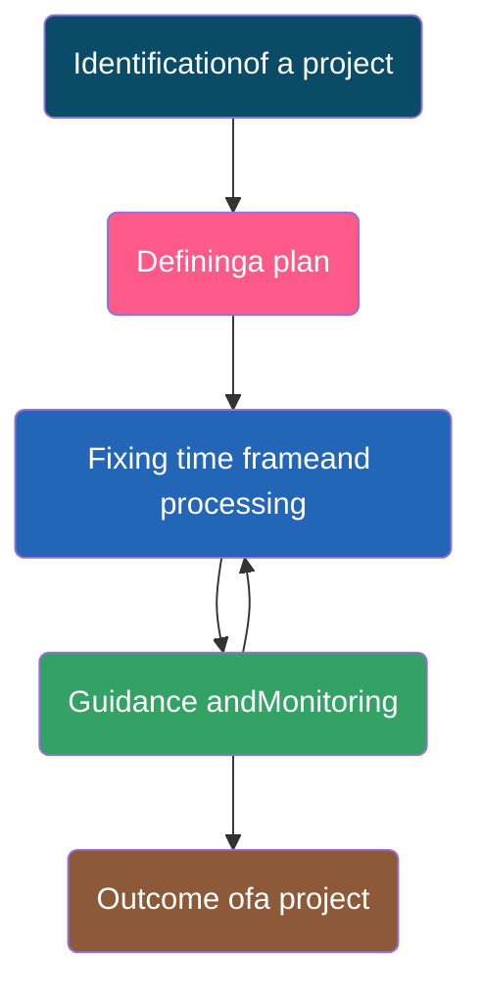

import { Example, Figure, Quote, Card } from "@/components/markdown";

import { Steps } from '@astrojs/starlight/components'; 

<Quote author="Gautam Buddha">
"An idea that is developed and put into action is more important than idea that
exists only as an idea."
</Quote>

In this Chapter

- [Introduction](#section-13.1)
- [Approaches for Solving Projects](#section-13.2)
- [Teamwork](#section-13.3)
- [Project Descriptions](#section-13.4)

---

## 13.1 Introduction ||section-13.1||

Project based learning gives a thorough practical exposure to students regarding
a problem upon which the project is based. Through project based learning,
students learn to organise their project and use their time effectively for
successful completion of the project. Projects are developed generally in groups
where students can learn various skills such as working together, problem
solving, decision making, and investigating activities. Project based learning
involves the steps such as analysing the problem, formulating the problem into
small modules, applying the mechanism or method to solve each module and then
integrating the solution of all the modules to arrive at the complete solution
of the problem. To solve a problem, it is required that those who work on it
gather the relevant data and process it by applying a particular method. Data
may be collected as per the requirement of the project in a particular format.
All the team members should be associated to accomplish the task. After
collecting data, it should be processed to solve the problem. The results should
be reported in a predetermined format.

## 13.2 Approaches for Solving Projects ||section-13.2||

The approach followed for the development and completion of a project plays a
pivotal role in project based learning. There are several approaches to execute
a project such as modular approach, top down approach and bottom up approach. A
structured or a modular approach to a project means that a project is divided
into various manageable modules and each of the modules has a well-defined task
to be performed with a set of inputs. This would lead to a set of outputs which
when integrated leads to the desired outcome.

<Figure
  id="13.3"
  title="Figure 13.1: Steps in project based learning"
  halfWidth={true}
>

</Figure>

Different steps involved in project based learning ([Figure 13.1](#figure-13.3))
are :

<Steps>
1. <Card title="Identification of a project">
   The project idea may come through any
   real-life situation. For example, one could think of doing a project for
   organising a seminar. One needs to understand the usefulness of the project
   and its impact. Students must be encouraged to undertake interdisciplinary
   projects.
   </Card>
2. <Card title="Defining a plan"> 
   Normally for any kind of project, there are several
   project members involved in it. One project leader has to be identified. The
   roles of project leader and each project member have to be clearly defined.
   Students who are performing a project must be assigned with specific
   activities. The various tools for executing these activities must be known.
   To obtain a better solution, one should always think of the extreme
   situations.
   </Card>
3. <Card title="Fixing of a time frame and processing">
   Every project is a time relevance
   project. A student must understand the importance of time frame for
   completion of the project. All the activities which are performed in the
   projects require a certain amount of time. Every project must be well
   structured and at the same time it must be flexible in its time frame.
   </Card>
4. <Card title="Providing guidance and monitoring a project">
   Many times, the participants
   in the project get stuck up with a particular process and it becomes
   impossible to proceed further. In such a case, they need guidance, which can
   be obtained from various resources such as books, websites and experts in the
   field. While it is essential that the project leader should ensure monitoring
   of the project, the guide teacher also helps in monitoring the project.
   </Card>
5. <Card title="Outcome of a project">
   One needs to understand thoroughly the outcome of a
   project. The outcome can be single, or it can be multiple. The output of a
   project can be peer reviewed and can be modified as per the feedback from the
   guide teacher or other users.
   </Card>
</Steps>

## 13.3 Teamwork ||section-13.3||

Many real-life tasks are very complex and require a lot of individuals to
contribute in achieving them. Efforts made by individuals collectively to
accomplish a task is called teamwork.

For example, in many sports, there is a team of players. These players play
together to win a match. Take an example of a cricket team. We find that even if
a bowler bowls a good ball but if the fielder cannot take a catch then the
wicket cannot be taken. So, in order to take a catch, efforts of a bowler as
well as of fielders are needed. To win a cricket match, contributions from all
the team members in all the three areas batting, bowling and fielding are
required.

### 13.3.1 Components of Teamwork ||section-13.3.1||

Apart from technical proficiency, a wide variety of other components make a
successful teamwork. It comprises skilled team members with specific roles to
achieve the goal.

#### (A) Communicate with Others ||section-13.3.1.a||

When a group of individuals perform one job, it is necessary to have effective
communication between the members of the team. Such communication can be done
via e-mails, telephones or by arranging group meetings. This helps the team
members to understand each other and sort out their problems to achieve the goal
effectively.

#### (B) Listen to Others ||section-13.3.1.b||

It is necessary to understand the ideas of others while executing a job
together. This can be achieved when the team members listen to each other in
group meetings and follow steps that are agreed upon.

#### (C) Share with Others ||section-13.3.1.c||

Ideas, images and tools need to be shared with each other in order to perform a
job. Sharing is an important component of teamwork. Any member of the team who
is well versed in a certain area should share the expertise and experience with
others to effectively achieve the goal within the time frame.

#### (D) Respect for Others ||section-13.3.1.d||

Every member of the team must be treated respectfully. All the thoughts and
ideas that are put forth in the group meetings may be respected and duly
considered. Not respecting the views of a particular member may cause problems
and that particular team member may not give his best.

#### (E) Help Others ||section-13.3.1.e||

A helping hand from every member is a key to success. Sometimes help from people
who are not a part of the team is also obtained in order to accomplish a job.

#### (F) Participate ||section-13.3.1.f||

All the team members must be encouraged by each other to participate in
completing the project and also in discussions in group meetings. Also, every
member should take an active participation so that they feel their importance in
the team.

## 13.4 Project Descriptions ||section-13.4||

In this section, some examples of project works are given, which can be taken up
in groups under project based learning. However, a group may choose any other
project in consultation with the guide teacher.

<Card>
##### Project Title 1: Automation of Order Processing in a Restaurant

###### Description

A new restaurant "Stay Healthy" is coming up in your locality. The
owner/management of the restaurant wants to use a computer to generate bills and
maintain other records of the restaurant. Your team is asked to develop an
application software to automate the order placing and associated processes.

###### Specifications

Make a group of students to undertake a project on automating the order
processing of the restaurant 'Stay Healthy'. The owner of the restaurant wants
the following specific functionalities to be made available in the developed
application:

- There should be two types of Login options — one for the manager of the joint
  and other for the customer.
- Kiosk(s) running the software for customers will be placed at reception for
  placing the order. On the opening screen, menu for placing orders will be
  displayed.
- To place orders, customers will enter Item Code(s) and quantity desired.
- After placing an order, a soft copy of the bill will be displayed on the
  kiosk, having an Order Number.
- Every bill will have a unique identification (such as combination of date, and
  order number of the day) and should be saved in the data file/database.
- Order Number starts from 1 every day.
- For Manager login—provision for entry/change of Menu, deletion of Order (on
  demand) and generation of following report is desired. 99A Report giving
  Summary of the Sales made on a Day. Program should accept the date for which
  the Summary is required.
- Add at least one more relevant report of your choice to the program.
</Card>

<Card>
##### Project Title 2 : Development of a Puzzle

###### Description

Implement a puzzle solving game in Python. The game presents a grid board
composed of cells to the player, in which some cells have Bomb. Player is
required to clear the board (of the bomb), without detonating any one of them
with the help of clue(s) provided on the board.

###### Specifications

For clearing the board, the player will click a cell on the board, if the cell
contains a bomb, the game finishes. If the cell does not contain a bomb, then
the cell reveals a number giving a clue about the number of bombs hidden in
adjacent cells.

Before you start coding the game, play any Minesweeper game five times. This
will help you in proper understanding of your project. To reduce the complexity
of the program you can fix the grid size to 6x6 and number of bombs to 6.

:::note

Do ensure to handle various exception(s) which may occur while playing the game,
in your code.

:::

</Card>

<Card>
##### Project Title 3 : Development of an Educational Game

###### Description

You are a member of the ICT club of your school. As a club member, you are given
the responsibility of identifying ways to improve mathematical skills of kids,
in the age group of $5$-$7$ years. One of the club members suggested developing an
Edutainment Game named "Match the Sum" for it. Match the Sum will hone summing
skills of student(s), by allowing them to form number $10$ by adding 2/3 digits.

Following are the details of provisions required for program:

- Display a list of 15 cells on screen, where each cell can hold a digit ($1$
  to $9$)
- Randomly generate a digit at a time and place it in the list from the right
  end. Program will keep on generating digits at equal intervals of time and
  place it in the rightmost cell. (Already existing digits, will be shifted
  left, by one cell, with every new addition of digits' in the list)
- For playing the game, students' will be allowed to type 2/3 digits (one at a
  time) currently displayed in the list of cells.
- If the sum of those digits is $10$, then those digits should get removed from
  the list of cells.
- Game will continue till there is an empty cell to insert a digit in the list
  of cells.

:::note

Do take care of the situation when digits displayed in a list of cells do not
add up to $10$.

:::

</Card>

---
