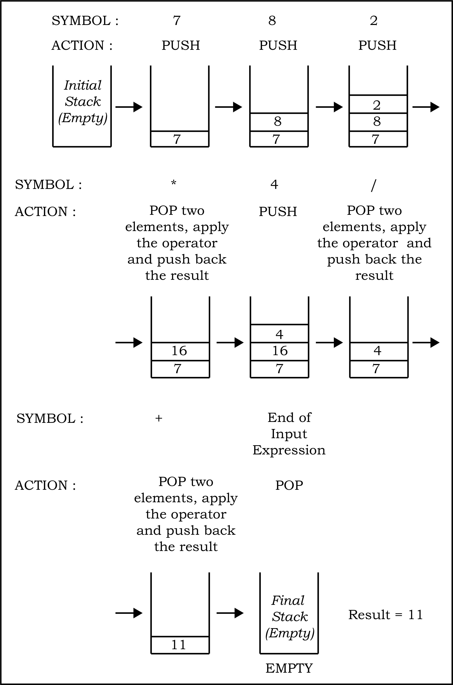

import { Steps } from '@astrojs/starlight/components';

import Figure from '@/components/Figure.astro';                                                                                                                 
import IdCard from '@/components/IdCard.astro';
import SourceButton from '@/components/SourceButton.astro';
import PythonCode from '@/components/PythonCode.astro';

<SourceButton source="lecs103"/>

<IdCard id="quote">
  _"We're going to be able to ask our computers to monitor things for us, and
  when certain conditions happen, are triggered, the computers will take certain
  actions and inform us after the fact."_
  <br/>
  — [Steve Jobs](https://en.wikipedia.org/wiki/Steve_Jobs)
</IdCard>

In this Chapter

- [Introduction](#31introduction)
- [Stack](#32stack)
- [Operations on Stack](#33operations-on-stack)
- [Implementation of Stack in python](#34implementation-of-stack-in-python)
- [Notations for arithmetic expressions](#35notations-for-arithmetic-expressions)
- [Conversion from infix to postfix notation](#36conversion-from-infix-to-postfix-notation)
- [Evaluation of postfix expressIon](#37evaluation-of-postfix-expression)


## 3.1	Introduction

We have learnt about different data types in Python for handling values in Class
XI. Recall that `String`, `List`, `Set`, `Tuple`, etc. are the sequence data types that
can be used to represent collection of elements either of the same type or
different types. Multiple data elements are grouped in a particular way for
faster accessibility and efficient storage of data. That is why we have used
different data types in python for storing data values. Such grouping is
referred as a data structure.

A data structure defines a mechanism to store, organise and access data along
with operations (processing) that can be efficiently performed on the data. For
example, string is a data structure containing a sequence of elements where each
element is a character. On the other hand, list is a sequence data structure in
which each element may be of different types. We can apply different operations
like reversal, slicing, counting of elements, etc. on list and string. Hence, a
data structure organises multiple elements in a way so that certain operations
on each element as well as the collective data unit could be performed easily.

**_Stack_** and **_Queue_** are two other popular data structures used in
programming. Although not directly available in Python, it is important to learn
these concepts as they are extensively used in a number of programming
languages. In this chapter, we will study about stack, its implementation using
Python as well as its applications.

:::tip[Do you know?]

Other important data structures in Computer Science include Array, Linked List,
Binary Trees, Heaps, Graph, Sparse Matrix, etc.

:::

## 3.2	Stack

We have seen piles of books in the library or stack of plates at home ([Figure
3.1](#figure-31)). To put another book or another plate in such a pile, we always place (add
to the pile) the object at the top only. Likewise, to remove a book or a plate
from such a pile, we always remove (delete from the pile) the object from the
top only. This is because in a large pile, it is inconvenient to add or remove
an object from in between or bottom. Such an arrangement of elements in a linear
order is called a stack. We add new elements or remove existing elements from
the same end, commonly referred to as the top of the stack. It thus follows the
_**Last-In-First-out (LIFO)**_ principle. That is, the element which was inserted last
(the most recent element) will be the first one to be taken out from the stack.

<Figure 
  id="figure-31" 
  title="Figure 3.1: Stack of plates and books"
  invertable={false}
>
  <centre>
    
  </centre>
</Figure>

:::tip[Do you know?]

A data structure in which elements are organised in a sequence is called linear
data structure.

:::

:::caution[Think and Reflect]

How does a compiler or an interpreter handle function calls in a program?

:::

### 3.2.1	Applications of Stack

Some of the applications of stack in real-life are:

- Pile of clothes in an almirah
- Multiple chairs in a vertical pile
- Bangles worn on wrist
- Pile of boxes of eatables in pantry or on a kitchen shelf

Some examples of application of stack in programming are as follows:

- When we need to reverse a string, the string is traversed from the last
  character till the first character. i.e. characters are traversed in the
  reverse order of their appearance in the string. This is very easily done by
  putting the characters of a string in a stack.
- We use text/image editor for editing the text/image where we have options to
  redo/undo the editing done. When we click on the redo /undo icon, the most
  recent editing is redone/undone. In this scenario, the system uses a stack to
  keep track of changes made.
- While browsing the web, we move from one web page to another by accessing
  links between them. In order to go back to the last visited web page, we may
  use the back button on the browser. Let us say we accessed a web page P1 from
  where we moved to web page P2 followed by browsing of web page P3. Currently,
  we are on web page P3 and want to revisit web page P1. We may go to a
  previously visited web page by using the `BACK` button of the browser. On
  clicking the `BACK` button once, we are taken from web page P3 to web page P2,
  another click on `BACK` shows web page P1. In this case, the history of browsed
  pages is maintained as stack.

:::caution[Think and Reflect]

The operating system in computer or mobile allocates memory to different
applications for their execution. How does an operating system keep track of the
free memory that can be allocated among programs/ applications to be executed?

:::

- While writing any arithmetic expression in a program, we may use parentheses
  to order the evaluation of operators. While executing the program, the
  compiler checks for matched parentheses i.e. each opening parenthesis should
  have a corresponding closing parenthesis and the pairs of parentheses are
  properly nested. In case of parentheses are mismatched, the compiler needs to
  throw an error. To handle matching of parentheses, stack is used.

## 3.3	Operations on Stack

As explained in the previous section, a stack is a mechanism that implements
LIFO arrangement hence elements are added and deleted from the stack at one end
only. The end from which elements are added or deleted is called **TOP** of the
stack. Two fundamental operations performed on the stack are **PUSH** and **POP**. In
this section, we will learn about them and implement them using Python.

### 3.3.1	**PUSH** and **POP** Operations

- **PUSH** adds a new element at the **TOP** of the stack. It is an insertion operation.
  We can add elements to a stack until it is full. A stack is full when no more
  elements can be added to it. Trying to add an element to a full stack results
  in an exception called _**'overflow'**_.
- **POP** operation is used to remove the top most element of the stack, that is,
  the element at the `TOP` of the stack. It is a delete operation. We can delete
  elements from a stack until it is empty i.e. there is no element in it. Trying
  to delete an element from an empty stack results in an exception called
  _**'underflow'**_.

A stack is used to insert and delete elements in **LIFO** order. Same principle is
followed in adding and removing glasses from a pile of glasses. Let us create a
stack of glasses assuming that each glass is numbered. Visual representations of
**PUSH** and **POP** operations on a stack of glasses are shown in [Figure 3.2](#figure-32).

<Figure 
  id="figure-32" 
  title="Figure 3.2: PUSH and POP operations on the stack of glasses"
  invertable={true}
>
  <centre>
    
  </centre>
</Figure>

## 3.4	Implementation of Stack In python

We have learnt so far that a stack is a linear and ordered collection of
elements. The simple way to implement a stack in Python is using the data type
list. We can fix either of the sides of the list as **TOP** to insert/remove
elements. It is to be noted that we are using built-in methods `append()` and
`pop()` of the list for implementation of the stack. As these built-in methods
insert/delete elements at the rightmost end of the list, hence explicit
declaration of **TOP** is not needed. Let us write a program to create a **STACK**
(stack of glasses as given in Figure 3.2) in which we will:

- insert/delete elements (glasses)
- check if the **STACK** is empty (no glasses in the stack)
- find the number of elements (glasses) in the **STACK**
- read the value of the topmost element (number on the topmost glass) in the **STACK**

The program shall define the following functions to perform these operations:

<Steps>

1. Let us create an empty stack named `glassStack`. We will do so by assigning an
   empty list to the identifier named `glassStack`:

   ```py
   glassStack = list()
   ```

2. A function named `isEmpty` to check whether the stack `glassStack` is empty or
   not. Remember trying to remove an element from an empty stack would result in
   _'underflow'_. This function returns True if the stack is empty, else returns
   False.

   ```py
   def isEmpty(glassStack): 
       if len(glassStack)==0:
           return True 
       else:
           return False
   ```

3. A function named `opPush` to insert (**PUSH**) a new element in stack. This
   function has two parameters the name of the stack in which the element is to
   be inserted (`glassStack`) and the element that needs to be inserted. We know
   that insertion of an element is always done at the TOP of the stack. Hence,
   we shall use the built-in method `append()` of list to add an element to the
   stack that always adds at the end of the list. As there is no limit on the
   size of list in Python, the implemented stack will never be full unless there
   is no more space available in memory. Hence, we will never face _'overflow'_
   (no space for new element) condition for stack.

   ```py
   def opPush(glassStack,element): 
       glassStack.append(element)
   ```

4. A function named `size` to read the number of elements in the `glassStack`.
   We will use the `len()` function of list in Python to find the number of
   elements in the `glassStack`.

   ```py
   def size(glassStack): 
       return len(glassStack)
   ```

5. A function named `top` to read the most recent element (**TOP**) in the
   `glassStack`.

   ```py
   def top(glassStack):
       if isEmpty(glassStack):
           print('Stack is empty') 
           return None
       else:
           x =len(glassStack) element=glassStack[x-1] 
           return element
   ```

6. A function named `opPop` to delete the topmost element from the stack. It
   takes one parameter - the name of the stack (`glassStack`) from which element
   is to be deleted and returns the value of the deleted element. The function
   first checks whether the stack is empty or not. If it is not empty, it
   removes the topmost element from it. We shall use the built- in method
   `pop()` of Python list that removes the element from the end of the list.

   ```py
   def opPop(glassStack):
       if isEmpty(glassStack): 
           print('underflow')      
           return None
       else:
           return(glassStack.pop())
   ```

7. A function named `display` to show the contents of the stack.

   ```py
   def display(glassStack): 
       x = len(glassStack)
       print("Current elements in the stack are: ")
       for i in range(x-1,-1,-1): 
           print(glassStack[i])
   ```

</Steps>

Once we define the above functions we can use the following Python code to
implement a stack of glasses.

import program_3_stack from './program_3.stack.py?raw';
import output_3_stack from './output_3.stack.txt?raw';

<PythonCode
    id="program-3-stack"
    title="Program 3: Implementation of Stack in Python"
    code={program_3_stack}
	output={output_3_stack}
/>


## 3.5	Notations for Arithmetic Expressions

We write arithmetic expressions using operators in between operands, like $x + y$,
$2 - 3 * y,$ etc. and use parentheses $()$ to order the evaluation of operators in
complex expressions. These expressions follow infix representation and are
evaluated using BODMAS rule.

Polish mathematician **Jan Lukasiewicz** in the 1920's introduced a different way of
representing arithmetic expression, called polish notation. In such notation,
operators are written before their operands. So the order of operations and
operands determines the result, making parentheses unnecessary. For example, we
can write $x+y$ in polish notation as $+xy$. This is also called prefix notation as
we prefix the operator before operands.

By reversing this logic, we can write an expression by putting operators after
their operands. For example, $x+y$ can be written as $xy+$. This is called reverse
polish notation or postfix notation. To summarise, any arithmetic expression can
be represented in any of the three notations viz. Infix, Prefix and Postfix and
are listed in Table 3.1 with examples.

<IdCard id="table-31" title="Table 3.1 Infix, Prefix and Postfix Notations">
  
| Type of Expression           | Description                                            | Example                                                |
| ---------------------------- | ------------------------------------------------------ | ------------------------------------------------------ |
| **Infix**                    | Operators are placed in between the operands           | $x * y + z$ <br/> $3 *(4 + 5)$ <br/> $(x + y)/(z * 5)$ |
| **Prefix (Polish)**          | Operators are placed before the corresponding operands | $+z*xy$ <br/> $*3+45$ <br/> $/+xy*z5$                  |
| **Postfix (Reverse Polish)** | Operators are placed after the corresponding operands  | $xy\_z+$ <br/> $345+\_$ <br/> $xy+z5*/$                  |
  
</IdCard>


## 3.6	Conversion from Infix to Postfix notation

It is easy for humans to evaluate an _infix_ expression. Consider an _infix_
expression $x + y / z$. While going from left to right we first encounter $+$
operator, but we do not add $x + y$ and rather evaluate $y/z$, followed by addition
operation. This is because we know the order of precedence of operators that
follows BODMAS rule. But, how do we pass this precedence knowledge to the
computer through an expression?

In contrast, _prefix_/_postfix_ expressions do not have to deal with such
precedence because the operators are already positioned according to their order
of evaluation. Hence a single traversal from left to right is sufficient to
evaluate the expression. In this section, we will learn about the conversion of
an arithmetic expression written in _infix_ notation to its equivalent
expression in _postfix_ notation using a stack.

:::caution[Think and Reflect]

Write an algorithm to convert an infix expression into equivalent prefix
expression using stack.

:::

During such conversion, a stack is used to keep track of the operators
encountered in the _infix_ expression. A variable of string type is used to
store the equivalent _postfix_ expression. [Algorithm 3.1](#algorithm-31) converts an expression
in _infix_ notation to _postfix_ notation:

<IdCard 
  id="algorithm-31" 
  title="Algorithm 3.1: Conversion of expression from infix to postfix notation"
  >
  <Steps>

1. Create an empty string named `postExp` to store the converted postfix
   expression.
2. INPUT infix expression in a variable, say `inExp`
3. For each character in `inExp`, REPEAT Step 4
4. IF character is a left parenthesis
   - THEN **PUSH** on the Stack

   ELSE IF character is a right parenthesis
   - THEN **POP** the elements from the Stack and append to string `postExp` until the
     corresponding left parenthesis is popped while discarding both left and
     right parentheses

   ELSE IF character is an operator
   - THEN IF its precedence is lower than that of operator at the top of Stack
     - THEN **POP** elements from the Stack till an operator with precedence less
       than the current operator is encountered and append to string `postExp`
       before pushing this operator on the postStack
     - ELSE **PUSH** operator on the Stack

   ELSE append the character to `postExp`
5. Pop elements from the Stack and append to `postExp` until Stack is empty
6. OUTPUT `postExp`

  </Steps>
</IdCard>


#### Example 3.1

Let us now use this algorithm to convert a given infix expression $(x + y)/(z*8)$
into equivalent postfix expression using a stack. [Figure 3.3](#figure-33) shows the steps to
be followed on encountering an operator or an operand in the given infix
expression. Note here that stack is used to track the operators and parentheses,
and a string variable contains the equivalent postfix expression. Initially both
are empty. Each character in the given infix expression is processed from left
to right and the appropriate action is taken as detailed in the algorithm. When
each character in the given infix expression has been processed, the string will
contain the equivalent postfix expression.

<Figure 
  id="figure-33" 
  title="Figure 3.3: Conversion of infix expression (x + y)/(z*8) to postfix notation"
  invertable={true}
>
  <centre>
    
    
  </centre>
</Figure>

## 3.7	Evaluation of Postfix expression

Stacks can be used to evaluate an expression in postfix notation. For
simplification, we are assuming that operators used in expressions are binary
operators. The detailed step by step procedure is given in [Algorithm 3.2](#algorithm-32).

<IdCard 
  id="algorithm-32" 
  title="Algorithm 3.2: Evaluation of postfix expression"
  >
  <Steps>

1. INPUT postfix expression in a variable, say `postExp`
   
2. For each character in `postExp`, REPEAT Step 3
   
3. IF character is an operand
   - THEN **PUSH** character on the Stack

   ELSE POP two elements from the Stack, apply the operator on the popped
   elements and **PUSH** the computed value onto the Stack

4. IF Stack has a single element
   - THEN **POP** the element and OUTPUT as the net result

   ELSE OUTPUT "Invaild Postfix expression"

  </Steps>
</IdCard>

#### Example 3.2

[Figure 3.4](#figure-34) shows the step-by-step process of evaluation of the postfix
expression $7 8 2 * 4 / +$ using [Algorithm 3.2](#algorithm-32).

<Figure 
  id="figure-34" 
  title="Figure 3.4: Evaluation of postfix expression 7 8 2 * 4 / +"
  invertable={true}
>
  <centre>
    
  </centre>
</Figure>


:::caution[Think and Reflect]

Write an algorithm to evaluate any prefix expression using a stack.

:::

---

## Summary

:::note[Summary]

- Stack is a data structure in which insertion and deletion is done from one end
  only, usually referred to a**s TOP.**
- Stack follows **LIFO** principle using which an element inserted in the last will
  be the first one to be out.
- **PUSH** and **POP** are two basic operations performed on a stack for insertion and
  deletion of elements, respectively.
- Trying to pop an element from an empty stack results into a special condition
  underflow.
- In Python, list is used for implementing a stack and its built-in-functions
  append and pop are used for insertion and deletion, respectively. Hence, no
  explicit declaration of **TOP** is needed.
- Any arithmetic expression can be represented in any of the three notations
  viz. _Infix_, _Prefix_ and _Postfix_.
- While programming, Infix notation is used for writing an expression in which
  binary operators are written in between the operands.
- A single traversal from left to right of Prefix/ Postfix expression is
  sufficient to evaluate the expression as operators are correctly placed as per
  their order of precedence.
- Stack is commonly used data structure to convert an Infix expression into
  equivalent Prefix/Postfix notation.
- While conversion of an Infix notation to its equivalent Prefix/Postfix
  notation, only operators are PUSHed onto the Stack.
- When evaluating any Postfix expression using Stack, only operands are PUSHed
  onto it.

:::

---

## Ecercise

### Question 1

State **TRUE** or **FALSE** for the following cases:

1. Stack is a linear data structure
2. Stack does not follow **LIFO** rule
3. PUSH operation may result into underflow condition
4. In POSTFIX notation for expression, operators are placed after operands

### Question 2

Find the output of the following code:

```py title="a"
result=0 
numberList=[10,20,30] 
numberList.append(40) 
result=result+numberList.pop() 
result=result+numberList.pop() 
print(“Result=”,result)
```

```py title="b"
answer=[]; output='' 
answer.append('T') 
answer.append('A') 
answer.append('M') 
ch=answer.pop() 
output=output+ch 
ch=answer.pop() 
output=output+ch 
ch=answer.pop() 
output=output+ch 
print(“Result=”,output)
```

### Question 3

Write a program to reverse a string using stack.

### Question 4

For the following arithmetic expression: $((2+3)*(4/2))+2$ Show step-by-step
process for matching parentheses using stack data structure.

### Question 5

Evaluate following postfix expressions while showing status of stack after each
operation given A=3, B=5, C=1, D=4

1. $A B + C *$
2. $A B * C / D *$

### Question 6

Convert the following infix notations to postfix notations, showing stack and
string contents at each step.

1. $A + B - C * D$
2. $A * (( C + D)/E)$

### Question 7

Write a program to create a Stack for storing only odd numbers out of all the
numbers entered by the user. Display the content of the Stack along with the
largest odd number in the Stack. 

(**Hint.** Keep popping out the elements from stack
and maintain the largest element retrieved so far in a variable. Repeat till
Stack is empty)
