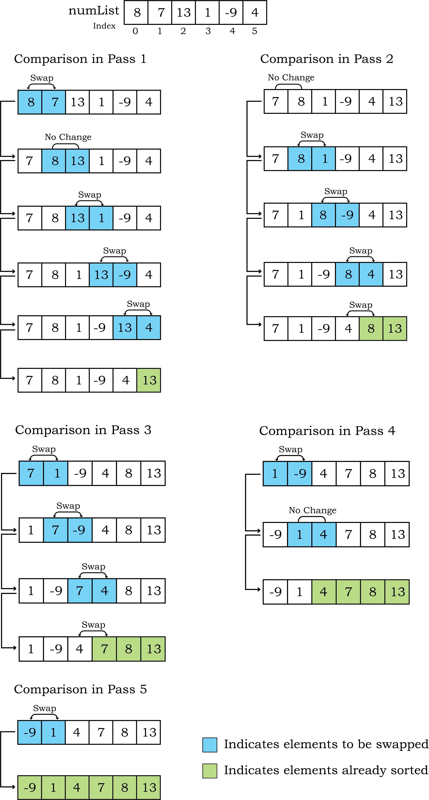
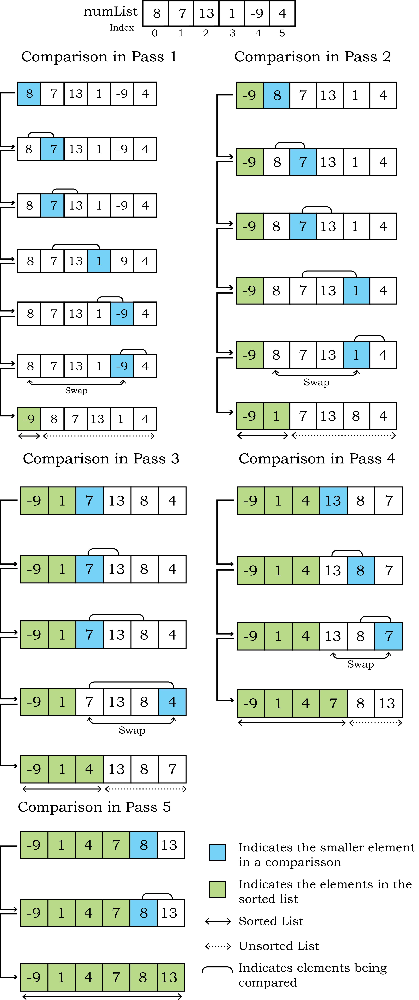
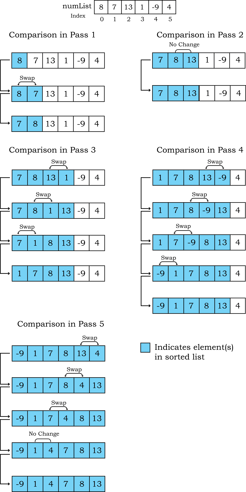

import { Steps } from '@astrojs/starlight/components';                                                                                                                                             

import PythonCode from '@/components/PythonCode.astro';
import IdCard from '@/components/IdCard.astro';
import SourceButton from '@/components/SourceButton.astro';
import Figure from '@/components/Figure.astro';

<SourceButton source="lecs105"/>

<IdCard>
  _"Every one of today's smartphones has thousands of times more processing power
  than the computers that guided astronauts to the moon."_
  <br/>
  — [Peter Thiel](https://en.wikipedia.org/wiki/Peter_Thiel)
</IdCard>

In this Chapter

- [Introduction](#51-introduction)
- [Bubble Sort](#52-bubble-sort)
- [Selection Sort](#53-selection-sort)
- [Insertion Sort](#54-insertion-sort)
- [Time Complexity of Algorithms](#55-time-complexity-of-algorithms)

## 5.1 Introduction

**Sorting** is the process of ordering or arranging a given collection of elements
in some particular order. We can sort a collection of numbers in ascending
(increasing) or descending (decreasing) order. If the collection is of strings,
we can sort it in an alphabetical order (a-z or z-a) or according to the length
of the string. For example, words in a dictionary are sorted in alphabetical
order; seats in an examination hall are ordered according to candidates' roll
number. We can also sort a list of students based on their height or weight.

Imagine finding the meaning of a word from a dictionary that is not ordered. We
will have to search for the word on each page till we find the word, which will
be very tedious. That is why dictionaries have the words in alphabetical order
and it ease the process of searching.

Sorting a large number of items can take a substantial amount of time. However,
this extra time (called overhead) is worth when compared to the amount of time
needed to find an element from an unsorted list. Sorting is an important area of
study in computer science, and many sorting algorithms have been developed and
analysed from their performance point of view. In this chapter, we will learn
about three sorting methods and implement them using Python. Bubble sort is
discussed in [section 5.2](#52-bubble-sort), followed by discussion on selection sort and insertion
sort in [section 5.3](#53-selection-sort) and [5.4](#54-insertion-sort), respectively

:::caution[Think and Reflect]

Can you identify other examples where sorting plays an important role in
computers?

:::

## 5.2 Bubble Sort

The first sorting technique we are going to understand is **Bubble sort**. It sorts
a given list of elements by repeatedly comparing the adjacent elements and
swapping them if they are unordered. Swapping two elements means changing their
positions with each other. In algorithm, every iteration through each element of
a list is called a pass. For a list with $n$ elements, the bubble sort makes a
total of $n - 1$ passes to sort the list. In each pass, the required pairs of
adjacent elements of the list will be compared. In order to arrange elements in
ascending order, the largest element is identified after each pass and placed at
the correct position in the list. This can be considered as the largest element
being 'bubbled up'. Hence the name Bubble sort. This sorted element is not
considered in the remaining passes and thus the list of elements gets reduced in
successive passes.

Figure 5.1 demonstrates the working of the bubble sort method to arrange a list
in ascending order. Let us consider a list having 6 elements as `numList = [8, 7,
13, 1, -9, 4]`. In the figure, elements being compared are highlighted with blue
colour and sorted elements are highlighted with green colour. To begin sorting,
the element at index 0 is compared with the element at index 1. If the first
element is bigger, it is swapped with the second. Else, no change is done. Next,
the element at index 1 is compared with the element at index 2. This continues
till the end of the list is reached. After the first pass, the largest element
will reach the end of the list as shown in [Figure 5.1](#figure-51) with green colour.

<Figure 
  id="figure-51" 
  title="Figure 5.1: Comparisons done in different passes of Bubble sort"
  invertable={true}
>
  <centre>
    
  </centre>
</Figure>

:::caution[Think and Reflect]

In [Figure 5.1](#figure-51), we can see that the list got sorted in the 4th pass itself. Still
the bubble sort technique made a redundant 5th pass which did not result in any
swap. If there is no swapping in any pass, it means the list is already sorted,
hence the sorting operation needs to be stopped. Can you think of making any
improvement in the [Algorithm 5.1](#algorithm-51) so that it stops when the list becomes sorted?

:::

[Algorithm 5.1](#algorithm-51) shows the steps followed for the bubble sort that takes `numList` as
a list of `n` elements, and sorts the list in ascending order:

<IdCard id="algorithm-51" title="Algorithm 5.1: Bubble Sort">
`BUBBLE_SORT(numList, n)`
  <Steps>

1. SET `i = 0` 

2. WHILE `i < n` REPEAT STEPS 3 to 8

3. SET `j = 0`

4. WHILE `j < n - i - 1`, REPEAT STEPS 5 to 7

5. IF `numList[j] > numList[j+1]` THEN

6. `swap(numList[j], numList[j+1])`

7. SET `j = j + 1`

8. SET `i = i + 1`

  </Steps>
</IdCard>

:::danger[Activity 5.1]

[Algorithm 5.1](#algorithm-51) sorts a list in ascending order. Write a bubble sort algorithm to
sort a list in descending order?

:::

import program_51 from './program_5.1.py?raw';
import output_51 from './output_5.1.txt?raw';

<PythonCode
    id="program-51"
    title="Program 5-1 Implementation of bubble sort using Python."
    code={program_51}
	output={output_51}
/>

## 5.3 Selection Sort

**Selection sort** is another sorting technique. To sort a list having $n$ elements,
the selection sort makes $(n-1)$ number of passes through the list. The list is
considered to be divided into two lists -- the left list containing the sorted
elements, and the right list containing the unsorted elements. Initially, the
left list is empty, and the right list contains all the elements.

For arranging elements in ascending order, in the first pass, all the elements
in the unsorted list are traversed to find the smallest element. The smallest
element is then swapped with the leftmost element of the unsorted list. This
element occupies the first position in the sorted list, and it is not considered
in further passes. In the second pass, the next smallest element is selected
from the remaining elements in the unsorted list and swapped with the leftmost
element of the unsorted list. This element occupies the second position in the
sorted list, and the unsorted list reduces by one element for the third pass.

This process continues until $n-1$ smallest elements are found and moved to their
respective places. The nth element is the last, and it is already in place.
Figure 5.2 demonstrates the working of selection sort method to arrange a list
in ascending order. In this Figure, elements being compared are shown using
arrows and the smaller element in a comparison is highlighted with blue colour.
The sorted elements are highlighted —

<Figure 
  id="figure-52" 
  title="Figure 5.2: Comparisons done in different passes of Selection sort"
  invertable={true}
>
  <centre>
    
  </centre>
</Figure>

The following is an algorithm for the selection sort that takes `numList` as a
list consisting of n elements, and sorts the list in ascending order:

Algorithm 5.2 shows the steps followed for the selection sort that takes `numList`
as a list of `n` elements, and sorts the list in ascending order:

<IdCard id="algorithm-52" title="Algorithm 5.2: Selection Sort">
`SELECTION_SORT(numList, n)`
  <Steps>

1. SET `i = 0`

2. WHILE `i < n` REPEAT STEPS 3 to 11

3. SET `min = i`, `flag = 0`

4. SET `j= i + 1`

5. WHILE `j < n`, REPEAT STEPS 6 to 10

6. IF `numList[j] < numList[min]` THEN

7. `min = j`

8. `flag = 1`

9. IF `flag = 1` THEN

10. `swap(numList[i], numList[min])`

11. SET `i = i + 1`

  </Steps>
</IdCard>

:::danger[Activity 5.2]

Consider a list of 10 elements:

`randList = [7, 11, 3, 10, 17, 23, 1, 4, 21, 5]`.

Determine the partially sorted list after four complete passes of selection
sort.

:::

import program_52 from './program_5.2.py?raw';
import output_52 from './output_5.2.txt?raw';

<PythonCode
    id="program-52"
    title="Program 5-2 Implementation of selection sort using Python."
    code={program_52}
	output={output_52}
/>

## 5.4 Insertion Sort

**Insertion sort** is another sorting algorithm that can arrange elements of a given
list in ascending or descending order. Like Selection sort, in Insertion sort
also, the list is divided into two parts - one of sorted elements and another of
unsorted elements. Each element in the unsorted list is considered one by one
and is inserted into the sorted list at its appropriate position. In each pass,
the sorted list is traversed from the backward direction to find the position
where the unsorted element could be inserted. Hence the sorting method is called
insertion sort.

In pass 1, the unsorted list has $n-1$ elements and the sorted list has a single
element (say element s). The first element of the unsorted list (say element e)
is compared with the element s of sorted list. If element e is smaller than
element s, then element s is shifted to the right making space for inserting
element e. This shifting will now make sorted list of size 2 and unsorted list
of size $n-2$.

In pass 2, the first element (say element e) of unsorted list will be compared
with each element of sorted list starting from the backward direction till the
appropriate position for insertion is found. The elements of sorted list will be
shifted towards right making space for the element e where it could be inserted.

This continues till all the elements in unsorted lists are inserted at
appropriate positions in the sorted list. This results into a sorted list in
which elements are arranged in ascending order.

Figure 5.3 demonstrates the working of the insertion sort to arrange a list in
ascending order.

<Figure 
  id="figure-53" 
  title="Figure 5.3: Comparisons done in different passes of Insertion sort"
  invertable={true}
>
  <centre>
    
  </centre>
</Figure>

Let us consider that numList is a list consisting of n elements. [Algorithm 5.3](#algorithm-53)
sorts the list numList in ascending order using insertion sort technique.

<IdCard id="algorithm-53" title="Algorithm 5.3: Insertion Sort">
`INSERTION_SORT(numList, n)`
  <Steps>

1. SET `i=1 `

2. WHILE `i< n`, REPEAT STEPS 3 to 9

3. `temp = numList[i]`

4. SET `j = i-1`

5. WHILE `j> = 0` and `numList[j]>temp`, REPEAT STEPS 6 to 7

6. `numList[j+1] = numList[j]` 

7. SET `j = j - 1`

8. `numList[j+1] = temp` #insert temp at position j

9. set `i = i + 1`

  </Steps>
</IdCard>

:::danger[Activity 5.3]

Consider a list of 10 elements:

`Array = [7, 11, 3, 10, 17, 23, 1, 4, 21, 5]`

Determine the partially sorted list after three complete passes of insertion
sort.

:::

import program_53 from './program_5.3.py?raw';
import output_53 from './output_5.3.txt?raw';

<PythonCode
    id="program-53"
    title="Program 5-3 Implementation of insertion sort using Python."
    code={program_53}
	output={output_53}
/>

## 5.5 Time Complexity of Algorithms

We have studied that there can be more than one approach to solve a problem
using a computer. In Class XI, we compared four different algorithms to check
whether a given number is prime or not. For the same problem, one algorithm may
require more processing time than the other. The amount of time an algorithm
takes to process a given data can be called its time complexity.

For a small set of data elements shown in examples of this chapter so far, the
time and memory required by different algorithms do not differ significantly.
However, in the real world, sorting algorithms are required to work on huge
amounts of data. In such cases, the total time utilisation becomes significant,
and therefore it is important to consider the time complexity of an algorithm
before being used in a real world data set.

Computer scientists proposing different techniques for sorting are always
interested to find out their time complexity. The aim is to find out how a
sorting algorithm behaves if the order of input elements changes or if the
number of elements in the list increases or decreases. Such comparisons help to
decide which algorithm is more suitable for which kind of data and application.

Calculating the complexity of different algorithms involves mathematical
calculations and detailed analysis, and it is beyond the scope of this textbook
to discuss them in detail. However, we will discuss some basics of complexity to
get some ideas. The following tips will guide us in estimating the time
complexity of an algorithm.

- Any algorithm that does not have any loop will have time complexity as $1$ since
  the number of instructions to be executed will be constant, irrespective of
  the data size. Such algorithms are known as Constant time algorithms.
- Any algorithm that has a loop (usually 1 to n) will have the time complexity
  as $n$ because the loop will execute the statement inside its body n number of
  times. Such algorithms are known as Linear time algorithms.
- A loop within a loop (nested loop) will have the time complexity as $n^2$. Such
  algorithms are known as Quadratic time algorithms.
- If there is a nested loop and also a single loop, the time complexity will be
  estimated on the basis of the nested loop only.

Now, look at the Python programs of the three sorting techniques discussed in
this chapter, you will notice that in each of the three programs, there is a
nested loop, i.e., one inside another. So according to the above rules, all the
sorting algorithms namely, bubble sort, selection sort and insertion sort have a
time complexity of $n^2$.

---

## Summary

:::note[Summary]

- The process of placing or rearranging a collection of elements into a
  particular order is known as sorting.
- Bubble sort is the simplest sorting algorithm that works by repeatedly
  swapping the adjacent elements in case they are unordered in n-1 passes.
- In Selection Sort, the smallest element is selected from the unsorted array
  and swapped with the leftmost element, and that element becomes a part of the
  sorted array. The process continues for the next element in the unsorted array
  till the list is sorted.
- Insertion Sort places the element of a list at its suitable place in each
  pass. It is similar to the placing of cards at its right position while
  playing cards.
- Complexity analysis is performed to explain how an algorithm will perform when
  the input grows larger.

:::

---

## Exercise

### Question 1

Consider a list of 10 elements:

```py
numList = [7, 11, 3, 10, 17, 23, 1, 4, 21, 5]
```

Display the partially sorted list after three complete passes of Bubble sort.

### Question 2

Identify the number of swaps required for sorting the following list using
selection sort and bubble sort and identify which is the better sorting
technique with respect to the number of comparisons.

`List 1 : 63 42 21 9`

### Question 3

Consider the following lists:

`List 1: 2 3 5 7 11`

`List 2: 11 7 5 3 2`

If the lists are sorted using Insertion sort then which of the lists List1 or
List 2 will make the minimum number of comparisons? Justify using diagrammatic
representation.

### Question 4

Write a program using user defined functions that accepts a List of numbers as
an argument and finds its median.

(**Hint:** Use bubble sort to sort the accepted list. If there are odd number of
terms, the median is the center term. If there are even number of terms, add the
two middle terms and divide by 2 get median)

### Question 5

All the branches of XYZ school conducted an aptitude test for all the students
in the age group 14 - 16. There were a total of n students. The marks of n
students are stored in a list. Write a program using a user defined function
that accepts a list of marks as an argument and calculates the $x^{th}$ percentile
(where x is any number between 0 and 100).You are required to perform the
following steps to be able to calculate the $x^{th}$ percentile.

**Note:** Percentile is a measure of relative performance i.e. It is calculated
based on a candidate's performance with respect to others. For example : If a
candidate's score is in the $90^{th}$ percentile, that means she/he scored better
than 90% of people who took the test.

Steps to calculate the $x^{th}$ percentile:

<Steps>
1. Order all the values in the data set from smallest to largest using Selection
  Sort. In general any of the sorting methods can be used.
2. Calculate index by multiplying $x$ percent by the total number of values, $n$. For
  example: to find $90^{th}$ percentile for 120 students: $0.90*120 = 108$
3. Ensure that the index is a whole number by using `math.round()`
4. Display the value at the index obtained in Step 3.
</Steps>

The corresponding value in the list is the $x^{th}$ percentile.

### Question 6

During admission in a course, the names of the students are inserted in
ascending order. Thus, performing the sorting operation at the time of inserting
elements in a list. Identify the type of sorting technique being used and write
a program using a user defined function that is invoked every time a name is
input and stores the name in ascending order of names in the list.

---
