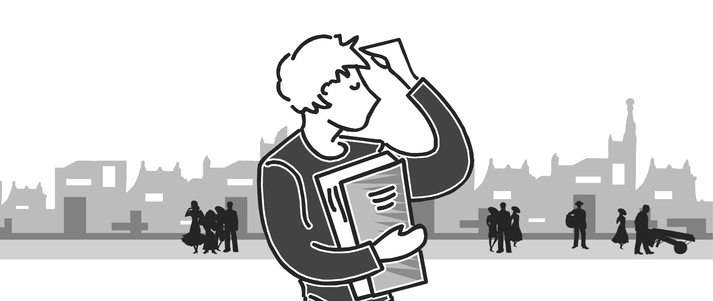
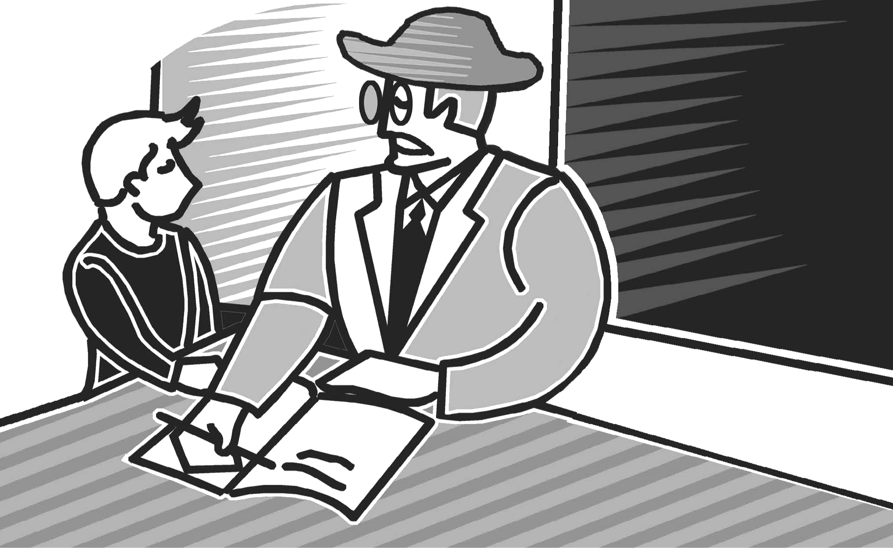
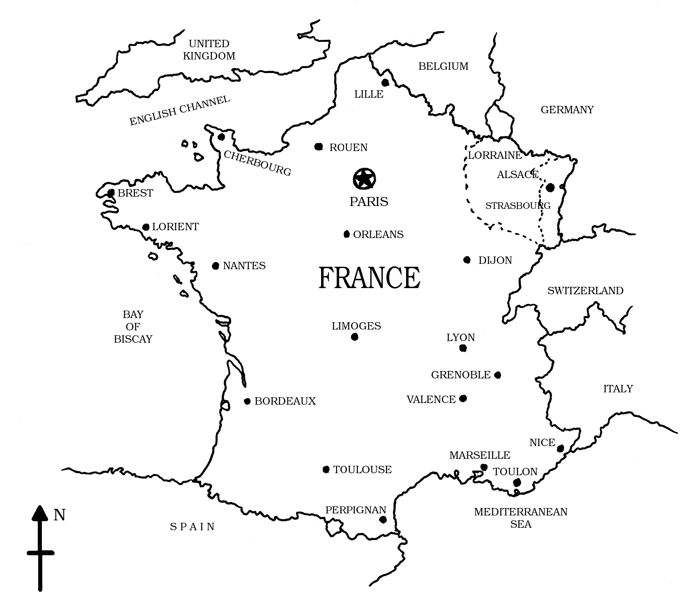

                                               
import { Card, Figure, Think } from "@/components/markdown";

<Card id="author" title="About the author">
[Alphonse Daudet](https://en.wikipedia.org/wiki/Alphonse_Daudet) (1840-1897) 
was a French novelist and short-story writer. [The
Last Lesson](https://en.wikisource.org/wiki/The_Last_Lesson) is set in the days of 
the [Franco-Prussian War](https://en.wikipedia.org/wiki/Franco-Prussian_War) (1870-1871) in which
France was defeated by [Prussia](https://en.wikipedia.org/wiki/Prussia) led by 
[Bismarck](https://en.wikipedia.org/wiki/Otto_von_Bismarck). 
Prussia then consisted of what
now are the nations of Germany, Poland and parts of Austria. In this story the
French districts of Alsace and Lorraine have passed into Prussian hands. Read
the story to find out what effect this had on life at school. Notice these
expressions in the text.
</Card>

:::note

Infer their meaning from the context

- in great dread of
- in unison
- counted on
- a great bustle
- thumbed at the edges
- reproach ourselves with

:::

## 1. The Last Lesson

I started for school very late that morning and was in great dread of a
scolding, especially because M. Hamel had said that he would question us on
participles, and I did not know the first word about them. For a moment I
thought of running away and spending the day out of doors. It was so warm, so
bright! The birds were chirping at the edge of the woods; and in the open field
back of the sawmill the Prussian soldiers were drilling. It was all much more
tempting than the rule for participles, but I had the strength to resist, and
hurried off to school.

When I passed the town hall there was a crowd in front of the bulletin-board.
For the last two years all our bad news had come from there — the lost battles,
the draft, the orders of the commanding officer — and I thought to myself,
without stopping, “What can be the matter now?”

Then, as I hurried by as fast as I could go, the blacksmith, Wachter, who was
there, with his apprentice, reading the bulletin, called after me, “Don't go so
fast, bub; you'll get to your school in plenty of time!”

I thought he was making fun of me, and reached M. Hamel's little garden all out
of breath.

Usually, when school began, there was a great bustle, which could be heard out
in the street, the opening and closing of desks, lessons repeated in unison,
very loud, with our hands over our ears to understand better, and the teacher's
great ruler rapping on the table. But now it was all so still! I had counted on
the commotion to get to my desk without being seen; but, of course, that day
everything had to be as quiet as Sunday morning. Through the window I saw my
classmates, already in their places, and M. Hamel walking up and down with his
terrible iron ruler under his arm. I had to open the door and go in before
everybody. You can imagine how I blushed and how frightened I was.

But nothing happened. M. Hamel saw me and said very kindly, “Go to your place
quickly, little Franz. We were beginning without you.”

<Figure id="1.1" invertable={true}>

</Figure>

I jumped over the bench and sat down at my desk. Not till then, when I had got a
little over my fright, did I see that our teacher had on his beautiful green
coat, his frilled shirt, and the little black silk cap, all embroidered, that he
never wore except on inspection and prize days. Besides, the whole school seemed
so strange and solemn. But the thing that surprised me most was to see, on the
back benches that were always empty, the village people sitting quietly like
ourselves; old Hauser, with his three-cornered hat, the former mayor, the former
postmaster, and several others besides. Everybody looked sad; and Hauser had
brought an old primer, thumbed at the edges, and he held it open on his knees
with his great spectacles lying across the pages.

<Figure id="1.2" halfWidth={true} invertable={true}>

</Figure>

While I was wondering about it all, M. Hamel mounted his chair, and, in the same
grave and gentle tone which he had used to me, said, “My children, this is the
last lesson I shall give you. The order has come from Berlin to teach only
German in the schools of Alsace and Lorraine. The new master comes tomorrow.
This is your last French lesson. I want you to be very attentive.”

What a thunderclap these words were to me! Oh, the wretches; that was what they
had put up at the town-hall!

My last French lesson! Why, I hardly knew how to write! I should never learn any
more! I must stop there, then! Oh, how sorry I was for not learning my lessons,
for seeking birds' eggs, or going sliding on the Saar! My books, that had seemed
such a nuisance a while ago, so heavy to carry, my grammar, and my history of
the saints, were old friends now that I couldn't give up. And M. Hamel, too; the
idea that he was going away, that I should never see him again, made me forget
all about his ruler and how cranky he was.

Poor man! It was in honour of this last lesson that he had put on his fine
Sunday clothes, and now I understood why the old men of the village were sitting
there in the back of the room. It was because they were sorry, too, that they
had not gone to school more. It was their way of thanking our master for his
forty years of faithful service and of showing their respect for the country
that was theirs no more.

While I was thinking of all this, I heard my name called. It was my turn to
recite. What would I not have given to be able to say that dreadful rule for the
participle all through, very loud and clear, and without one mistake? But I got
mixed up on the first words and stood there, holding on to my desk, my heart
beating, and not daring to look up.

I heard M. Hamel say to me, “I won't scold you, little Franz; you must feel bad
enough. See how it is! Every day we have said to ourselves, 'Bah! I've plenty of
time. I'll learn it tomorrow.' And now you see where we've come out. Ah, that's
the great trouble with Alsace; she puts off learning till tomorrow. Now those
fellows out there will have the right to say to you, 'How is it; you pretend to
be Frenchmen, and yet you can neither speak nor write your own language?' But
you are not the worst, poor little Franz. We've all a great deal to reproach
ourselves with.”

“Your parents were not anxious enough to have you learn. They preferred to put
you to work on a farm or at the mills, so as to have a little more money. And I?
I've been to blame also. Have I not often sent you to water my flowers instead
of learning your lessons? And when I wanted to go fishing, did I not just give
you a holiday?”

<Figure id="1.3" halfWidth={true} invertable={true}>

</Figure>

Then, from one thing to another, M. Hamel went on to talk of the French
language, saying that it was the most beautiful language in the world — the
clearest, the most logical; that we must guard it among us and never forget it,
because when a people are enslaved, as long as they hold fast to their language
it is as if they had the key to their prison. Then he opened a grammar and read
us our lesson. I was amazed to see how well I understood it. All he said seemed
so easy, so easy! I think, too, that I had never listened so carefully, and that
he had never explained everything with so much patience. It seemed almost as if
the poor man wanted to give us all he knew before going away, and to put it all
into our heads at one stroke.

<Figure id="1.4" title="France, 1870-71, Sketch map not to scale" invertable={true}>

</Figure>

:::note[Think as you read]

1. What was Franz expected to be prepared with for school that day?
2. What did Franz notice that was unusual about the school that day?
3. What had been put up on the bulletin-board?

:::

<Figure id="1.5" halfWidth={true} invertable={true}>

</Figure>

After the grammar, we had a lesson in writing. That day M. Hamel had new copies
for us, written in a beautiful round hand — France, Alsace, France, Alsace. They
looked like little flags floating everywhere in the school-room, hung from the
rod at the top of our desks. You ought to have seen how every one set to work,
and how quiet it was! The only sound was the scratching of the pens over the
paper. Once some beetles flew in; but nobody paid any attention to them, not
even the littlest ones, who worked right on tracing their fish-hooks, as if that
was French, too. On the roof the pigeons cooed very low, and I thought to
myself, “Will they make them sing in German, even the pigeons?”

Whenever I looked up from my writing I saw M. Hamel sitting motionless in his
chair and gazing first at one thing, then at another, as if he wanted to fix in
his mind just how everything looked in that little school-room. Fancy! For forty
years he had been there in the same place, with his garden outside the window
and his class in front of him, just like that. Only the desks and benches had
been worn smooth; the walnut-trees in the garden were taller, and the hopvine
that he had planted himself twined about the windows to the roof. How it must
have broken his heart to leave it all, poor man; to hear his sister moving about
in the room above, packing their trunks! For they must leave the country next
day.

But he had the courage to hear every lesson to the very last. After the writing,
we had a lesson in history, and then the babies chanted their ba, be bi, bo, bu.
Down there at the back of the room old Hauser had put on his spectacles and,
holding his primer in both hands, spelled the letters with them. You could see
that he, too, was crying; his voice trembled with emotion, and it was so funny
to hear him that we all wanted to laugh and cry. Ah, how well I remember it,
that last lesson!

All at once the church-clock struck twelve. Then the Angelus. At the same moment
the trumpets of the Prussians, returning from drill, sounded under our windows.
M. Hamel stood up, very pale, in his chair. I never saw him look so tall.

“My friends,” said he, “I—I—” But something choked him. He could not go on.

Then he turned to the blackboard, took a piece of chalk, and, bearing on with
all his might, he wrote as large as he could — “Vive La France!”

Then he stopped and leaned his head against the wall, and, without a word, he
made a gesture to us with his hand — “School is dismissed — you may go.”

:::note[Think as you read]

1. What changes did the order from Berlin cause in school that day?
2. How did Franz's feelings about M. Hamel and school change?

:::

---

## Understanding the text

### Question 1.

The people in this story suddenly realise how precious their language is to
them. What shows you this? Why does this happen?

### Question 2.

Franz thinks, “Will they make them sing in German, even the pigeons?” What could
this mean?

(There could be more than one answer.)

---

## Talking about the text

### Question 1.

“When a people are enslaved, as long as they hold fast to their language it is
as if they had the key to their prison.”

Can you think of examples in history where a conquered people had their language
taken away from them or had a language imposed on them?

### Question 2.

What happens to a linguistic minority in a state? How do you think they can keep
their language alive? For example:

- Punjabis in Bangalore
- Tamilians in Mumbai
- Kannadigas in Delhi
- Gujaratis in Kolkata

### Question 3.

Is it possible to carry pride in one's language too far? Do you know what
'linguistic chauvinism' means?

---

## Working with words

### Question 1.

English is a language that contains words from many other languages. This
inclusiveness is one of the reasons it is now a world language, For example:

- petite - French
- kindergarten - German
- capital - Latin
- democracy - Greek
- bazaar - Hindi

Find out the origins of the following words.

- tycoon
- barbecue
- zero
- tulip
- veranda
- ski
- logo
- robot
- trek
- bandicoot

### Question 2.

Notice the underlined words in these sentences and tick the option that best
explains their meaning.

- (a) “What a thunderclap these words were to me!”

  _The words were_
  - (i) loud and clear.
  - (ii) startling and unexpected.
  - (iii) pleasant and welcome.

- (b) “When a people are enslaved, as long as they hold fast to their language
  it is as if they had the key to their prison”

  _It is as if they have the key to the prison as long as they_
  - (i) do not lose their language.
  - (ii) are attached to their language.
  - (iii) quickly learn the conqueror's language.

- (c) Don't go so fast, you will get to your school in plenty of time.

  _You will get to your school_
  - (i) very late.
  - (ii) too early.
  - (iii) early enough.

- (d) I never saw him look so tall.

  _M. Hamel_
  - (a) had grown physically taller
  - (b) seemed very confident
  - (c) stood on the chair

---

## Noticing form

Read this sentence

M. Hamel had said that he would question us on participles. In the sentence
above, the verb form “had said” in the first part is used to indicate an
“earlier past”. The whole story is narrated in the past. M. Hamel's “saying”
happened earlier than the events in this story. This form of the verb is called
the past perfect.

Pick out five sentences from the story with this form of the verb and say why
this form has been used.

---

## Writing

### Question 1.

Write a notice for your school bulletin board. Your notice could be an
announcement of a forthcoming event, or a requirement to be fulfilled, or a rule
to be followed.

### Question 2.

Write a paragraph of about 100 words arguing for or against having to study
three languages at school.

### Question 3.

Have you ever changed your opinion about someone or something that you had
earlier liked or disliked? Narrate what led you to change your mind.

---

## Things to do

### Question 1.

Find out about the following (You may go to the internet, interview people,
consult reference books or visit a library.)

- (a) Linguistic human rights
- (b) Constitutional guarantees for linguistic minorities in India.

### Question 2.

Given below is a survey form. Talk to at least five of your classmates and fill
in the information you get in the form.

| S.No. | Languages you know | Home language | Neighbourhood language | City/Town language | School language |
| ----- | ------------------ | ------------- | ---------------------- | ------------------ | --------------- |
| 1     |                    |               |                        |                    |                 |
| 2     |                    |               |                        |                    |                 |
| 3     |                    |               |                        |                    |                 |
| 4     |                    |               |                        |                    |                 |
| 5     |                    |               |                        |                    |                 |

---

## ABOUT THE UNIT

### THEME

The pain that is inflicted on the people of a territory by its conquerors by
taking away the right to study or speak their own language.

### SUB-THEME

Student and teacher attitudes to learning and teaching.

### READING COMPREHENSION

The comprehension check at the end of each section in the unit helps pupils make
sure that they have understood the facts before they move on to the next
section. One session of forty minutes is likely to be enough for one section of
the unit. Pupils can read each section silently and discuss the answers in
pairs. The questions at the end of the unit are inferential. These help pupils
make sense of the writer's intention in focussing on a local episode and to
comment on an issue of universal significance. There could be a follow-up
discussion on parts for which students need explanation.

### TALKING ABOUT THE TEXT

Topics to be discussed in small groups or pairs. This shall help pupils think of
issues that relate to the realities of the society they live in. Gives scope for
developing speaking skills in the English language on varied issues. Fluency
development.

### WORKING WITH WORDS

To make pupils aware of

- the enrichment of the English language through borrowings from the other
  languages.
- idiomatic expressions and figurative use of language.

### NOTICING FORM

To make pupils notice tense form and understand the context of its use.

### WRITING

- Practice in a functional genre, e.g., bulletin.
- Argumentative writing on a topic related to their life at school.
- Narrating subjective experience discussing personal likes and dislikes.

### THINGS TO DO

Extension activity that will help pupils understand language rights of citizens
and the problems of linguistic minorities. Social and political awareness.

---
