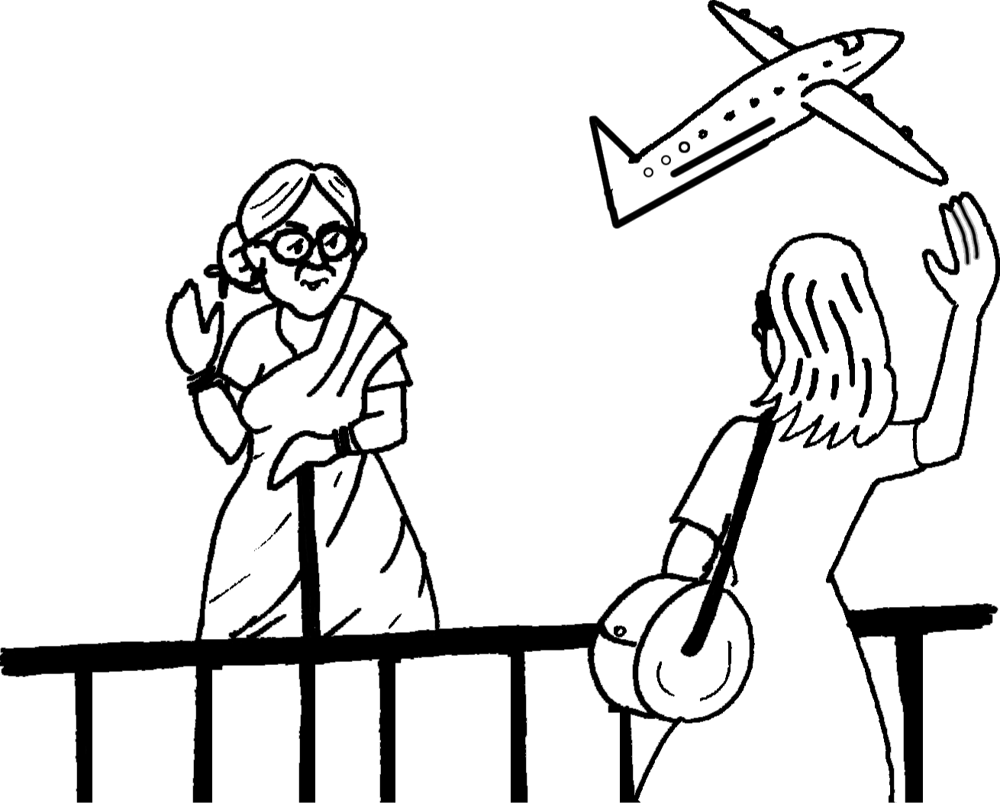

import { Card, Figure, Think } from "@/components/markdown";

<Card id="poet" title="About the poet">

[Kamala Das](https://en.wikipedia.org/wiki/Kamala_Surayya) (1934-2009) was born
in Malabar, Kerala. She is recognised as one of India's foremost poets. Her
works are known for their originality, versatility and the indigenous flavour of
the soil. Kamala Das has published many novels and short stories in English and
Malayalam under the name 'Madhavikutty'. In addition to five books of poetry.
She is a sensitive writer who captures the complex subtleties of human
relationships in lyrical idiom,
[My Mother at Sixty-six](https://poemotopia.com/kamala-das/my-mother-at-sixty-six/)
is an example.

</Card>

:::note[Before you read]

Ageing is a natural process; have you ever thought what our elderly parents
expect from us?

:::

## My Mother at Sixty-six

<Figure halfWidth={true} invertable={true}>

</Figure>

Driving from my parent's\
home to Cochin last Friday\
morning, I saw my mother,\
beside me,\
doze, open mouthed, her face\
ashen like that\
of a corpse and realised with pain\
that she was as old as she\
looked but soon\
put that thought away, and\
looked out at Young\
Trees _sprinting_, the merry children spilling\
out of their homes, but after the airport's\
security check, standing a few yards\
away, I looked again at her, _wan_, pale\
as a late winter's moon and felt that old\
familiar ache, my childhood's fear,\
but all I said was, see you soon, Amma,\
all I did was smile and smile and\
smile......

<Figure halfWidth={true} invertable={true}>

</Figure>

_**sprinting:**_ short fast race, running

_**wan:**_ colourless

---

## Think it out

### Question 1.

What is the kind of pain and ache that the poet feels?

### Question 2.

Why are the young trees described as 'sprinting'?

### Question 3.

Why has the poet brought in the image of the merry children 'spilling out of
their homes'?

### Question 4.

Why has the mother been compared to the 'late winter's moon'?

### Question 5.

What do the parting words of the poet and her smile signify?

:::note[]

Notice that the whole poem is in a single sentence, punctuated by commas.

It indicates a single thread of thought interspersed with observations of the
real world around and the way these are connected to the main idea.

:::

---