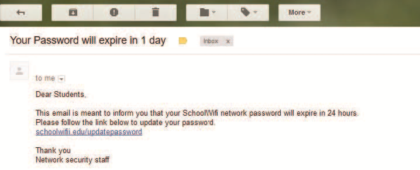
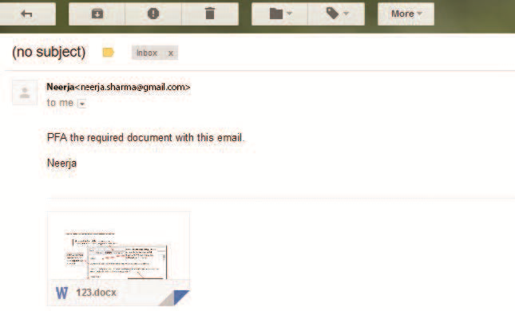

import {
  Activity,
  Card,
  Example,
  Figure,
  Table,
  Quote,
  Summary,
  Think
} from "@/components/markdown";

<Quote author="Stephen Hawking">
"I think computer viruses should count as life. I think it says something about
human nature that the only form of life we have created so far is purely
destructive. We've created life in our own image."
</Quote>

In this chapter

- [Introduction](#section-6.1)
- [Digital Footprints](#section-6.2)
- [Digital Society and Netizen](#section-6.3)
- [Data Protection](#section-6.4)
- [Creative Commons](#section-6.5)
- [Cyber Crime](#section-6.6)
- [Indian Information Technology Act (IT Act)](#section-6.7)
- [E-waste: Hazards and Management](#section-6.8)
- [Impact on Health Chapter](#section-6.9)

## 6.1 Introduction ||section-6.1||

In recent years, the world around us has seen a lot of changes due to use of
'Digital Technologies'. These changes have made a dramatic impact on our lives,
making things more convenient, faster, and easier to handle. In the past, a
letter would take days to reach, and every recipient would get his or her own
copy and respond separately. Today, one can send and receive emails to more than
one person at a time. The instantaneous nature of electronic communications has
made us more efficient and productive.

From the banking industry to aviation, industrial production to e-commerce,
especially with regard to the delivery of their goods and services, all are now
dependent on the use of computers and digital technologies. Applications of
digital technologies have redefined and evolved all spheres of human activities.
Today more and more people are using digital technologies through smartphones,
computers, etc., with the help of high speed Internet. Why did the digital
technologies become so widespread? The introduction of personal computers (PCs)
and Internet followed by smartphones has brought these technologies to the
common man. While we reap the benefits of digital technologies, these
technologies can also be misused. Let's look at the impact of these technologies
on our society and the best practices that can ensure a productive and safe
digital environment for us.

## 6.2 Digital Footprints ||section-6.2||

Have you ever searched online for any information? Have you ever purchased an
online ticket, or responded to your friend's email, or checked the score of a
game online? Whenever we surf the Internet using smartphones, tablets,
computers, etc., we leave a trail of data reflecting the activities performed by
us online, which is our digital footprint. Our digital footprint can be created
and used with or without our knowledge. It includes websites we visit, emails we
send, and any information we submit online, etc., along with the computer's IP
address, location, and other device specific details. Such data could be used
for targeted advertisement or could also be misused or exploited. Thus, it is
good to be aware of the data trail we might be leaving behind. This awareness
should make us cautious about what we write, upload or download or even browse
online. There are two kinds of digital footprints we leave behind. Active
digital footprints which includes data that we intentionally submit online. This
would include emails we write, or responses or posts we make on different
websites or mobile Apps, etc. The digital data trail we leave online
unintentionally is called passive digital footprints. This includes the data
generated when we visit a website, use a mobile App, browse Internet, etc. as
shown in [Figure 6.1](#figure-6.1).

<Figure
  id="6.1"
  title="Figure 6.1: Exemplar web applications that result in digital footprints"
  halfWidth={true}
  images={[
    {
      src: import("./res/fig_6.1.svg"),
      alt: "Exemplar web applications that result in digital footprints",
    }
  ]}
/>

Everyone who is connected to the Internet may have a digital footprint. With
more usage, the trail grows. On examining the browser settings, we can find out
how it stores our browsing history, cookies, passwords, auto fills, and many
other types of data.

Besides browser, most of our digital footprints are stored in servers where the
applications are hosted. We may not have access to remove or erase that data,
neither do we have any control on how that data will be used. Therefore, once a
data trail is generated, even if we later try to erase data about our online
activities, the digital footprints still remain. There is no guarantee that
digital footprints will be fully eliminated from the Internet. Therefore, we
need to be more cautious while being online! All our online activities leave a
data trace on the Internet as well as on the computing device that we use. This
can be used to trace the user, their location, device and other usage details.

<Think title="Think and Reflect">
Can your digital footprints be used to judge your attitude and work ethics?
</Think>

<Activity is="6.1" title="Activity 6.1">
As a digital citizen, list various services that you avail online.
</Activity>

## 6.3 Digital Society and Netizen ||section-6.3||

As our society is inclined towards using more and more digital technologies, we
end up managing most of our tasks digitally. In this era of digital society, our
daily activities like communication, social networking, banking, shopping,
entertainment, education, transportation, etc., are increasingly being driven by
online transactions.

Digital society thus reflects the growing trend of using digital technologies in
all spheres of human activities. But while online, all of us need to be aware of
how to conduct ourselves, how best to relate with others and what ethics, morals
and values to maintain. Anyone who uses digital technology along with Internet
is a digital citizen or a netizen. Being a good netizen means practicing safe,
ethical and legal use of digital technology. A responsible netizen must abide by
net etiquettes, communication etiquettes and social media etiquettes.

### 6.3.1 Net Etiquettes ||section-6.3.1||

We follow certain etiquettes during our social interactions. Similarly, we need
to exhibit proper manners and etiquettes while being online as shown in [Figure
6.2](#figure-6.2). One should be ethical, respectful and responsible while surfing the
Internet.

<Figure
  id="6.2"
  title="Figure 6.2: Net etiquettes"
  halfWidth={true}
  images={[
    {
      src: import("./res/fig_6.2.svg"),
      srcDark: import("./res/fig_6.2.dark.svg"),
      alt: "Net etiquettes",
    }
  ]}
/>

:::tip

While surfing the Internet, we should be cautious about our personal and
confidential data.

- Think before sharing credentials with others on an online platform.

- Keep personal information safe and protected through passwords.

:::

#### (A) Be Ethical ||section-6.3.1.a||

- No copyright violation: we should not use copyrighted materials without the
  permission of the creator or owner. As an ethical digital citizen, we need to
  be careful while streaming audio or video or downloading images and files from
  the Internet. We will learn more about copyright in
  [Section 6.4](#section-6.4).

- Share the expertise: it is good to share information and knowledge on Internet
  so that others can access it. However, prior to sharing information, we need
  to be sure that we have sufficient knowledge on that topic. The information
  shared should be true and unambiguous. Also, in order to avoid redundant
  information, we should verify that the information is not available already on
  Internet.

#### (B) Be Respectful ||section-6.3.1.b||

- Respect privacy: as good digital citizens we have the right to privacy and the
  freedom of personal expression. At the same time, we have to understand that
  other digital citizens also have the same rights and freedoms. Our personal
  communication with a digital citizen may include images, documents, files,
  etc., that are private to both. We should respect this privacy and should not
  share those images, documents, files, etc., with any other digital citizen
  without each others' consent.

- Respect diversity: in a group or public forum, we should respect the diversity
  of the people in terms of knowledge, experience, culture and other aspects.

#### (C) Be Responsible ||section-6.3.1.c||

- Avoid cyber bullying: any insulting, degrading or intimidating online
  behaviour like repeated posting of rumours, giving threats online, posting the
  victim's personal information, sexual harassment or comments aimed to publicly
  ridicule a victim is termed as cyber bullying. It implies repeatedly targeting
  someone with intentions to hurt or embarrass. Perhaps new or non-frequent
  users of the Internet feel that things done online have no effect in the real
  world. We need to realise that bullying online can have very serious
  implications on the other person (victim). Also, remember our actions can be
  traced back using our digital footprints.

- Don't feed the troll: an Internet troll is a person who deliberately sows
  discord on the Internet by starting quarrels or upsetting people, by posting
  inflammatory or off topic messages in an online community, just for amusement.
  Since trolls thrive on attention, the best way to discourage trolls is not to
  pay any attention to their comments.

<Activity title="Activity 6.2">
Find out how to report about an abusive or inappropriate post or about a sender
in a social network.
</Activity>

### 6.3.2 Communication Etiquettes ||section-6.3.2||

Digital communication includes email, texting, instant messaging, talking on the
cell phone, audio or video conferencing, posting on forums, social networking
sites, etc. All these are great ways to connect with people in order to exchange
ideas, share data and knowledge. Good communication over email, chat room and
other such forums require a digital citizen to abide by the communication
etiquettes as shown in [Figure 6.3](#figure-6.3).

<Figure 
  id="6.3" 
  title="Figure 6.3: Communication etiquettes"
  images={[
    {
      src: import("./res/fig_6.3.svg"),
      alt: "Communication etiquettes",
    }
  ]}
/>

:::tip[Avoid Spam!!]

On receiving junk email (called Spam), neither reply nor open any attachment in
such email.

:::

#### (A) Be Precise ||section-6.3.2.a||

- Respect time: we should not waste precious time in responding to unnecessary
  emails or comments unless they have some relevance for us. Also, we should not
  always expect an instant response as the recipient may have other priorities.

- Respect data limits: For concerns related to data and bandwidth, very large
  attachments may be avoided. Rather send compressed files or link of the files
  through cloud shared storage like Google Drive, Microsoft OneDrive, Yahoo
  Dropbox, etc.

#### (B) Be Polite ||section-6.3.2.b||

Whether the communication is synchronous (happening in real time like chat,
audio/video calls) or asynchronous (like email, forum post or comments), we
should be polite and non-aggressive in our communication. We should avoid being
abusive even if we don't agree with others' point of view.

#### (C) Be Credible ||section-6.3.2.c||

We should be cautious while making a comment, replying or writing an email or
forum post as such acts decide our credibility over a period of time. That is
how we decide to follow some particular person's forum posts while ignoring
posts of other members of the forum. On various discussion forums, we usually
try to go through the previous comments of a person and judge their credibility
before relying on that person's comments.

:::tip[No Permanent Deletion!!]

We can post or comment anything on Internet, and delete it later.

- But remember, it cannot be permanently deleted. It is recorded in our Digital
  Footprint.

- This is how many culprits who spread hate, bully others or engage in criminal
  activities are traced and apprehended.

:::

### 6.3.3 Social Media Etiquettes ||section-6.3.3||

In the current digital era, we are familiar with different kinds social media
and we may have an account on Facebook, Google+, Twitter, Instagram, Pinterest,
or YouTube channel. Social media are websites or applications that enable their
users to participate in social networking by creating and sharing content with
others in the community. These platforms encourage users to share their thoughts
and experiences through posts or pictures. In this way users can interact with
other online users of those social media apps or channels. This is why the
impact and outreach of social media has grown exponentially. It has begun to
shape the outcome of politics, business, culture, education and more. In social
media too, there are certain etiquettes we need to follow as shown in [Figure
6.4](#figure-6.4).

<Figure 
  id="6.4" 
  title="Figure 6.4: Social media etiquettes"
  images={[
    {
      src: import("./res/fig_6.4.svg"),
      alt: "Social media etiquettes",
    }
  ]}
/>

:::tip[Don't Meet Up!!]

- Never arrange to meet an online friend because it may not be safe.

- No matter how genuine someone is appearing online, they might be pretending
  and hiding their real identity.

:::

#### (A) Be Secure ||section-6.3.3.a||

- Choose password wisely: it is vital for social network users. News of
  breaching or leakage of user data from social network often attracts
  headlines. Users should be wary of such possibilities and must know how to
  safeguard themselves and their accounts. The minimum one can do is to have
  strong and frequently changed password. Never share personal credentials like
  username and password with others.

- Know who you befriend: social networks usually encourage connecting with users
  (making friends), sometime even those whom we don't know or have not met.
  However, we need to be careful while befriending unknown people as their
  intentions possibly could be malicious and unsafe.

- Beware of fake information: fake news, messages and posts are common in social
  networks. As a user, we should be aware of them. With experience, we should be
  able to figure out whether a news, message or post is genuine or fake. Thus,
  we should not blindly believe in everything that we come across on such
  platforms, we should apply our knowledge and experience to validate such news,
  message or post.

<Think title="Think and Reflect">
Is having the same password for all your accounts on different websites safe?
</Think>

:::tip[Play Safe!!]

Think carefully before sharing personal photos.

:::

#### (B) Be Reliable ||section-6.3.3.b||

- Think before uploading: we can upload almost anything on social network.
  However, remember that once uploaded, it is always there in the remote server
  even if we delete the files. Hence we need to be cautious while uploading or
  sending sensitive or confidential files which have a bearing on our privacy.

<Activity title="Activity 6.3">
Suppose someone's email password is 'technology', which is weak. Can you suggest
a stronger password?
</Activity>

## 6.4 Data Protection ||section-6.4||

In this digital age, data or information protection is mainly about the privacy
of data stored digitally. Elements of data that can cause substantial harm,
embarrassment, inconvenience and unfairness to an individual, if breached or
compromised, is called sensitive data. Examples of sensitive data include
biometric information, health information, financial information, or other
personal documents, images or audios or videos. Privacy of sensitive data can be
implemented by encryption, authentication, and other secure methods to ensure
that such data is accessible only to the authorised user and is for a legitimate
purpose.

All over the world, each country has its own data protection policies (laws).
These policies are legal documents that provide guidelines to the user on
processing, storage and transmission of sensitive information. The motive behind
implementation of these policies is to ensure that sensitive information is
appropriately protected from modification or disclosure.

<Think title="Think and Reflect">
Why should we always mention the source from which we got an idea or used
resources (text, image, audio, video, etc.) to prepare a project or a writeup?
</Think>

### 6.4.1 Intellectual Property Right (IPR) ||section-6.4.1||

When someone owns a house or a motorcycle, we say that the person owns that
property. Similarly, if someone comes out with a new idea, this original idea is
that person's intellectual property. Intellectual Property refers to the
inventions, literary and artistic expressions, designs and symbols, names and
logos. The ownership of such concepts lies with the creator, or the holder of
the intellectual property. This enables the creator or copyright owner to earn
recognition or financial benefit by using their creation or invention.
Intellectual Property is legally protected through copyrights, patents,
trademarks,etc.

:::tip[Executing IPR: say for a software]

- Code of the software will be protected by a copyright

- Functional expression of the idea will be protected by a patent

- The name and logo of the software will come under a registered trademark

:::

#### (A) Copyright ||section-6.4.1.a||

Copyright grants legal rights to creators for their original works like writing,
photograph, audio recordings, video, sculptures, architectural works, computer
software, and other creative works like literary and artistic work. Copyrights
are automatically granted to creators and authors. Copyright law gives the
copyright holder a set of rights that they alone can avail legally. The rights
include right to copy (reproduce) a work, right to create derivative works based
upon it, right to distribute copies of the work to the public, and right to
publicly display or perform the work. It prevents others from copying, using or
selling the work. For example, writer Rudyard Kipling holds the copyright to his
novel, 'The Jungle Book', which tells the story of Mowgli, the jungle boy. It
would be an infringement of the writer's copyright if someone used parts of the
novel without permission. To use other's copyrighted material, one needs to
obtain a license from them.

<Activity id="6.4" title="Activity 6.4">
Explore the following websites to know about open/public licensing:

- (i) [creativecommons.org](https://creativecommons.org) for CC, and
- (ii) [gnu.org](https://gnu.org) for GNU GPL.
</Activity>

#### (B) Patent ||section-6.4.1.b||

A patent is usually granted for inventions. Unlike copyright, the inventor needs
to apply (file) for patenting the invention. When a patent is granted, the owner
gets an exclusive right to prevent others from using, selling, or distributing
the protected invention. Patent gives full control to the patentee to decide
whether or how the invention can be used by others. Thus it encourages inventors
to share their scientific or technological findings with others. A patent
protects an invention for 20 years, after which it can be freely used.
Recognition and/or financial benefit foster the right environment, and provide
motivation for more creativity and innovation.

:::tip

Only the copyright owner of a work can enter into a license agreement.

:::

#### (C) Trademark ||section-6.4.1.c||

Trademark includes any visual symbol, word, name, design, slogan, label, etc.,
that distinguishes the brand or commercial enterprise, from other brands or
commercial enterprises. For example, no company other than Nike can use the Nike
brand to sell shoes or clothes. It also prevents others from using a confusingly
similar mark, including words or phrases. For example, confusing brands like
"Nikke" cannot be used. However, it may be possible to apply for the Nike
trademark for unrelated goods like notebooks.

:::tip

End User License Agreement (EULA) contains the dos and don'ts with respect to
the software being purchased. It covers all clauses of software purchase, viz.,
how many copies can be installed, whether source is available, whether it can be
modified and redistributed and so on.

:::

### 6.4.2 Licensing ||section-6.4.2||

We have studied about copyright in the previous section. Licensing and
copyrights are two sides of the same coin. A license is a type of contract or a
permission agreement between the creator of an original work permitting someone
to use their work, generally for some price; whereas copyright is the legal
rights of the creator for the protection of original work of different types.
Licensing is the legal term used to describe the terms under which people are
allowed to use the copyrighted material. We will limit our study to software
licensing in this chapter.

A software license is an agreement that provides legally binding guidelines
pertaining to the authorised use of digital material. The digital material may
include any software or any form of art, literature, photos, etc., in digital
form. Any such resource posted on the Internet constitutes intellectual property
and must be downloaded, used or distributed according to the guidelines given in
the license agreement. Failure to follow such guidelines is considered as an
infringement of Intellectual Property Rights (IPR), and is a criminal offence.

:::tip[Beware!!]

- Plagiarism means using other's work and not giving adequate citation for use.

- Copyright infringement means using another person's work, without permission
  or without paying for it, if it is being sold.

:::

### 6.4.3 Violation of IPR ||section-6.4.3||

Violation of intellectual property right may happen in one of the following
ways:

#### (A) Plagiarism ||section-6.4.3.a||

With the availability of Internet, we can instantly copy or share text, pictures
and videos. Presenting someone else's idea or work as one's own idea or work is
called plagiarism. If we copy some contents from Internet, but do not mention
the source or the original creator, then it is considered as an act of
plagiarism. Further, if someone derives an idea or a product from an already
existing idea or product, but instead presents it as a new idea, then also it is
plagiarism. It is a serious ethical offense and sometimes considered as an act
of fraud. Even if we take contents that are open for public use, we should cite
the author or source to avoid plagiarism.

#### (B) Copyright Infringement ||section-6.4.3.b||

Copyright infringement is when we use other person's work without obtaining
their permission to use or we have not paid for it, if it is being sold. Suppose
we download an image from the Internet and use it in our project. But if the
owner of the copyright of the image does not permit its free usage, then using
such an image even after giving reference of the image in our project is a
violation of copyright. Just because it is on the Internet, does not mean that
it is free for use. Hence, check the copyright status of writer's work before
using it to avoid copyright infringement.

### (C) Trademark Infringement Remember ||section-6.4.3.c||

Trademark Infringement means unauthorised use of other's trademark on products
and services. An owner of a trademark may commence legal proceedings against
someone who infringes its registered trademark.

### 6.4.4 Public Access and Open Source Software ||section-6.4.4||

Copyright sometimes put restriction on the usage of
the copyrighted works by anyone else. If others are allowed to use and built
upon the existing work, it will encourage collaboration and would result in new
innovations in the same direction. Licenses provide
rules and guidelines for others to use the existing work.
When authors share their copyrighted works with others under public license, it
allows others to use and even modify the content. Open source licenses help
others to
contribute to existing work or project without seeking special individual
permission to do so.

The GNU General Public License (GPL) and the Creative Commons (CC) are two
popular categories of public licenses. CC is used for all kind of creative
works
like websites, music, film, literature, etc. CC enables the free distribution of
an otherwise copyrighted work. It is used when an author wants to give people
the right to share, use and build upon a work that they have created. GPL is
primarily designed for providing public licence to a software. GNU GPL is
another free software license, which provides end users the freedom to run,
study, share and modify the software, besides getting regular updates.

Users or companies who distribute GPL licensed works may charge a fee for copies
or give them free of charge. This distinguishes the GPL license from freeware
software licenses like Skype, Adobe Acrobat reader, etc. that allow copying for
personal use but prohibit commercial distribution, or proprietary licenses where
copying is prohibited by copyright law. Many of the proprietary software that we
use are sold commercially and their program code (source code) are not shared or
distributed. However, there are certain software available freely for anyone and
their source code is also open for anyone to access, modify, correct and
improve. Free and open source software (FOSS) has a large community of users and
developers who are contributing continuously towards adding new features or
improving the existing features. For example, Linux kernel-based operating
systems like [Ubuntu](https://ubuntu.com/) and [Fedora](https://fedoraproject.org/) come under FOSS. Some of the popular FOSS tools
are office packages, like [Libre Office](https://www.libreoffice.org/), browser like [Mozilla Firefox](https://www.mozilla.org/en-US/firefox/), etc.

Software piracy is the unauthorised use or distribution of software. Those who
purchase a license for a copy of the software do not have the rights to make
additional copies without the permission of the copyright owner. It amounts to
copyright infringement regardless of whether it is done for sale, for free
distribution or for copier's own use. One should avoid software piracy. Using a
pirated software not only degrades the performance of a computer system, but
also affects the software industry which in turn affects the economy of a
country.

:::tip[Remember]

- CC licenses are a set of copyright licenses that give the recipients, rights
  to copy, modify and redistribute the creative material, but giving the
  authors, the liberty to decide the conditions of licensing.

- GPL is the most widely used free software license which grants the recipients,
  rights to copy, modify and redistribute the software and that the same rights
  are preserved in all derivative works. 
  
:::

## 6.5 Creative Commons ||section-6.5||

Creative Commons is a non-profit organisation (https://creativecommons.org/)
that aims to build a publically accessible global platform where a range of
creative and academic works are shared freely. Any one across the globe can
access them, share them, and even use them for creating their own work out of it
without infringing the copyright or Intellectual Property rights of the owners.
In fact, it gives proper attribution to the owners.

The Creative Commons organisation provides Creative Commons (CC) licenses free
of charge. It allows owners of a work to grant copyright permissions for their
creative and/or academic works in a free, simple and standardised way. A CC
license is a type of copyright license that enables the free distribution of
anybody's copyrighted work. This license is used when an author wants to give
others the right to share, use and extend the work done by them. The work
licensed under CC is governed by the Copyright law and so applies to all types
of work including art, music, literature, dramatics, movies, images, educational
resources, photographs and software. The CC Search feature of the online
platform makes the licensed material easier to find. The author of the content
is given full freedom to set up conditions to use their work. The owner of a
work can combine these conditions to create six different types of CC licenses,
as listed in [Table 6.1](#table-6.1).

<Table id="6.1" title="Table 6.1: Creative Commons (CC) Licenses">
| License Name                         | Symbolic Name | License Icon                                                        | Description                                                                                                                                                                                                                       |
| :----------------------------------- | :------------ | :------------------------------------------------------------------ | :-------------------------------------------------------------------------------------------------------------------------------------------------------------------------------------------------------------------------------- |
| Attribution                          | CC BY         |              | This license lets others distribute, remix, tweak, and build upon your work, even commercially, as long as they credit you for the original creation.                                                                             |
| Attribution-ShareAlike               | CC BY-SA      |        | This license lets others remix, tweak, and build upon your work even for commercial purposes, as long as they credit you and license their new creations under the identical terms.                                               |
| Attribution-NoDerivs                 | CC BY-ND      |        | This license lets others reuse the work for any purpose, including commercially; however, it cannot be shared with others in adapted form, and credit must be provided to you.                                                    |
| Attribution-NonCommercial            | CC BY-NC      |        | This license lets others remix, tweak, and build upon your work non-commercially, and although their new works must also acknowledge you and be non-commercial.                                                                   |
| Attribution-NonCommercial-ShareAlike | CC BY-NC-SA   |  | This license lets others remix, tweak, and build upon your work non-commercially, as long as they credit you and license their new creations under the identical terms.                                                           |
| Attribution-NonCommercial-NoDerivs   | CC BY-NC-ND   |  | This license is the most restrictive of our six main licenses, only allowing others to download your works and share them with others as long as they credit you, but they can't change them in any way or use them commercially. |
</Table>

## 6.6 Cyber Crime ||section-6.6||

Criminal activities or offences carried out in a digital environment can be
considered as cyber crime. In such crimes, either the computer itself is the
target or the computer is used as a tool to commit a crime. Cyber crimes are
carried out against either an individual, or a group, or an organisation or even
against a country, with the intent to directly or indirectly cause physical
harm, financial loss or mental harassment. A cyber criminal attacks a computer
or a network to reach other computers in order to disable or damage data or
services. Apart from this, a cyber criminal may spread viruses and other
malwares in order to steal private and confidential data for blackmailing and
extortion. A computer virus is some lines of malicious code that can copy itself
and can have detrimental effect on the computers, by destroying data or
corrupting the system. Similarly, malware is a software designed to specifically
gain unauthorised access to computer systems. The nature of criminal activities
are alarmingly increasing day-by-day, with frequent reports of hacking,
ransomware attacks, denial-of-service, phishing, email fraud, banking fraud and
identity theft.

:::tip[Remember!!]

Cyber crime is defined as a crime in which computer is the medium of crime
(hacking, phishing, spamming), or the computer is used as a tool to commit
crimes (extortion, data breaches, theft).

:::

<Activity id="6.5" title="Activity 6.5">
How can you unsubscribe from a mail group or block an email sender?
</Activity>

### 6.6.1 Hacking ||section-6.6.1||

Hacking is the act of unauthorised access to a computer, computer network or any
digital system. Hackers usually have technical expertise of the hardware and
software. They look for bugs to exploit and break into the system.

Hacking, when done with a positive intent, is called ethical hacking. Such
ethical hackers are known as white hat hackers. They are specialists in
exploring any vulnerability or loophole by during testing of the software. Thus,
they help in improving the security of a software. An ethical hacker may exploit
a website in order to discover its security loopholes or vulnerabilities. He
then reports his findings to the website owner. Thus, ethical hacking is
actually preparing the owner against any cyber attack.

A non-ethical hacker is the one who tries to gain unauthorised access to
computers or networks in order to steal sensitive data with the intent to damage
or bring down systems. They are called black hat hackers or crackers. Their
primary focus is on security cracking and data stealing. They use their skill
for illegal or malicious purposes. Such hackers try to break through system
securities for identity theft, monetary gain, to bring a competitor or rival
site down, to leak sensitive information, etc.

:::tip[ Beware !!]

Accepting links from untrusted emails can be hazardous, as they may potentially
contain a virus or link to malicious website. We should ensure to open any email
link or attachment only when it is from a trusted source and doesn't look
doubtful.

:::

### 6.6.2 Phishing and Fraud Emails ||section-6.6.2||

Phishing is an unlawful activity where fake websites or emails that look
original or authentic are presented to the user to fraudulently collect
sensitive and personal details, particularly usernames, passwords, banking and
credit card details. The most common phishing method is through email spoofing
where a fake or forged email address is used and the user presumes it to be from
an authentic source. So you might get an email from an address that looks
similar to your bank or educational institution, asking for your information,
but if you look carefully you will see their URL address is fake. They will
often use logo's of the original, making them difficult to detect from the real!
Phishing attempts through phone calls or text messages are also common these
days.

#### (A) Identity Theft ||section-6.6.2.a||

Identity thieves increasingly use personal information stolen from computers or
computer networks, to commit fraud by using the data gained unlawfully. A user's
identifiable personal data like demographic details, email ID, banking
credentials, passport, PAN, Aadhaar number and various such personal data are
stolen and misused by the hacker on behalf of the victim. This is one type of
phishing attack where the intention is largely for monetary gain. There can be
many ways in which the criminal takes advantage of an individual's stolen
identity. Given below are a few examples:

- Financial identity theft: when the stolen identity is used for financial gain.
- Criminal identity theft: criminals use a victim's stolen identity to avoid
  detection of their true identity.
- Medical identity theft: criminals can seek medical drugs or treatment using a
  stolen identity.

<Activity id="6.6" title="Activity 6.6">
Explore and find out how to file a complaint with the cyber cell in your area.
</Activity>

### 6.6.3 Ransomware ||section-6.6.3||

This is another kind of cyber crime where the attacker gains access to the
computer and blocks the user from accessing, usually by encrypting the data. The
attacker blackmails the victim to pay for getting access to the data, or
sometimes threatens to publish personal and sensitive information or photographs
unless a ransom is paid.

Ransomware can get downloaded when the users visit any malicious or unsecure
websites or download software from doubtful repositories. Some ransomware are
sent as email attachments in spam mails. It can also reach our system when we
click on a malicious advertisement on the Internet.

### 6.6.4 Combatting and Preventing Cyber Crime ||section-6.6.4||

The challenges of cyber crime can be mitigated with the twin approach of being
alert and taking legal help.

:::tip

Digital signatures are the digital equivalent of a paper certificate. Digital
signatures work on a unique digital ID issued by an Certificate Authority (CA)
to the user. Signing a document digitally means attaching that user's identify,
which can be used to authenticate.

A licensed Certifying Authority (CA) who has been granted a license to issue it
under Section 24 of the Indian IT-Act 2000, can issue the digital signature.

:::

Following points can be considered as safety measures to reduce the risk of
cyber crime:

- Take regular backup of important data.
- Use an antivirus software and keep it updated always.
- Avoid installing pirated software. Always download software from known and
  secure (HTTPS) sites.
- Always update the system software which include the Internet browser and other
  application software
- Do not visit or download anything from untrusted websites.
- Usually the browser alerts users about doubtful websites whose security
  certificate could not be verified; avoid visiting such sites.
- Use strong password for web login, and change it periodically. Do not use same
  password for all the websites. Use different combinations of alphanumeric
  characters including special characters. Ignore common words or names in
  password.
- While using someone else's computer, don't allow browser to save password or
  auto fill data, and try to browse in your private browser window.

- For an unknown site, do not agree to use cookies when asked for through a
  Yes/No option.
- Perform online transaction like shopping, ticketing, and other such services
  only through well-known and secure sites.
- Always secure wireless network at home with strong password and regularly
  change it.

## 6.7 IndIan InFormatIon technology act (IT ACT) ||section-6.7||

With the growth of Internet, many cases of cyber crimes, frauds, cyber attacks
and cyber bullying are reported. The nature of fraudulent activities and crimes
keeps changing. To deal with such menaces, many countries have come up with
legal measures for protection of sensitive personal data and to safeguard the
rights of Internet users. The Government of India's The Information Technology
Act, 2000 (also known as IT Act), amended in 2008, provides guidelines to the
user on the processing, storage and transmission of sensitive information. In
many Indian states, there are cyber cells in police stations where one can
report any cyber crime. The act provides legal framework for electronic
governance by giving recognition to electronic records and digital signatures.
The act outlines cyber crimes and penalties for them.

Cyber Appellate Tribunal has been established to resolve disputes arising from
cyber crime, such as tampering with computer source documents, hacking the
computer system, using password of another person, publishing sensitive personal
data of others without their consent, etc. The act is needed so that people can
perform transactions over the Internet through credit cards without fear of
misuse. Not only people, the act empowers government departments also to accept
filing, creation and storage of official documents in the digital format.

:::tip

California Law University has identified non- functioning cathode ray tubes
(CRTs) from televisions and computer monitors as hazardous.

:::

## 6.8 e-waste: hazards and management ||section-6.8||

E-waste or Electronic waste includes electric or electronic gadgets and devices
that are no longer in use. Hence, discarded computers, laptops, mobile phones,
televisions, tablets, music systems, speakers, printers, scanners etc.
constitute e-waste when they are near or end of their useful life.

E-waste is becoming one of the fastest growing environmental hazards in the
world today. The increased use of electronic equipment has also caused an
exponential increase in the number of discarded products. Lack of awareness and
appropriate skill to manage it has further worsened the problem. So, Waste
Electrical and Electronic Equipment (WEEE) is becoming a major concern for all
countries across the world. Globally, e-waste constitutes more than 5 per cent
of the municipal solid waste. Therefore, it is very important that e-waste is
disposed of in such a manner that it causes minimum damage to the environment
and society.

:::tip

Leaching is the process of removing a substance from another substance by
passing water through it.

:::

### 6.8.1 Impact of e-waste on environment

To some extent, e-waste is responsible for the degradation of our environment.
Whether it is emission of gases and fumes into the atmosphere, discharge of
liquid waste into drains or disposal of solid e-waste materials, all of this
contributes to environmental pollution in some way or the other.

When e-waste is carelessly thrown or dumped in landfills or dumping grounds,
certain elements or metals used in production of electronic products cause air,
water and soil pollution. This is because when these products come in contact
with air and moisture, they tend to leach. As a result, the harmful chemicals
seep into the soil, causing soil pollution. Further, when these chemicals reach
and contaminate the natural ground water, it causes water pollution as the water
becomes unfit for humans, animals and even for agricultural use. When dust
particles loaded with heavy metals enters the atmosphere, it causes air
pollution as well.

### 6.8.2 Impact of e-waste on humans ||section-6.8.2||

As mentioned before, the electrical or electronic devices are manufactured using
certain metals and elements like lead, beryllium, cadmium, plastics, etc. Most
of these materials are difficult to recycle and are considered to be toxic and
carcinogenic. If e-waste is not disposed of in proper manner, it can be
extremely harmful to humans, plants, animals and the environment as discussed
below:

:::tip

Carcinogenic: May cause cancer

:::

- One of the most widely used metals in electronic devices (such as monitors and
  batteries) is lead. When lead enters the human body through contaminated food,
  water, air or soil, it causes lead poisoning which affects the kidneys, brain
  and central nervous system. Children are particularly vulnerable to lead
  poisoning.

- When e-waste such as electronic circuit boards are burnt for disposal, the
  elements contained in them create a harmful chemical called beryllium which
  causes skin diseases, allergies and an increased risk of lung cancer. Burning
  of insulated wires to extract copper can cause neurological disorders.

- Some of the electronic devices contain mercury which causes respiratory
  disorders and brain damage.

- The cadmium found in semiconductors and resistors can damage kidneys, liver
  and bones.

- None of the electronic devices are manufactured without using plastics. When
  this plastic reacts with air and moisture, it passes harmful chemicals into
  the soil and water resources. When consumed, it damages the immune system of
  the body and also causes various psychological problems like stress and
  anxiety.

### 6.8.3 Management of e-waste ||section-6.8.3||

E-waste management is the efficient disposal of e-waste. Although we cannot
completely destroy e-waste, still certain steps and measures have to be taken to
reduce harm to the humans and environment. Some of the feasible methods of
e-waste management are reduce, reuse and recycle.

- **Reduce:** We should try to reduce the generation of e-waste by purchasing
  the electronic or electrical devices only according to our need. Also, they
  should be used to their maximum capacity and discarded only after their useful
  life has ended. Good maintenance of electronics devices also increases the
  life of the devices.

- **Reuse:** It is the process of re-using the electronic or electric waste
  after slight modification. The electronic equipment that is still functioning
  should be donated or sold to someone who is still willing to use it. The
  process of re-selling old electronic goods at lower prices is called
  refurbishing.

- **Recycle:** Recycling is the process of conversion of electronic devices into
  something that can be used again and again in some or the other manner. Only
  those products should be recycled that cannot be repaired, refurbished or
  re-used. To promote recycling of e-waste many companies and NGOs are providing
  door-to-door pick up facilities for collecting the e-waste from homes and
  offices.

<Think title="Think and Reflect">
Do you follow precautions to stay healthy - physically, mentally as well as
emotionally while using digital technologies?
</Think>

### 6.8.4 E-waste Management in India ||section-6.8.4||

In India, the Environmental Protection Act, 1986, has been enacted to punish
people responsible for causing any form of pollution by paying for the damage
done to the natural environment. According to this act, "Polluter pays
Principle", any one causing any form of pollution will pay for the damage
caused. Any violation of the provisions of this act is liable for punishment.

The Central Pollution Control Board (CPCB) has issued a formal set of guidelines
for proper handling and disposal of e-waste. According to these guidelines, the
manufacturer of any electronic equipment will be "personally" responsible for
the final safe disposal of the product when it becomes an e-waste.

The Department of Information Technology (DIT), Ministry of Communication and
Information Technology, has also issued a comprehensive technical guide on
"Environmental Management for Information Technology Industry in India." The
industries have to follow these guidelines for recycling and reuse of e-waste.
In order to make the consumers aware of the recycling of e-waste, prominent
smartphone and computer manufacturing companies have started various recycling
programs.

:::tip[Device Safety:]

Ensures Good Health of a Computer System

- Regularly clean it to keep the dust off. Use a liquid solution specifically
  formulated for the cleaning of electronic screens.

- Wipe monitor's screen often using the regular microfibre soft cloth (the one
  used for spectacles).

- Keep it away from direct heat, sunlight and put it in a room with enough
  ventilation for air circulation.

- Do not eat food or drink over the keyboard. Food crumbs that fall into the
  gaps between the keys or spilled over liquid can cause issues to the devices.

:::

## 6.9 Impact on Health ||section-6.9||

As digital technologies have penetrated into different fields, we are spending
more time in front of screens, be it mobile, laptop, desktop, television, gaming
console, music or sound device. But interacting in an improper posture can be
bad for us — both physically, and mentally. Besides, spending too much time on
Internet can be addictive and can have a negative impact on our physical and
psychological well being.

However, these health concerns can be addressed to some extent by taking care of
the way we position such devices and the way we position our posture. Ergonomics
is a branch of science that deals with designing or arranging workplaces
including the furniture, equipments and systems so that it becomes safe and
comfortable for the user. Ergonomics helps us in reducing the strain on our
bodies — including the fatigue and injuries due to prolonged use.

When we continuously look at the screen for watching, typing, chatting or
playing games, our eyes are continuously exposed to the glare coming from the
screens. Looking at small handheld devices makes it worse. Eye strain is a
symptom commonly complained by users of digital devices. Ergonomically
maintaining the viewing distance and angle, along with the position can be of
some help. Figure 6.5 shows the posture to be maintained in order to avoid
fatigue caused due to prolonged use of computer system and other digital
devices. However, to get rid of dry, watering, or itchy eyes, it is better to
periodically focus on distant objects, and take a break for outdoor activities.

<Figure
  id="6.5"
  title="Figure 6.5: Correct posture while sitting in front of a computer"
  halfWidth={true}
  images={[
    {
      src: import("./res/fig_6.5.svg"),
      srcDark: import("./res/fig_6.5.dark.svg"),
      alt: "Correct posture while sitting in front of a computer",
    }
  ]}
/>

Bad posture, backaches, neck and shoulder pains can be prevented by arranging
the workspace as recommended by ergonomics. Overuse of keyboards (be it physical
keyboard or touchscreen-based virtual keyboard) not aligned ergonomically, can
give rise to a painful condition of wrists and fingers, and may require medical
help in the long run.

Stress, physical fatigue and obesity are the other related impacts the body may
face if one spends too much time using digital devices.

:::tip[Maintain a Balance!!]

Enjoy the exciting world of digital devices in tandem with other pursuits of
thrilling sports and hobbies. Online friends are good, but spending time with
friends in real life is very fulfilling. Often the wholesome nature of real
interactions cannot be compared to just online social networking.

:::

---

## Summary

- Digital footprint is the trail of data we leave behind when we visit any
  website (or use any online application or portal) to fill-in data or perform
  any transaction.

- A user of digital technology needs to follow certain etiquettes like
  net-etiquettes, communication- etiquettes and social media-etiquettes.

- Net-etiquette includes avoiding copyright violations, respecting privacy and
  diversity of users, and avoiding cyber bullies and cyber trolls, besides
  sharing of expertise.

- Communication-etiquette requires us to be precise and polite in our
  conversation so that we remain credible through our remarks and comments.

- While using social media, one needs to take care of security through password,
  be aware of fake information and be careful while befriending unknowns. Care
  must be taken while sharing anything on social media as it may create havoc if
  being mishandled, particularly our personal, sensitive information.

- Intellectual Property Rights (IPR) help in data protection through copyrights,
  patents and trademarks. There are both ethical and legal aspects of violating
  IPR. A good digital citizen should avoid plagiarism, copyright infringement
  and trademark infringement.

- Certain software are made available for free public access. Free and Open
  Source Software (FOSS) allow users to not only access but also to modify (or
  improve) them.

- Cyber crimes include various criminal activities carried out to steal data or
  to break down important services. These include hacking, spreading viruses or
  malware, sending phishing or fraudulent emails, ransomware, etc.

- Excessive usage of digital devices has a negative impact on our physical as
  well as psychological well-being. Ergonomic positioning of devices as well as
  our posture are important.

---

## Exercise

### Question 1

After practicals, Atharv left the computer laboratory but forgot to sign off
from his email account. Later, his classmate Revaan started using the same
computer. He is now logged in as Atharv. He sends inflammatory email messages to
few of his classmates using Atharv's email account. Revaan's activity is an
example of which of the following cyber crime? Justify your answer.

- a) Hacking
- b) Identity theft
- c) Cyber bullying
- d) Plagiarism

### Question 2

Rishika found a crumpled paper under her desk. She picked it up and opened it.
It contained some text which was struck off thrice. But she could still figure
out easily that the struck off text was the email ID and password of Garvit, her
classmate. What is ethically correct for Rishika to do?

- a) Inform Garvit so that he may change his password.
- b) Give the password of Garvit's email ID to all other classmates.
- c) Use Garvit's password to access his account.

### Question 3

Suhana is down with fever. So, she decided not to go to school tomorrow. Next
day, in the evening she called up her classmate, Shaurya and enquired about the
computer class. She also requested him to explain the concept. Shaurya said,
"Mam taught us how to use tuples in python". Further, he generously said, "Give
me some time, I will email you the material which will help you to understand
tuples in python". Shaurya quickly downloaded a 2-minute clip from the Internet
explaining the concept of tuples in python. Using video editor, he added the
text "Prepared by Shaurya" in the downloaded video clip. Then, he emailed the
modified video clip to Suhana. This act of Shaurya is an example of —

- a) Fair use
- b) Hacking
- c) Copyright infringement
- d) Cyber crime

### Question 4

After a fight with your friend, you did the following activities. Which of these
activities is not an example of cyber bullying?

- a) You sent an email to your friend with a message saying that "I am sorry".
- b) You sent a threatening message to your friend saying "Do not try to call or
  talk to me".
- c) You created an embarrassing picture of your friend and uploaded on your
  account on a social networking site.

### Question 5

Sourabh has to prepare a project on "Digital India Initiatives". He decides to
get information from the Internet. He downloads three web pages (webpage 1,
webpage 2, webpage 3) containing information on Digital India Initiatives. Which
of the following steps taken by Sourabh is an example of plagiarism or copyright
infringement? Give justification in support of your answer.

- a) He read a paragraph on " Digital India Initiatives" from webpage 1 and
  rephrased it in his own words. He finally pasted the rephrased paragraph in
  his project.
- b) He downloaded three images of " Digital India Initiatives" from webpage 2.
  He made a collage for his project using these images.
- c) He downloaded "Digital India Initiative" icon from web page 3 and pasted it
  on the front page of his project report.

### Question 6

Match the following:

| Column A           | Column B                                                                                                            |
| ------------------ | ------------------------------------------------------------------------------------------------------------------- |
| Plagiarism         | Copy and paste information from the Internet into your report and then organise it                                  |
| Hacking            | Breaking into computers to read private emails and other files                                                      |
| Credit card fraud  | Fakers, by offering special rewards or money prize asked for personal information, such as bank account information |
| Digital Foot Print | The trail that is created when a person uses the Internet                                                           |

### Question 7

You got the below shown SMS from your bank querying a recent transaction. Answer
the following —

- a) Will you SMS your pin number to the given contact number?
- b) Will you call the bank helpline number to recheck the validity of the SMS
  received?

### Question 8

Preeti celebrated her birthday with her family. She was excited to share the
moments with her friend Himanshu. She uploaded selected images of her birthday
party on a social networking site so that Himanshu can see them. After few days,
Preeti had a fight with Himanshu. Next morning, she deleted her birthday
photographs from that social networking site, so that Himanshu cannot access
them. Later in the evening, to her surprise, she saw that one of the images
which she had already deleted from the social networking site was available with
their common friend Gayatri. She hurriedly enquired Gayatri "Where did you get
this picture from?". Gayatri replied "Himanshu forwarded this image few minutes
back".

Help Preeti to get answers for the following questions. Give justification for
your answers so that Preeti can understand it clearly.

- a) How could Himanshu access an image which I had already deleted?
- b) Can anybody else also access these deleted images?
- c) Had these images not been deleted from my digital footprint?

### Question 9

The school offers wireless facility (wifi) to the Computer Science students of
Class XI. For communication, the network security staff of the school have a
registered URL schoolwifi.edu. On 17 September 2017, the following email was
mass distributed to all the Computer Science students of Class XI. The email
claimed that the password of the students was about to expire. Instructions were
given to go to URL to renew their password within 24 hours.

- a) Do you find any discrepancy in this email?
- b) What will happen if the student will click on the given URL?
- c) Is the email an example of cyber crime? If yes, then specify which type of
  cyber crime is it. Justify your answer.

### Question 10

You are planning to go for a vacation. You surfed the Internet to get answers
for the following queries —

- a) Weather conditions
- b) Availability of air tickets and fares
- c) Places to visit
- d) Best hotel deals Which of your above mentioned actions might have created a
  digital footprint?

### Question 11

How would you recognise if one of your friends is being cyber bullied?

- a) Cite the online activities which would help you detect that your friend is
  being cyber bullied?
- b) What provisions are in IT Act 2000, (amended in 2008) to combact such
  situations.

### Question 12

Write the differences between the following —

- a) Copyrights and Patents
- b) Plagiarism and Copyright infringement
- c) Non-ethical hacking and Ethical hacking
- d) Active and Passive footprints
- e) Free software and Free and open source software

### Question 13

If you plan to use a short text from an article on the web, what steps must you
take in order to credit the sources used?

### Question 14

When you search online for pictures, how will you find pictures that are
available in the free public domain. How can those pictures be used in your
project without copyright violations?

### Question 15

Describe why it is important to secure your wireless router at home. Search the
Internet to find the rules to create a reasonably secure password. Create an
imaginary password for your home router. Will you share your password for home
router with following people. Justify your answer.

- a) Parents
- b) Friends
- c) Neighbours
- d) Home tutors

### Question 16

List down the steps you need to take in order to ensure —

Find out which of the following email etiquettes are missing in it. Justify your
answer.

- a) your computer is in good working condition for a longer time.
- b) smart and safe Internet surfing.

### Question 17

What is data privacy? Websites that you visit collect what type of information
about you?

### Question 18

In the computer science class, Sunil and Jagdish were assigned the following
task by their teacher.

- a) Sunil was asked to find information about "India, a Nuclear power". He was
  asked to use Google Chrome browser and prepare his report using Google Docs.
- b) Jagdish was asked to find information about "Digital India". He was asked
  to use Mozilla Firefox browser and prepare his report using Libre Office
  Writer.

What is the difference between technologies used by Sunil and Jagdish?

### Question 19

Cite examples depicting that you were a victim of following cyber crime. Also,
cite provisions in IT Act to deal with such a cyber crime.

- a) Identity theft
- b) Credit card account theft

### Question 20

Neerja is a student of Class XI. She has opted for Computer Science. Neerja
prepared the project assigned to her. She mailed it to her teacher. The snapshot
of that email is shown below.

Find out which of the following email etiquettes 
are missing in it. Justify your answer. 

- a) Subject of the mail
- b) Formal greeting
- c) Self-explanatory terms
- d) Identity of the sender
- e) Regards

### Question 21

Sumit got good marks in all the subjects. His father gifted him a laptop. He
would like to make Sumit aware of health hazards associated with inappropriate
and excessive use of laptop. Help his father to list the points which he should
discuss with Sumit.

---
