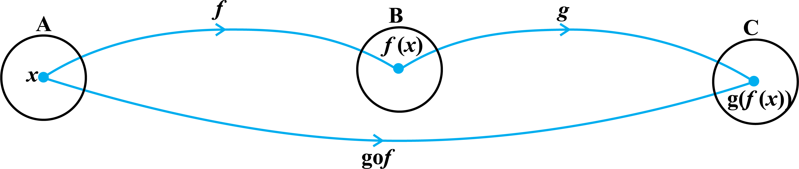

import { Card, Quote, Figure, Example, Definition, Summary } from "@/components/markdown";

<Quote author="G. H. Hardy">
  There is no permanent place in the world for ugly mathematics ... . It may be
  very hard to define mathematical beauty but that is just as true of beauty of
  any kind, we may not know quite what we mean by a beautiful poem, but that
  does not prevent us from recognising one when we read it.

  _दुनिया में बदसूरत गणित के लिए कोई स्थायी जगह नहीं है... गणितीय सुंदरता को परिभाषित करना बहुत कठिन हो सकता है लेकिन यह किसी भी तरह की सुंदरता के लिए उतना ही सच है, हम शायद यह नहीं जानते कि एक सुंदर कविता से हमारा क्या मतलब है, लेकिन जब हम इसे पढ़ते हैं तो यह हमें पहचानने से नहीं रोकता है।_ [गूगल द्वारा अनुवादित]
</Quote>

<Figure
  id="portrait"
  invertable={false}
  halfWidth={true}
  images={[
    {
      src: import("./res/lejeune_dirichlet.jpg"),
      alt: "Lejeune Dirichlet",
    },
  ]}
>
  **[Lejeune Dirichlet](https://en.wikipedia.org/wiki/Peter_Gustav_Lejeune_Dirichlet)**\
  **(1805-1859)**
</Figure>

## 1.1 भूमिका (Introduction) ||section-1.1||

स्मरण कीजिए कि कक्षा XI में, संबंध एवं फलन, प्रांत, सहप्रांत तथा 
परिसर आदि की अवधारणाओं का, विभिन्न प्रकार के वास्तविक 
मानीय फलनों और उनके आलेखों सहित परिचय कराया जा चुका 
है। गणित में शब्द 'संबंध (Relation)' की सवंफ़ल्पना को अंग्रेजी 
भाषा में इस शब्द के अर्थ से लिया गया है, जिसके अनुसार दो 
वस्तुएँ परस्पर संबंधित होती है, यदि उनके बीच एक अभिज्ञेय 
(Recognisable) कड़ी हो। मान लीजिए कि $A$, किसी स्कूल की 
कक्षा XII के विद्यार्थियों का समुच्चय है तथा $B$ उसी स्कूल की 
कक्षा XI के विद्यार्थियों का समुच्चय हैं। अब समुच्चय $A$ से 
समुच्चय $B$ तक के संबंधों के कुछ उदाहरण इस प्रकार हैं

- (i) $\{(a, b) ∈ A \times B: a, b$ का भाई है$\}$,
- (ii) $\{(a, b) ∈ A \times B: a, b$ की बहन है$\}$,
- (iii) $\{(a, b) ∈ A \times B: a$ की आयु $b$ की आयु से अधिक है$\}$,
- (iv) $\{(a, b) ∈ A \times B:$ पिछली अंतिम परीक्षा में $a$ द्वारा प्राप्त पूर्णांक $b$ द्वारा
  प्राप्त पूर्णांक से कम है$\}$,
- (v) $\{(a, b) ∈ A \times B: a$ उसी जगह रहता है जहाँ $b$ रहता है $\}$. तथापि $A$ से $B$
  तक के किसी संबंध $R$ को अमूर्तरूप (Abstracting) से हम गणित में $A \times B$ के एक स्वेच्छ
  (Arbitrary) उपसमुच्चय की तरह परिभाषित करते हैं।

यदि $(a, b) ∈ R$, तो हम कहते हैं कि संबंध $R$ के अंतर्गत $a, b$ से संबंधित है और हम इसे
$a R b$ लिखते हैं। सामान्यत:, यदि $(a, b) ∈ R$, तो हम इस बात की चिंता नहीं करते हैं कि
$a$ तथा $b$ के बीच कोई अभिज्ञेय कड़ी है अथवा नहीं है। जैसा कि कक्षा XI में देख चुके हैं, फलन एक
विशेष प्रकार के संबंध होता हैं।

इस अध्याय में, हम विभिन्न प्रकार के संबंधों एवं फलनों, फलनों के संयोजन (composition),
व्युत्क्रमणीय (Invertible) फलनों और द्विआधारी संक्रियाओं का अध्ययन करेंगे।

### 1.2 संबंधों के प्रकार (Types of Relations) ||section-1.2||

इस अनुच्छेद में हम विभिन्न प्रकार के संबंधों का अध्ययन करेंगे। हमें ज्ञात है कि किसी समुच्चय $A$ में
संबंध, $A \times A$ का एक उपसमुच्चय होता है। अत: रिक्त समुच्चय $φ ⊂ A \times A$ तथा $A \times A$ स्वयं,
दो अन्त्य संबंध हैं। स्पष्टीकरण हेतु, $R = \{(a, b): a - b = 10\}$ द्वारा प्रदत्त समुच्चय A =
{1, 2, 3, 4} पर परिभाषित एक संबंध R पर विचार कीजिए। यह एक रिक्त समुच्चय है, क्योंकि ऐसा
कोई भी युग्म (pair) नहीं है जो प्रतिबंध a - b = 10 को संतुष्ट करता है। इसी प्रकार
$R' = \{(a, b) : | a - b | ≥ 0\}$, संपूर्ण समुच्चय $A \times A$ के तुल्य है, क्योंकि $A \times A$ के
सभी युग्म $(a, b), | a - b | ≥ 0$ को संतुष्ट करते हैं। यह दोनों अन्त्य के उदाहरण हमें
निम्नलिखित परिभाषाओं के लिए प्रेरित करते हैं।

<Definition id="1" title="परिभाषा 1">

समुच्चय $A$ पर परिभाषित संबंध $R$ एक _**रिक्त संबंध**_ कहलाता है, यदि $A$ का कोई भी अवयव $A$ 
के किसी भी अवयव से संबंधित नहीं है, अर्थात् $R = φ ⊂ A \times A$. 

</Definition>

<Definition id="2" title="परिभाषा 2">

समुच्चय $A$ पर परिभाषित संबंध $R$, एक _**सार्वत्रिक (universal) संबंध**_ कहलाता है, यदि $A$ 
का प्रत्येक अवयव $A$ के सभी अवयवों से संबंधित है, अर्थात् $R = A \times A$. 

रिक्त संबंध तथा सार्वत्रिक संबंध को कभी-कभी _**तुच्छ (trivial) संबंध**_ भी कहते हैं। 

</Definition>

<Example id="1" title="उदाहरण 1">

मान लीजिए कि $A$ किसी बालकों के स्कूल के सभी विद्यार्थियों का समुच्चय है। दर्शाइए कि 
$R = \{(a, b) : a, b$ की बहन है $\}$ द्वारा प्रदत्त संबंध एक रिक्त संबंध है 
तथा $R' = \{(a, b) : a$ तथा $b$ की ऊँचाईयों का अंतर 3 मीटर से कम है $\}$ 
द्वारा प्रदत्त संबंध एक सार्वत्रिक संबंध है।

हल

प्रश्नानुसार, क्योंकि स्कूल बालकों का है, अतएव स्कूल का कोई भी विद्यार्थी, स्कूल के किसी भी 
विद्यार्थी की बहन नहीं हो सकता है। अत: $R = φ$, जिससे प्रदर्शित होता है कि R रिक्त संबंध है। 
यह भी स्पष्ट है कि किन्हीं भी दो विद्यार्थियों की ऊँचाइयों का अंतर 3 मीटर से कम होना ही चाहिए। 
इससे प्रकट होता है कि $R' = A \times A$ सार्वत्रिक संबंध है। 

</Example>

:::note[टिप्पणी]

कक्षा XI में विद्यार्थीगण सीख चुके हैं कि किसी संबंध को दो प्रकार से निरूपित किया जा सकता है, 
नामत: रोस्टर विधि तथा समुच्चय निर्माण विधि। तथापि बहुत से लेखकों द्वारा समुच्चय $\{1, 2, 3, 4\}$ 
पर परिभाषित संबंध $R = \{(a, b) : b = a + 1\}$ को $a R b$ द्वारा भी निरूपित किया जाता है, 
यदि और केवल यदि b = a + 1 हो। जब कभी सुविधाजनक होगा, हम भी इस संकेतन (notation) का 
प्रयोग करेंगे।

:::

यदि $(a, b) ∈ R$, तो हम कहते हैं कि $a,b$ से संबंधित है' और इस बात को हम $a R b$ द्वारा प्रकट करते हैं। 

एक अत्यन्त महत्वपूर्ण संबंध, जिसकी गणित में एक सार्थक (significant) भूमिका है, _**तुल्यता संबंध (Equivalence Relation)**_ 
कहलाता है। तुल्यता संबंध का अध्ययन करने के लिए हम पहले तीन प्रकार के संबंधों, नामत: स्वतुल्य (Reflexive), सममित (Symmetric) 
तथा संक्रामक (Transitive) संबंधों पर विचार करते हैं।

<Definition id="3" title="परिभाषा 3">

समुच्चय $A$ पर परिभाषित संबंध $R$;

- (i) _**स्वतुल्य (reflexive)**_ कहलाता है, यदि प्रत्येक $a ∈ A$ के लिए $(a, a) ∈ R$,
- (ii) _**सममित (symmetric)**_ कहलाता है, यदि समस्त $a1, a2 ∈ A$ के लिए $(a1, a2) ∈ R$ से $(a2, a1) ∈ R$ प्राप्त हो। 
- (iii) _**संक्रामक (transitive)**_ कहलाता है, यदि समस्त, $a1, a2, a3 ∈ A$ के लिए $(a1, a2) ∈ R$ तथा $(a2, a3) ∈ R$ से $(a1, a3) ∈ R$ प्राप्त हो। 

</Definition>

<Definition id="4" title="परिभाषा 4">

$A$ पर परिभाषित संबंध $R$ एक _**तुल्यता संबंध**_ कहलाता है, यदि $R$ स्वतुल्य, 
सममित तथा संक्रामक है।

</Definition>

<Example id="2" title="उदाहरण 2">

Let T be the set of all triangles in a plane with $R$ a relation in $T$ given by
$R = \{(T1, T2) : T1$ is congruent to $T2\}$. Show that $R$ is an equivalence
relation.

हल

$R$ is reflexive, since every triangle is congruent to itself.

Further, $(T_1, T_2) ∈ R ⇒ T_1$ is congruent to $T_2 ⇒ T_1$ is congruent to
$T_1 ⇒ (T_2, T_1) ∈ R$. Hence, $R$ is symmetric.

Moreover, $(T_1, T_2), (T_2, T_1) ∈ R ⇒ T$ is congruent to $T_2$ and $T_2$ is
congruent to $T_3 ⇒ T_1$ is congruent to $T_3 ⇒ (T_1, T_3) ∈ R$. Therefore, $R$
is an equivalence relation.

</Example>

<Example id="3" title="उदाहरण 3">

Let $L$ be the set of all lines in a plane and R be the relation in $L$ defined
as $R = \{(L_1, L_2) : L_1$ is perpendicular to $L_2\}$. Show that $R$ is
symmetric but neither reflexive nor transitive.

हल

<Figure
  id="1.1"
  title="Fig 1.1"
  invertable={true}
>
  
</Figure>

$R$ is not reflexive, as a line $L_1$ can not be perpendicular to itself, i.e.,
$(L_1, L_1) ∉ R$. $R$ is symmetric as $(L_1, L_2) ∈ R$

$⇒ L_1$ is perpendicular to $L_2$

$⇒ L_2$ is perpendicular to $L_1$

$⇒ (L2, L1) ∈ R$.

$R$ is not transitive. Indeed, if $L_1$ is perpendicular to $L_2$ and $L_2$ is
perpendicular to $L_3$, then $L_1$ can never be perpendicular to $L_3$. In fact,
$L_1$ is parallel to $L_3$, i.e., $(L_1, L_2) ∈ R, (L_2, L_3) ∈ R$ but
$(L_1, L_3) ∉ R$.

</Example>

<Example id="4" title="उदाहरण 4">

Show that the relation $R$ in the set $\{1, 2, 3\}$ given by
$R = \{(1, 1), (2, 2), (3, 3), (1, 2), (2, 3)\}$ is reflexive but neither
symmetric nor transitive.

हल

$R$ is reflexive, since $(1, 1)$, $(2, 2)$ and $(3, 3)$ lie in $R$. Also, $R$ is
not symmetric, as $(1, 2) ∈ R$ but $(2, 1) ∉ R$. Similarly, $R$ is not
transitive, as $(1, 2) ∈ R$ and $(2, 3) ∈ R$ but $(1, 3) ∉ R$.

</Example>

<Example id="5" title="उदाहरण 5">

Show that the relation R in the set $ℤ$ of integers given by

$R = \{(a, b) : 2$ divides $a - b\}$

is an equivalence relation.

हल

$R$ is reflexive, as $2$ divides $(a - a)$ for all $a ∈ ℤ$. Further, if
$(a, b) ∈ R$, then $2$ divides $a - b$. Therefore, $2$ divides $b - a$. Hence,
$(b, a) ∈ R$, which shows that $R$ is symmetric. Similarly, if $(a, b) ∈ R$ and
$(b, c) ∈ R$, then $a - b$ and $b - c$ are divisible by $2$. Now,
$a - c = (a - b) + (b - c)$ is even (Why?). So, $(a - c)$ is divisible by $2$.
This shows that $R$ is transitive. Thus, $R$ is an equivalence relation in $ℤ$.

</Example>

In [Example 5](#example-5), note that all even integers are related to zero, as $(0, ± 2)$,
$(0, ± 4)$ etc., lie in $R$ and no odd integer is related to $0$, as $(0, ± 1)$,
$(0, ± 3)$ etc., do not lie in $R$. Similarly, all odd integers are related to
one and no even integer is related to one. Therefore, the set $E$ of all even
integers and the set $O$ of all odd integers are subsets of $ℤ$ satisfying
following conditions:

- (i) All elements of $E$ are related to each other and all elements of $O$ are
  related to each other.
- (ii) No element of $E$ is related to any element of $O$ and vice-versa.
- (iii) $E$ and $O$ are disjoint and $ℤ = E ∪ O$.

The subset $E$ is called the _**equivalence class containing zero**_ and is
denoted by $[0]$. Similarly, $O$ is the equivalence class containing $1$ and is
denoted by $[1]$. Note that $[0] ≠ [1]$, $[0] = [2r]$ and $[1] = [2r + 1]$,
$r ∈ ℤ$. Infact, what we have seen above is true for an arbitrary equivalence
relation $R$ in a set $X$. Given an arbitrary equivalence relation $R$ in an
arbitrary set $X$, $R$ divides $X$ into mutually disjoint subsets Ai called
partitions or subdivisions of $X$ satisfying:

- (i) all elements of $A_i$ are related to each other, for all i.
- (ii) no element of $A_i$ is related to any element of $A_j$, $i ≠ j$.
- (iii) $∪ A j = X$ and $A_i ∩ A_j = φ$, $i ≠ j$.

The subsets $A_i$ are called _**equivalence classes**_. The interesting part of
the situation is that we can go reverse also. For example, consider a
subdivision of the set $ℤ$ given by three mutually disjoint subsets $A_1$, $A_2$
and $A_3$ whose union is $ℤ$ with

$A_1 = \{x ∈ ℤ : x$ is a multiple of $3\} = \{..., - 6, - 3, 0, 3, 6, ...\}$

$A_2 = \{x ∈ ℤ : x - 1$ is a multiple of $3\} = \{..., - 5, - 2, 1, 4, 7, ...\}$

$A_3 = \{x ∈ ℤ : x - 2$ is a multiple of $3\} = \{..., - 4, - 1, 2, 5, 8, ...\}$

Define a relation $R$ in $ℤ$ given by $R = \{(a, b) : 3$ divides $a - b\}$.
Following the arguments similar to those used in Example 5, we can show that $R$
is an equivalence relation. Also, $A_1$ coincides with the set of all integers
in $ℤ$ which are related to zero, $A_2$ coincides with the set of all integers
which are related to $1$ and $A_3$ coincides with the set of all integers in $ℤ$
which are related to $2$. Thus, $A_1 = [0], A_2 = [1]$ and $A_3 = [2]$. In fact,
$A_1 = [3r]$, $A_2 = [3r + 1]$ and $A_3 = [3r + 2]$, for all $r ∈ ℤ$.

<Example id="6" title="उदाहरण 6">

Let $R$ be the relation defined in the set $A = \{1, 2, 3, 4, 5, 6, 7\}$ by
$R = \{(a, b) :$ both $a$ and $b$ are either odd or even$\}$. Show that $R$ is
an equivalence relation. Further, show that all the elements of the subset
$\{1, 3, 5, 7\}$ are related to each other and all the elements of the subset
$\{2, 4, 6\}$ are related to each other, but no element of the subset
$\{1, 3, 5, 7\}$ is related to any element of the subset $\{2, 4, 6\}$.

हल

Given any element $a$ in $A$, both $a$ and $a$ must be either odd or even, so
that $(a, a) ∈ R$. Further, $(a, b) ∈ R ⇒$ both $a$ and $b$ must be either odd
or even $⇒ (b, a) ∈ R$. Similarly, $(a, b) ∈ R$ and $(b, c) ∈ R ⇒$ all elements
$a$, $b$, $c$, must be either even or odd simultaneously $⇒ (a, c) ∈ R$. Hence,
$R$ is an equivalence relation. Further, all the elements of $\{1, 3, 5, 7\}$
are related to each other, as all the elements of this subset are odd.
Similarly, all the elements of the subset $\{2, 4, 6\}$ are related to each
other, as all of them are even. Also, no element of the subset $\{1, 3, 5, 7\}$
can be related to any element of $\{2, 4, 6\}$, as elements of $\{1, 3, 5, 7\}$
are odd, while elements of $\{2, 4, 6\}$ are even.

</Example>
---

## EXERCISE 1.1 ||exercise-1.1||

### 1.1 Question 1 ||1.1-question-1||

Determine whether each of the following relations are reflexive, symmetric and
transitive:

- (i) Relation $R$ in the set $A = \{1, 2, 3, ..., 13, 14\}$ defined as
  $R = \{(x, y) : 3x - y = 0\}$

- (ii) Relation $R$ in the set $N$ of natural numbers defined as
  $R = \{(x, y) : y = x + 5$ and $x < 4\}$

- (iii) Relation $R$ in the set $A = \{1, 2, 3, 4, 5, 6\}$ as $R = \{(x, y) : y$
  is divisible by $x\}$

- (iv) Relation $R$ in the set $Z$ of all integers defined as
  $R = \{(x, y) : x - y$ is an integer$\}$

- (v) Relation $R$ in the set $A$ of human beings in a town at a particular time
  given by
  - (a) $R = \{(x, y) : x$ and y work at the same place$\}$
  - (b) $R = \{(x, y) : x$ and y live in the same locality$\}$
  - (c) $R = \{(x, y) : x$ is exactly 7 cm taller than $y\}$
  - (d) $R = \{(x, y) : x$ is wife of $y\}$
  - (e) $R = \{(x, y) : x$ is father of $y\}$

### 1.1 Question 2 ||1.1-question-2||

Show that the relation $R$ in the set $R$ of real numbers, defined as
$R = \{(a, b) : a ≤ b2\}$ is neither reflexive nor symmetric nor transitive.

### 1.1 Question 3 ||1.1-question-3||

Check whether the relation $R$ defined in the set $\{1, 2, 3, 4, 5, 6\}$ as
$R = \{(a, b) : b = a + 1\}$ is reflexive, symmetric or transitive.

### 1.1 Question 4 ||1.1-question-4||

Show that the relation $R$ in $R$ defined as $R = \{(a, b) : a ≤ b\}$, is
reflexive and transitive but not symmetric.

### 1.1 Question 5 ||1.1-question-5||

Check whether the relation $R$ in $R$ defined by $R = \{(a, b) : a ≤ b3\}$ is
reflexive,symmetric or transitive.

### 1.1 Question 6 ||1.1-question-6||

Show that the relation $R$ in the set $\{1, 2, 3\}$ given by
$R = \{(1, 2), (2, 1)\}$ is symmetric but neither reflexive nor transitive.

### 1.1 Question 7 ||1.1-question-7||

Show that the relation R in the set A of all the books in a library of a
college, given by $R = \{(x, y) : x$ and $y$ have same number of pages$\}$ is an
equivalence relation.

### 1.1 Question 8 ||1.1-question-8||

Show that the relation $R$ in the set $A = \{1, 2, 3, 4, 5\}$ given by
$R = \{(a, b) : |a - b|$ is even$\}$, is an equivalence relation. Show that all
the elements of $\{1, 3, 5\}$ are related to each other and all the elements of
$\{2, 4\}$ are related to each other. But no element of $\{1, 3, 5\}$ is related
to any element of $\{2, 4\}$.

### 1.1 Question 9 ||1.1-question-9||

Show that each of the relation 4 in the set $A = \{x ∈ Z : 0 ≤ x ≤ 12\}$, given by

- (i) $R = \{(a, b) : |a - b|$ is a multiple of $4\}$
- (ii) $R = \{(a, b) : a = b\}$ is an equivalence relation. Find the set of all
  elements related to 1 in each case.

### 1.1 Question 10 ||1.1-question-10||

Give an example of a relation. Which is

- (i) Symmetric but neither reflexive nor transitive.
- (ii) Transitive but neither reflexive nor symmetric.
- (iii) Reflexive and symmetric but not transitive.
- (iv) Reflexive and transitive but not symmetric.
- (v) Symmetric and transitive but not reflexive.

### 1.1 Question 11 ||1.1-question-11||

Show that the relation $R$ in the set $A$ of points in a plane given by
$R = \{(P, Q) :$ distance of the point $P$ from the origin is same as the
distance of the point $Q$ from the origin$\}$, is an equivalence relation.
Further, show that the set of all points related to a point $P ≠ (0, 0)$ is the
circle passing through $P$ with origin as centre.

### 1.1 Question 12 ||1.1-question-12||

Show that the relation R defined in the set A of all triangles as
$R = \{(T_1, T_2) : T_1$ is similar to $T_2\}$, is equivalence relation.
Consider three right angle triangles $T_1$ with sides $3, 4, 5$, $T_2$ with
sides $5, 12, 13$ and $T_3$ with sides $6, 8, 10$. Which triangles among $T_1$,
$T_2$ and $T_3$ are related?

### 1.1 Question 13 ||1.1-question-13||

Show that the relation $R$ defined in the set $A$ of all polygons as
$R = \{(P_1, P_2) : P_1$ and $P_2$ have same number of sides$\}$, is an
equivalence relation. What is the set of all elements in $A$ related to the
right angle triangle $T$ with sides $3$, $4$ and $5$?

### 1.1 Question 14 ||1.1-question-14||

Let $L$ be the set of all lines in $XY$ plane and $R$ be the relation in $L$
defined as $R = \{(L_1, L_2) : L_1$ is parallel to $L_2\}$. Show that $R$ is an
equivalence relation. Find the set of all lines related to the line
$y = 2x + 4$.

### 1.1 Question 15 ||1.1-question-15||

Let $R$ be the relation in the set $\{1, 2, 3, 4\}$ given by
$R = \{(1, 2), (2, 2), (1, 1), (4,4), (1, 3), (3, 3), (3, 2)\}$. Choose the
correct answer.

- (A) $R$ is reflexive and symmetric but not transitive.
- (B) $R$ is reflexive and transitive but not symmetric.
- (C) $R$ is symmetric and transitive but not reflexive.
- (D) $R$ is an equivalence relation.

### 1.1 Question 16 ||1.1-question-16||

Let $R$ be the relation in the set $N$ given by
$R = \{(a, b) : a = b - 2, b > 6\}$. Choose the correct answer.

- (A) $(2, 4) ∈ R$
- (B) $(3, 8) ∈ R$
- (C) $(6, 8) ∈ R$
- (D) $(8, 7) ∈ R$

---

## 1.3 Types of Functions ||section-1.3||

The notion of a function along with some special functions like identity
function, constant function, polynomial function, rational function, modulus
function, signum function etc. along with their graphs have been given in Class
XI.

Addition, subtraction, multiplication and division of two functions have also
been studied. As the concept of function is of paramount importance in
mathematics and among other disciplines as well, we would like to extend our
study about function from where we finished earlier. In this section, we would
like to study different types of functions.

Consider the functions $f_1$, $f_2$, $f_3$ and $f_4$ given by the following
diagrams.

In [Fig 1.2](#figure-1.2), we observe that the images of distinct elements of $X_1$ under the
function $f_1$ are distinct, but the image of two distinct elements $1$ and $2$
of $X_1$ under $f_2$ is same, namely $b$. Further, there are some elements like
$e$ and $f$ in $X_2$ which are not images of any element of $X1$ under $f_1$,
while all elements of $X3$ are images of some elements of $X1$ under $f_3$. The
above observations lead to the following definitions:

<Definition id="5" title="परिभाषा 5">

A function $f : X → Y$ is defined to be _**one-one**_ (or _**injective**_), if
the images of distinct elements of $X$ under $f$ are distinct, i.e., for every
$x_1, x_2 ∈ X, f(x_1) = f(x_2)$ implies $x_1 = x_2$. Otherwise, $f$ is called
_**many-one**_.

</Definition>

The function $f_1$ and $f_4$ in [Fig 1.2](#figure-1.2) (i) and (iv) are one-one and the
function $f_2$ and $f3_3$ in [Fig 1.2](#figure-1.2) (ii) and (iii) are many-one.

<Definition id="6" title="परिभाषा 6">

A function $f : X → Y$ is said to be _**onto**_ (or _**surjective**_), if every
element of $Y$ is the image of some element of $X$ under f, i.e., for every
$y ∈ Y$, there exists an element $x$ in $X$ such that $f(x) = y$.

</Definition>

The function $f_3$ and $f_4$ in [Fig 1.2](#figure-1.2) (iii), (iv) are onto and the function
$f_1$ in [Fig 1.2](#figure-1.2) (i) is not onto as elements $e$, $f$ in $X_2$ are not the image
of any element in $X1$ under $f_1$.

<Figure
  id="1.2"
  title="Fig 1.2 (i) to (iv)"
  invertable={true}
>
  
</Figure>

:::note[टिप्पणी]

$f : X → Y$ is onto if and only if Range of $f = Y$.

:::

<Definition id="7" title="परिभाषा 7">

A function $f : X → Y$ is said to be one-one and onto (or _**bijective**_), if $f$ is
both one-one and onto.

</Definition>

The function $f_4$ in [Fig 1.2](#figure-1.2) (iv) is one-one and onto.

<Example id="7" title="उदाहरण 7">

Let $A$ be the set of all $50$ students of Class X in a school. Let $f : A → ℕ$ be
function defined by $f(x) =$ roll number of the student $x$. Show that $f$ is
one-one but not onto.

हल

No two different students of the class can have same roll number. Therefore, $f$
must be one-one. We can assume without any loss of generality that roll numbers
of students are from $1$ to $50$. This implies that $51$ in $ℕ$ is not roll
number of any student of the class, so that $51$ can not be image of any element
of $X$ under $f$. Hence, $f$ is not onto.

</Example>

<Example id="8" title="उदाहरण 8">
Show that the function $f : ℕ → ℕ$, given by $f(x) = 2x$, is one-one but not
onto.

हल

The function $f$ is one-one, for $f(x_1) = f(x_2) ⇒ 2x_1 = 2x_2 ⇒ x_1 = x_2$.
Further, f is not onto, as for $1 ∈ ℕ$, there does not exist any $x$ in $ℕ$ such
that $f(x) = 2x = 1$.

</Example>

<Example id="9" title="उदाहरण 9">

Prove that the function $f : ℝ → ℝ$, given by $f(x) = 2x$, is one-one and onto.

हल

<Figure
  id="1.3"
  title="Fig 1.3"
  invertable={true}
>
  
</Figure>

$f$ is one-one, as $f(x_1) = f(x_2) ⇒ 2x_1 = 2x_2 ⇒ x_1 = x_2$. Also, given any
real number $y$ in $ℝ$, there exists $\frac{y}{2}$ in $ℝ$ such that
$f(\frac{y}{2}) = 2⋅(\frac{y}{2}) = y$. Hence, $f$ is onto.

</Example>

<Example id="10" title="उदाहरण 10">

Show that the function $f : ℕ → ℕ$, given by $f (1) = f (2) = 1$ and
$f(x) = x - 1$, for every $x > 2$, is onto but not one-one.

हल

$f$ is not one-one, as $f(1) = f(2) = 1$. But $f$ is onto, as given any
$y ∈ ℕ, y ≠ 1$, we can choose $x$ as $y + 1$ such that
$f(y + 1) = y + 1 - 1 = y$. Also for $1 ∈ ℕ$, we have $f(1) = 1$.

</Example>

<Example id="11" title="उदाहरण 11">

Show that the function $f : ℝ → ℝ$, defined as $f(x) = x^2$, is neither one-one
nor onto.

हल

<Figure
  id="1.4"
  title="Fig 1.4"
  invertable={true}
>
  
</Figure>

Since $f(-1) = 1 = f (1)$, $f$ is not one-one. Also, the element $-2$ in the
co-domain $ℝ$ is not image of any element $x$ in the domain $ℝ$ (Why?).
Therefore $f$ is not onto.

</Example>

<Example id="12" title="उदाहरण 12">

Show that $f : ℕ → ℕ$, given by

$$
f(x) =
\begin{cases}
x+1,& \text{if }x\text{ is odd},\\
x-1,& \text{if }x\text{ is even},
\end{cases}
$$

is both one-one and onto.

हल

Suppose $f(x_1) = f(x_2)$. Note that if $x_1$ is odd and $x_2$ is even, then we
will have $x_1 + 1 = x_2 - 1$, i.e., $x_2 - x_1 = 2$ which is impossible.
Similarly, the possibility of $x_1$ being even and $x_2$ being odd can also be
ruled out, using the similar argument. Therefore, both $x_1$ and $x_2$ must be
either odd or even. Suppose both $x_1$ and $x_2$ are odd. Then $f(x_1) = f(x_2)
⇒ x_1 + 1 = x_2 + 1 ⇒ x_1 = x_2 $. Similarly, if both $x_1$ and $x_2$ are even,
then also $f(x_1) = f(x_2) ⇒ x_1 - 1 = x_2 - 1 ⇒ x_1 = x_2$. Thus, $f$ is
one-one. Also, any odd number $2r + 1$ in the co-domain $ℕ$ is the image of
$2r+ 2$ in the domain $ℕ$ and any even number $2r$ in the co-domain $ℕ$ is the
image of $2r - 1$ in the domain $ℕ$. Thus, $f$ is onto.

</Example>

<Example id="13" title="उदाहरण 13">

Show that an onto function $f : \{1, 2, 3\} → \{1, 2, 3\}$ is always one-one.

हल

Suppose $f$ is not one-one. Then there exists two elements, say $1$ and $2$ in
the domain whose image in the co-domain is same. Also, the image of $3$ under
$f$ can be only one element. Therefore, the range set can have at the most two
elements of the co-domain $\{1, 2, 3\}$, showing that $f$ is not onto, a
contradiction. Hence, $f$ must be one-one.

</Example>

<Example id="14" title="उदाहरण 14">

Show that a one-one function $f : \{1, 2, 3\} → \{1, 2, 3\}$ must be onto.

हल

Since $f$ is one-one, three elements of $\{1, 2, 3\}$ must be taken to 3
different elements of the co-domain $\{1, 2, 3\}$ under $f$. Hence, $f$ has to
be onto.

</Example>

:::note[टिप्पणी]

The results mentioned in Examples [13](#example-13) and [14](#example-14) are
also true for an arbitrary finite set $X$, i.e., a one-one function $f : X → X$
is necessarily onto and an onto map $f : X → X$ is necessarily one-one, for
every finite set $X$. In contrast to this, Examples [8](#example-8) and
[10](#example-10) show that for an infinite set, this may not be true. In fact,
this is a characteristic difference between a finite and an infinite set.

:::

---

## EXERCISE 1.2 ||exercise-1.2||

### 1.2 Question 1 ||1.2-question-1||

Show that the function $f : ℝ_* → ℝ_*$ defined by $f(x) = \frac{1}{x}$ is
one-one and onto, where $ℝ_*$ is the set of all non-zero real numbers. Is the
result true, if the domain $ℝ_*$ is replaced by $ℕ$ with co-domain being same as
$ℝ_*$?

### 1.2 Question 2 ||1.2-question-2||

Check the injectivity and surjectivity of the following functions:

- (i) $f : ℕ → ℕ$ given by $f(x) = x^2$
- (ii) $f : ℤ → ℤ$ given by $f(x) = x^2$
- (iii) $f : ℝ → ℝ$ given by $f(x) = x^2$
- (iv) $f : ℕ → ℕ$ given by $f(x) = x^3$
- (v) $f : ℤ → ℤ$ given by $f(x) = x^3$

### 1.2 Question 3 ||1.2-question-3||

Prove that the Greatest Integer Function $f : ℝ → ℝ$, given by $f(x) = [x]$, is
neither one-one nor onto, where $[x]$ denotes the greatest integer less than or
equal to $x$.

### 1.2 Question 4 ||1.2-question-4||

Show that the Modulus Function $f : ℝ → ℝ$, given by $f(x) = |x|$, is neither
one- one nor onto, where $|x|$ is $x$, if $x$ is positive or $0$ and $|x|$ is
$-x$, if $x$ is negative.

### 1.2 Question 5 ||1.2-question-5||

Show that the Signum Function $f : ℝ → ℝ$, given by is neither one-one nor onto.

### 1.2 Question 6 ||1.2-question-6||

Let $A = \{1, 2, 3\}$, $B = \{4, 5, 6, 7\}$ and let
$f = \{(1, 4), (2, 5), (3, 6)\}$ be a function from $A$ to $B$. Show that $f$ is
one-one.

### 1.2 Question 7 ||1.2-question-7||

In each of the following cases, state whether the function is one-one, onto or
bijective. Justify your answer.

- (i) $f : ℝ → ℝ$ defined by $f(x) = 3 - 4x$
- (ii) $f : ℝ → ℝ$ defined by $f(x) = 1 + x^2$

### 1.2 Question 8 ||1.2-question-8||

Let $A$ and $B$ be sets. Show that $f : A \times B → B \times A$ such that
$f(a, b) = (b, a)$ is bijective function.

### 1.2 Question 9 ||1.2-question-9||

Let $f : ℕ → ℕ$ be defined by

$$

f(n) = \begin{cases} \frac{n+1}{2}, & \text{if } n \text{ is odd}\\ \frac{n}{2},
& \text{if } n \text{ is even} \end{cases} \text{for all } n ∈ ℕ.

$$

State whether the function $f$ is bijective. Justify your answer.

### 1.2 Question 10 ||1.2-question-10||

Let $A = ℝ - \{3\}$ and $B = ℝ - \{1\}$. Consider the function $f : A → B$
defined by $f(x) = \frac{x-2}{x-3}$. Is $f$ one-one and onto? Justify your
answer.

### 1.2 Question 11 ||1.2-question-11||

Let $f : ℝ → ℝ$ be defined as $f(x) = x^4$. Choose the correct answer.

- (A) $f$ is one-one onto
- (B) $f$ is many-one onto
- (C) $f$ is one-one but not onto
- (D) $f$ is neither one-one nor onto.

### 1.2 Question 12 ||1.2-question-12||

Let $f : ℝ → ℝ$ be defined as $f(x) = 3x$. Choose the correct answer.

- (A) $f$ is one-one onto
- (B) $f$ is many-one onto
- (C) $f$ is one-one but not onto
- (D) $f$ is neither one-one nor onto.

---

## 1.4 Composition of Functions and Invertible Function ||section-1.4||

<Definition id="8" title="परिभाषा 8">

Let $f : A → B$ and $g : B → C$ be two functions. Then the composition of $f$
and $g$, denoted by $gof$, is defined as the function $gof : A → C$ given by
$gof(x) = g(f(x))$, $∀ x ∈ A$.

</Definition>

<Figure
  id="1.5"
  title="Fig 1.5"
  invertable={true}
>
  
</Figure>

<Example id="15" title="उदाहरण 15">

Let

$f : \{2, 3, 4, 5\} → \{3, 4, 5, 9\}$ and

$g : \{3, 4, 5, 9\} → \{7, 11, 15\}$

be functions defined as

$f(2) = 3$, $f(3) = 4$, $f(4) = f(5) = 5$ and

$g(3) = g(4) = 7$ and $g(5) = g(9) = 11$.

Find $gof$.

हल

We have

$gof(2) = g(f(2)) = g(3) = 7$,

$gof(3) = g(f(3)) = g(4) = 7$,

$gof(4) = g(f(4)) = g(5) = 11$

and $gof(5) = g (5) = 11$.

</Example>

<Example id="16" title="उदाहरण 16">
Find $gof$ and $fog$, if $f : ℝ → ℝ$ and $g : ℝ → ℝ$ are given by
$f (x) = cos x$ and $g
(x) = 3x^2$. Show that $gof ≠ fog$.

हल

We have $gof (x) = g (f(x)) = g(cos(x)) = 3 (cos(x))^2 = 3 cos^2(x)$. Similarly,
$fog(x) = f(g(x)) = f(3x^2) = cos(3x^2)$. Note that $3cos^2(x) ≠ cos(3x^2)$, for
$x = 0$. Hence, $gof ≠ fog$.

</Example>

<Definition id="9" title="परिभाषा 9">

A function $f : X → Y$ is defined to be _**invertible**_, if there exists a
function $g : Y → X$ such that $gof = I_X$ and $fog = I_Y$. The function $g$ is
called the inverse of $f$ and is denoted by $f^{-1}$.

</Definition>

Thus, if $f$ is invertible, then $f$ must be one-one and onto and conversely, if
$f$ is one-one and onto, then $f$ must be invertible. This fact significantly
helps for proving a function $f$ to be invertible by showing that $f$ is one-one
and onto, specially when the actual inverse of $f$ is not to be determined.

<Example id="17" title="उदाहरण 17">

Let $f : ℕ → Y$ be a function defined as $f(x) = 4x + 3$, where,
$Y = \{y ∈ ℕ: y = 4x + 3$ for some $x ∈ ℕ\}$. Show that $f$ is invertible. Find
the inverse.

हल

Consider an arbitrary element $y$ of $Y$. By the definition of $Y$,
$y = 4x + 3$, for some $x$ in the domain ℕ.

This shows that $x = \frac{(y − 3)}{4}$. Define $g : Y → N$ by
$g (y) = \frac{(y − 3)}{4}$.

Now, $gof(x) = g (f(x)) = g(4x + 3) = \frac{(4x + 3 − 3)}{4} = x$ and

$fog(y) = f(g(y)) = f(\frac{(y-3)}{4}) = \frac{4(y-3)}{4} + 3 = y - 3 + 3 = y$.

This shows that $gof = I_ℕ$ and $fog = I_Y$, which implies that $f$ is
invertible and $g$ is the inverse of $f$.

</Example>

## Miscellaneous Examples ||section-1.M||

<Example id="18" title="उदाहरण 18">

If $R_1$ and $R_2$ are equivalence relations in a set $A$, show that $R_1 ∩ R_2$
is also an equivalence relation.

हल

Since $R_1$ and $R_2$ are equivalence relations, $(a, a) ∈ R_1$, and
$(a, a) ∈ R_2$ $∀ a ∈ A$.

This implies that $(a, a) ∈ R_1 ∩ R_2, ∀ a$, showing $R_1 ∩ R_2$ is reflexive.

Further, $(a, b) ∈ R_1 ∩ R_2$

$⇒ (a, b) ∈ R_1$ and $(a, b) ∈ R_2$

$⇒ (b, a) ∈ R_1$ and $(b, a) ∈ R_2$

$⇒ (b, a) ∈ R_1 ∩ R_2$, hence, $R_1 ∩ R_2$ is symmetric.

Similarly, $(a, b) ∈ R_1 ∩ R_2$ and $(b, c) ∈ R_1 ∩ R_2$

$⇒ (a, c) ∈ R_1$ and $(a, c) ∈ R_2$

$⇒ (a,c) ∈ R_1 ∩ R_2$.

This shows that $R_1 ∩ R_2$ is transitive.

Thus, $R_1 ∩ R_2$ is an equivalence relation.

</Example>

<Example id="19" title="उदाहरण 19">

Let $R$ be a relation on the set $A$ of ordered pairs of positive integers
defined by $(x, y) R (u, v)$ if and only if $xv = yu$. Show that $R$ is an
equivalence relation.

हल

Clearly, $(x, y) R (x, y), ∀ (x, y) ∈ A$, since $xy = yx$.

This shows that $R$ is reflexive.

Further, $(x, y) R (u, v)$

$⇒ xv = yu ⇒ uy = vx$ and hence $(u, v) R (x,
y)$.

This shows that $R$ is symmetric.

Similarly, $(x, y) R (u, v)$ and $(u, v) R (a,b)$

$⇒ xv = yu$ and $ub = va$

$⇒ xv\frac{a}{u} = yu\frac{a}{u}$

$⇒ xv\frac{b}{v} = yu\frac{a}{u}$

$⇒ xb = ya$ and hence $(x, y) R (a, b)$.

Thus, $R$ is transitive.

Thus, $R$ is an equivalence relation.

</Example>

<Example id="20" title="उदाहरण 20">

Let $X = \{1, 2, 3, 4, 5, 6, 7, 8, 9\}$.

Let $R_1$ be a relation in $X$ given by

$R_1 = \{(x, y) : x - y$ is divisible by $3\}$

and $R_2$ be another relation on $X$ given by

$R_2 = \{(x, y): \{x, y\} ⊂ \{1, 4, 7\}\}$ or
$\{x, y\} ⊂ \{2, 5, 8\} or \{x, y\} ⊂ \{3, 6, 9\}\}$.

Show that $R_1 = R_2$.

हल

Note that the characteristic of sets $\{1, 4, 7\}$, $\{2, 5, 8\}$ and
$\{3, 6, 9\}$ is that difference between any two elements of these sets is a
multiple of $3$.

Therefore, $(x, y) ∈ R_1$

$⇒ x - y$ is a multiple of $3$

$⇒ \{x, y\} ⊂ \{1, 4, 7\}$ or $\{x, y\} ⊂ \{2, 5,
8\}$ or $\{x, y\} ⊂ \{3, 6, 9\}$

$⇒ (x, y) ∈ R_2$. Hence, $R_1 ⊂ R_2$.

Similarly, $\{x, y\} ∈ R_2$

$⇒ \{x, y\} ⊂ \{1, 4, 7\}$ or $\{x, y\} ⊂ \{2, 5, 8\}$ or
$\{x, y\} ⊂ \{3, 6, 9\}$

$⇒ x - y$ is divisible by $3$

$⇒ \{x, y\} ∈ R_1$. This shows that $R_2 ⊂ R_1$.

Hence, $R_1 = R_2$.

</Example>

<Example id="21" title="उदाहरण 21">

Let $f : X → Y$ be a function. Define a relation $R$ in $X$ given by
$R = \{(a, b): f(a) = f(b)\}$. Examine whether $R$ is an equivalence relation or
not.

हल

For every $a ∈ X, (a, a) ∈ R$, since $f (a) = f (a)$, showing that $R$ is
reflexive.

Similarly, $(a, b) ∈ R$

$⇒ f (a) = f (b)$

$⇒ f (b) = f (a)$

$⇒ (b, a) ∈ R$. Therefore, $R$ is symmetric.

Further, $(a, b) ∈ R$ and $(b, c) ∈ R$

$⇒ f (a) = f (b)$ and $f (b) = f (c)$

$⇒ f (a) = f (c)$

$⇒ (a, c) ∈ R$, which implies that $R$ is transitive.

Hence, $R$ is an equivalence relation.

</Example>

<Example id="22" title="उदाहरण 22">

Find the number of all one-one functions from set $A = \{1, 2, 3\}$ to itself.

हल

One-one function from $\{1, 2, 3\}$ to itself is simply a permutation on three
symbols $1, 2, 3$. Therefore, total number of one-one maps from $\{1, 2, 3\}$ to
itself is same as total number of permutations on three symbols $1, 2, 3$ which
is $3! = 6$.

</Example>

<Example id="23" title="उदाहरण 23">

Let $A = \{1, 2, 3\}$. Then show that the number of relations containing
$(1, 2)$ and $(2, 3)$ which are reflexive and transitive but not symmetric is
three.

हल

The smallest relation R1 containing $(1, 2)$ and $(2, 3)$ which is reflexive and
transitive but not symmetric is $\{(1, 1), (2, 2), (3, 3), (1, 2), (2, 3), (1,
3)\}$. Now, if we add the pair $(2, 1)$ to $R_1$ to get $R_2$, then the relation
$R_2$ will be reflexive, transitive but not symmetric. Similarly, we can obtain
$R_3$ by adding $(3, 2)$ to $R_1$ to get the desired relation. However, we can
not add two pairs $(2, 1), (3, 2)$ or single pair $(3, 1)$ to $R_1$ at a time,
as by doing so, we will be forced to add the remaining pair in order to maintain
transitivity and in the process, the relation will become symmetric also which
is not required. Thus, the total number of desired relations is three.

</Example>

<Example id="24" title="उदाहरण 24">

Show that the number of equivalence relation in the set $\{1, 2, 3\}$ containing
$(1, 2)$ and $(2, 1)$ is two.

हल

The smallest equivalence relation $R_1$ containing $(1, 2)$ and $(2, 1)$ is
$\{(1, 1),
(2, 2), (3, 3), (1, 2), (2, 1)\}$. Now we are left with only 4 pairs namely $(2,
3)$, $(3, 2)$, $(1, 3)$ and $(3, 1)$. If we add any one, say $(2, 3)$ to $R_1$,
then for symmetry we must add $(3, 2)$ also and now for transitivity we are
forced to add $(1, 3)$ and $(3, 1)$. Thus, the only equivalence relation bigger
than $R_1$ is the universal relation. This shows that the total number of
equivalence relations containing $(1, 2)$ and $(2, 1)$ is two.

</Example>

<Example id="25" title="उदाहरण 25">

Consider the identity function $I_ℕ : ℕ → ℕ$ defined as $I_ℕ(x) = x ∀ x ∈ ℕ$.
Show that although $I_ℕ$ is onto but $I ℕ + I ℕ : ℕ → ℕ$ defined as

$(I_ℕ + I_ℕ)(x) = I_ℕ(x) + I_ℕ(x) = x + x = 2x$ is not onto.

हल

Clearly $I_ℕ$ is onto. But $I_ℕ + I_ℕ$ is not onto, as we can find an element
$3$ in the co-domain $ℕ$ such that there does not exist any $x$ in the domain
$ℕ$ with $(I_ℕ + I_ℕ)(x) = 2x = 3$.

</Example>

<Example id="26" title="उदाहरण 26">

Consider a function $f : [0,\frac{π}{2}] → ℝ$ given by $f(x) = sin(x)$ and
$g : [0,\frac{π}{2}] → ℝ$ given by $g(x) = cos(x)$. Show that $f$ and $g$ are
one-one, but $f + g$ is not one-one.

हल

Since for any two distinct elements $x_1$ and $x_2$ in $[0,\frac{π}{2}]$,
$sin(x_1) ≠ sin(x_2)$ and $cos(x_1) ≠ cos(x_2)$, both $f$ and g must be one-one.

But $(f + g)(0) = sin(0) + cos(0) = 1$ and
$(f + g)(\frac{π}{2}) = sin(\frac{π}{2}) + cos(\frac{π}{2}) = 1$.

Therefore, $f + g$ is not one-one.

</Example>

---

## Miscellaneous Exercise on Chapter 1 ||exercise-1.M||

### 1.M Question 1 ||1.M-question-1||

Show that the function $f : ℝ → \{x ∈ ℝ : - 1 < x < 1\}$ defined by
$f(x) = \frac{x}{1+|x|}$, $x ∈ R$ is one one and onto function.

### 1.M Question 2 ||1.M-question-2||

Show that the function $f : ℝ → ℝ$ given by $f(x) = x^3$ is injective.

### 1.M Question 3 ||1.M-question-3||

Given a non empty set $X$, consider $P(X)$ which is the set of all subsets of
$X$. Define the relation $R$ in $P(X)$ as follows:

For subsets $A$, $B$ in $P(X)$, $ARB$ if and only if $A ⊂ B$. Is $R$ an
equivalence relation on $P(X)$? Justify your answer.

### 1.M Question 4 ||1.M-question-4||

Find the number of all onto functions from the set $\{1, 2, 3,......, n\}$ to
itself.

### 1.M Question 5 ||1.M-question-5||

Let $A = \{- 1, 0, 1, 2\}$, $B = \{- 4, - 2, 0, 2\}$ and $f, g : A → B$ be
functions defined by $f(x) = x^2 - x, x ∈ A$ and
$g(x) = 2|x-\frac{1}{2}|-1, x ∈ A$. Are $f$ and $g$ equal? Justify your answer.

(Hint: One may note that two functions $f : A → B$ and $g : A → B$ such that
$f(a) = g(a) ∀ a ∈ A$, are called equal functions).

### 1.M Question 6 ||1.M-question-6||

Let $A = \{1, 2, 3\}$. Then number of relations containing $(1, 2)$ and $(1, 3)$
which are reflexive and symmetric but not transitive is

- (A) 1
- (B) 2
- (C) 3
- (D) 4

### 1.M Question 7 ||1.M-question-7||

Let $A = \{1, 2, 3\}$. Then number of equivalence relations containing $(1, 2)$
is

- (A) 1
- (B) 2
- (C) 3
- (D) 4

---

## Summary

In this chapter, we studied different types of relations and equivalence
relation, composition of functions, invertible functions and binary operations.
The main features of this chapter are as follows:

- _**Empty relation**_ is the relation $R$ in $X$ given by $R = φ ⊂ X \times X$.
- _**Universal relation**_ is the relation $R$ in $X$ given by $R = X \times X$.
- _**Reflexive relation**_ $R$ in $X$ is a relation with $(a, a) ∈ R ∀ a ∈ X$.
- _**Symmetric relation**_ $R$ in $X$ is a relation satisfying $(a, b) ∈ R$
  implies $(b, a) ∈  R$.
- _**Transitive relation**_ $R$ in $X$ is a relation satisfying $(a, b) ∈ R$ and
  $(b, c) ∈ R$ implies that $(a, c) ∈ R$.
- _**Equivalence relation**_ $R$ in $X$ is a relation which is reflexive,
  symmetric and transitive.
- _**Equivalence class**_ [a] containing $a ∈ X$ for an equivalence relation $R$
  in $X$ is the subset of $X$ containing all elements $b$ related to $a$.
- A function $f : X → Y$ is one-one (or injective) if
  $f(x_1) = f(x_2) ⇒ x_1 = x_2 ∀ x_1, x_2 ∈ X$.
- A function $f : X → Y$ is onto (or surjective) if given any $y ∈ Y$, $∃ x ∈ X$
  such that $f(x) = y$.
- A function $f : X → Y$ is one-one and onto (or bijective), if $f$ is both
  one-one and onto.
- Given a finite set $X$, a function $f : X → X$ is one-one (respectively onto)
  if and only if $f$ is onto (respectively one-one). This is the characteristic
  property of a finite set. This is not true for infinite set

---

<Card>

## ऐतिहासिक पृष्ठभूमि ||historical-note||

फलन की संकल्पना,
[R. Descartes](https://en.wikipedia.org/wiki/Ren%C3%A9_Descartes) (सन् 1596-1650 ई.)
से प्रारंभ हो कर एक लंबे अंतराल में विकसित हुई है। Descartes ने सन् 1637 ई. में अपनी पांडुलिपि
[_**“Geometrie”**_](https://en.wikipedia.org/wiki/La_G%C3%A9om%C3%A9trie)
में शब्द ‘फलन’ का प्रयोग, ज्यामितीय वक्रों, जैसे अतिपरवलय (Hyperbola), परिवलय (Parabola) तथा दीर्घवृत्त (Ellipse), का अध्ययन करते समय, एक चर राशि $x$ के धन पूर्णांक घात $x^n$ के अर्थ में किया था।
[James Gregory](https://en.wikipedia.org/wiki/James_Gregory_(mathematician))
(सन् 1636-1675 ई.) ने अपनी वृफ़ति
[_**“Vera Circuli et Hyperbolae Quadratura”**_](https://archive.org/details/ita-bnc-mag-00001357-001/)
(सन् 1667 ई.) में, फलन को एक ऐसी राशि माना था, जो किसी अन्य राशि पर बीजीय अथवा अन्य संक्रियाओं को उत्तरोत्तर प्रयोग करने से प्राप्त होती है। बाद में 
[G. W. Leibnitz](https://en.wikipedia.org/wiki/Gottfried_Wilhelm_Leibniz)
(1646-1716 ई.) नें 1673 ई. में लिखित अपनी पांडुलिपि
[_**“Methodus tangentium inversa, seu de functionibus”**_](https://docslib.org/doc/12906580/the-inverse-method-of-tangents-a-dialogue-between-leibniz-and)
में शब्द ‘फलन’ को किसी ऐसी राशि के अर्थ में प्रयोग किया, जो किसी वक्र के एक बिंदु से दूसरे बिंदु तक इस प्रकार परिवर्तित होती रहती है, जैसे वक्र पर बिंदु के निर्देशांक, वक्र की प्रवणता, वक्र की स्पर्शी तथा अभिलंब परिवर्तित होते हैं। तथापि अपनी वृफ़ति 
_**“Historia”**_ 
(1714 ई.) में Leibnitz ने फलन को एक चर पर आधारित राशि के रूप में प्रयोग किया था। वाक्यांश '$x$ का फलन' प्रयोग में लाने वाले वे सर्वप्रथम व्यक्ति थे। 
[John Bernoulli](https://en.wikipedia.org/wiki/Johann_Bernoulli)
(1667-1748 ई.) ने सर्वप्रथम 1718 ई. में संकेतन (Notation) $φx$ को वाक्यांश '$x$ का फलन' को प्रकट करने के लिए किया था। परंतु फलन को निरूपित करने के लिए प्रतीकों, जैसे $f$, $F$, $φ$, $ψ$ ... का व्यापक प्रयोग
[Leonhard Euler](https://en.wikipedia.org/wiki/Leonhard_Euler) 
(1707-1783 ई.) द्वारा 1734 ई. में अपनी पांडुलिपि 
[_**“Analysis Infinitorium”**_](https://archive.org/details/bub_gb_jQ1bAAAAQAAJ).
के प्रथम खण्ड में किया गया था। बाद में 
[Joeph Louis Lagrange](https://en.wikipedia.org/wiki/Joseph-Louis_Lagrange)
(1736-1813 ई.) ने 1793 ई. में अपनी पांडुलिपि 
[_**“Theorie des functions analytiques”**_](https://archive.org/details/thoriedesfoncti01lagrgoog)
प्रकाशित की, जिसमें उन्होंने विश्लेषणात्मक (Analytic) फलन के बारे में परिचर्चा की थी तथा संकेतन $f(x)$, $F(x)$, $φ(x)$ आदि का प्रयोग $x$ के भिन्न-भिन्न फलनों के लिए किया था। तदोपरांत 
[Lejeunne Dirichlet](https://en.wikipedia.org/wiki/Peter_Gustav_Lejeune_Dirichlet)
(1805-1859 ई.) ने फलन की परिभाषा दी। जिसका प्रयोग उस समय तक होता रहा जब तक वर्तमान काल में फलन की समुच्चय सैद्धांतिक परिभाषा का प्रचलन नहीं हुआ, जो 
[Georg Cantor](https://en.wikipedia.org/wiki/Georg_Cantor)
(1845-1918 ई) द्वारा विकसित समुच्चय सिद्धांत के बाद हुआ। वर्तमान काल में प्रचलित फलन की समुच्चय सैद्धांतिक परिभाषा Dirichlet द्वारा प्रदत्त फलन की परिभाषा का मात्र अमूर्तीकरण (Abstraction) है। 

</Card>

---
